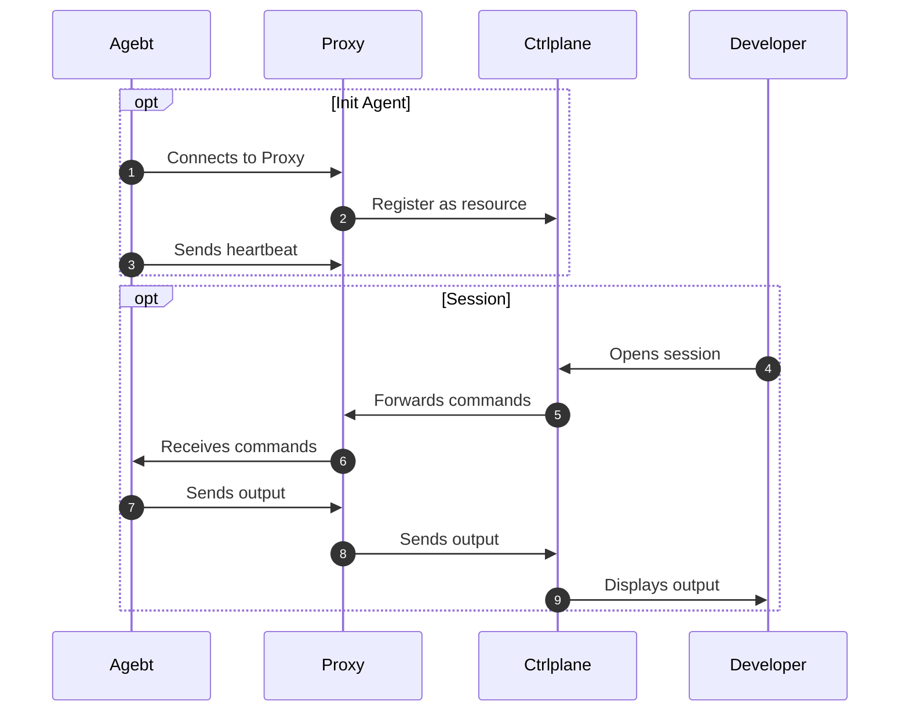

# Resource Proxy Router

Simple router that redirects web terminal requests to instances and vis-versa.

### Sequence Diagram

```mermaid
sequenceDiagram
    autonumber

    participant AG as Agebt
    participant PR as Proxy
    participant CP as Ctrlplane
    participant DE as Developer

    opt Init Agent
        AG->>PR: Connects to Proxy
        PR->>CP: Register as resource
        AG->>PR: Sends heartbeat
    end

    opt Session
        DE->>CP: Opens session
        CP->>PR: Forwards commands
        PR->>AG: Receives commands
        AG->>PR: Sends output
        PR->>CP: Sends output
        CP->>DE: Displays output
    end
```
