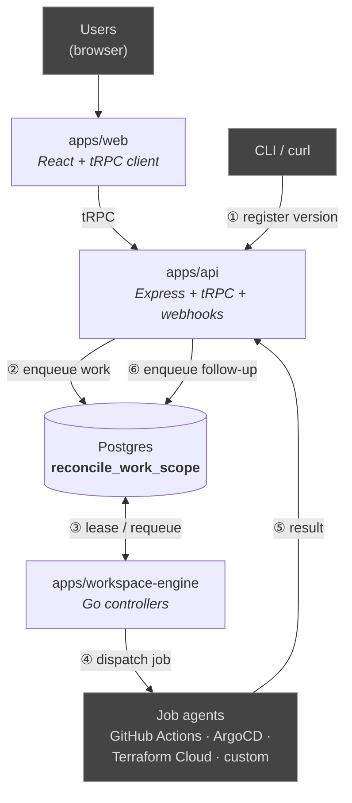

This is the developer-facing entry point to the ctrlplane codebase. It shows
how the apps in this monorepo fit together when a deployment version moves
from creation to execution.

## The orchestration loop

CLI or `curl` calls register a deployment version against `apps/api` (①). The
api persists the version and writes a work item into the `reconcile_work_scope`
table in Postgres (②) — **this is the only thing the api does to "start"
orchestration; it does not call the engine.**

`apps/workspace-engine` controllers continuously lease items from that queue
(③), and each controller's output enqueues work for the next controller
(planning → policy → dispatch). When dispatch fires, the engine reaches out to
a job agent over HTTPS (④).

Results come back through webhooks to the api (⑤), which writes the job update
plus any follow-up work into the queue (⑥). The engine picks it up again. The
loop ③↔⑥ is the whole orchestration model — every release phase is a trip
through the queue.
