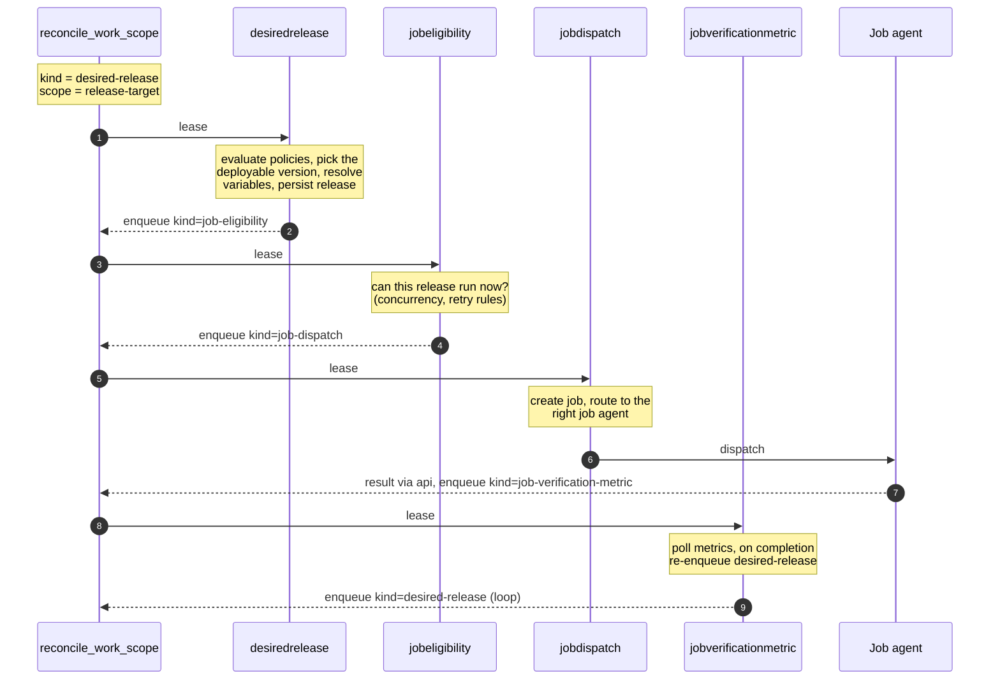
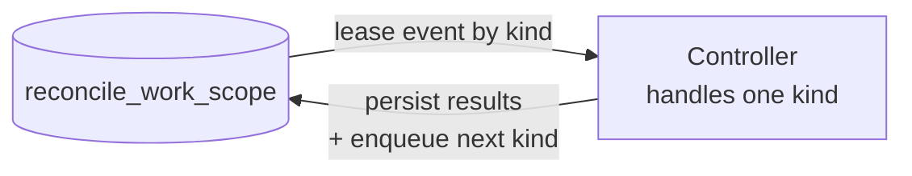
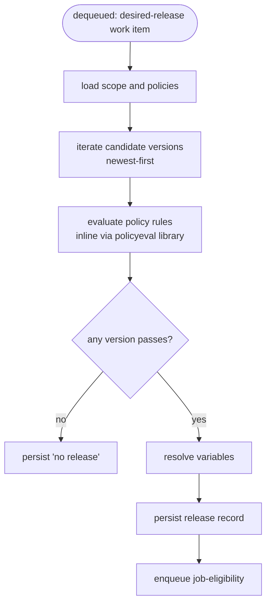

The workspace-engine is the Go service that drives every release forward. It
polls a Postgres work queue (`reconcile_work_scope`), leases items by `kind`,
and runs the matching controller. Each controller's output is enqueueing more
work, so a single release moves through phases by chaining items through the
queue.

## The release-flow chain

When a release-target needs to be evaluated (a new version was created, a
policy changed, a job finished, a resource started matching), a
`desired-release` work item lands in the queue. From there:

Four controllers, one queue between them. **No controller calls another
directly** — handoff is always via insert-then-lease. That means each phase is
independently retriable, leasable, and observable, and the engine can run as
multiple instances safely.

## How every controller works

Every controller is a `reconcile.Processor` registered for one `kind`. The
pattern is identical across all of them: lease an event, recompute the desired
state from current Postgres state, persist the result, enqueue follow-up.

Two things make this a reconciler rather than a job runner. First,
**controllers are stateless** — every invocation re-reads input from Postgres
rather than carrying state forward in memory. If the world changes between
events (a policy is disabled, an approval lands, a new version appears), the
next event picks up the change automatically. Second, **the loop closes back
to the start** — when a job finishes, `jobverificationmetric` enqueues another
`desired-release` event and `desiredrelease` recomputes from scratch.
Idempotent recomputation is the orchestration model.

## Inside `desiredrelease`

`desiredrelease` is the only controller in the chain that does meaningful
internal work — the other three are mostly routing or checking. Here is what
happens on a single lease:

Two things worth knowing:

1. **Policy evaluation is inline, not a separate controller.** A `policyeval`
   directory exists at `svc/controllers/policyeval/` but that's a different
   controller that writes per-version rule evaluations for the UI. The gating
   logic that decides whether a version can deploy lives in the `policyeval`
   *library subpackage* at `svc/controllers/desiredrelease/policyeval/` and is
   called as a function from inside `desiredrelease`.
2. **Versions are evaluated newest-first as a stream.** The controller doesn't
   load all candidate versions then filter — it iterates them and stops at the
   first one that passes all policy rules. That's what makes "skip blocked
   versions but deploy the newest passing one" cheap.

## Other release-flow controllers

**`jobeligibility`** — given a release record, decides whether a job can run
*right now*. Runs two evaluators: `releasetargetconcurrency` (under the
configured concurrency cap?) and `retry` (under the retry budget?). If both
pass, enqueue `job-dispatch`. If not, requeue with `notBefore`.

**`jobdispatch`** — given a job, picks the right job-agent adapter (GitHub
Actions, ArgoCD, Terraform Cloud, Argo Workflows, or the test runner) and
sends the job over HTTPS. The agent's `externalId` is recorded so results can
be correlated back later.

**`jobverificationmetric`** — given a finished job, polls verification
providers (Datadog, HTTP probes, Terraform Cloud run status, etc.) until they
return pass/fail. On completion, calls `EnqueueDesiredRelease` to close the
loop.

## Controllers outside the release-flow chain

The `svc/controllers/` directory contains several other controllers that exist
for UI surface or precomputed state, not for moving a release through phases:

- `policyeval` (top-level) — computes per-version rule evaluations so the UI
  can show "why isn't this version deploying yet."
- `deploymentplan` / `deploymentplanresult` — power plan previews and dry-run
  views.
- `deploymentresourceselectoreval` / `environmentresourceselectoreval` —
  precompute which resources currently match a deployment or environment
  selector.
- `relationshipeval` — evaluates resource relationship rules into the resource
  graph.
- `forcedeploy` — handles user-triggered manual deploys (a separate path from
  the policy-gated chain).

If you're trying to understand "what happens when I push a version," you can
safely ignore these and focus on the four chain controllers.
