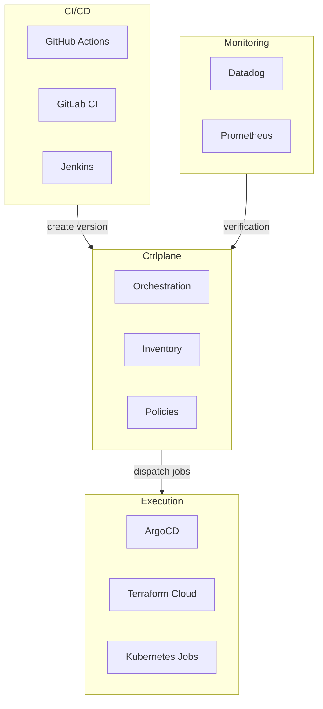

Ctrlplane is often compared to CI/CD tools, GitOps engines, and deployment
platforms. This page clarifies where Ctrlplane fits and how it differs from
alternatives.

## The Key Difference

**Ctrlplane is an orchestration layer, not an execution layer.**

It doesn't build your code (that's CI). It doesn't apply manifests to clusters
(that's ArgoCD/Flux/kubectl). It decides _when_ and _where_ deployments should
happen, enforces policies, and coordinates the flow across environments.

## Ctrlplane vs ArgoCD

| Aspect              | ArgoCD                                         | Ctrlplane                                                |
| ------------------- | ---------------------------------------------- | -------------------------------------------------------- |
| **Primary purpose** | GitOps continuous delivery for Kubernetes      | Deployment orchestration across environments             |
| **What it does**    | Syncs Applications to K8s clusters             | Coordinates when/where deployments happen                |
| **Scope**           | Single cluster (or multi with ApplicationSets) | Multi-cluster, multi-environment, multi-region           |
| **Policies**        | Limited (sync waves, hooks)                    | Rich policy engine (approval, verification, progression) |
| **Verification**    | Health checks on K8s resources                 | External verification (Datadog, Prometheus, HTTP)        |
| **Inventory**       | No unified inventory                           | Centralized resource inventory                           |

**When to use together**: Ctrlplane orchestrates _when_ to deploy to each
cluster; ArgoCD _executes_ the deployment. Ctrlplane has a native ArgoCD job
agent that creates/syncs Applications.

**Example flow**:

1. CI creates a Version in Ctrlplane
2. Ctrlplane evaluates policies (approval needed for prod)
3. After approval, Ctrlplane tells ArgoCD to sync the Application
4. ArgoCD applies manifests to the cluster
5. Ctrlplane runs verification (checks Datadog metrics)
6. If verification passes, Ctrlplane promotes to the next environment

## Ctrlplane vs Flux

| Aspect              | Flux                                  | Ctrlplane                                    |
| ------------------- | ------------------------------------- | -------------------------------------------- |
| **Primary purpose** | GitOps toolkit for Kubernetes         | Deployment orchestration across environments |
| **What it does**    | Reconciles Git state to cluster state | Coordinates multi-environment rollouts       |
| **Multi-cluster**   | Via Flux controllers per cluster      | Centralized orchestration of all clusters    |
| **Policies**        | Kustomize overlays, dependencies      | Approval, verification, gradual rollout      |

**When to use together**: Flux handles the GitOps reconciliation; Ctrlplane
handles the higher-level orchestration of when each environment should receive
updates.

## Ctrlplane vs Spinnaker

| Aspect              | Spinnaker                                    | Ctrlplane                               |
| ------------------- | -------------------------------------------- | --------------------------------------- |
| **Primary purpose** | Multi-cloud continuous delivery              | Deployment orchestration with inventory |
| **Complexity**      | Complex, requires significant infrastructure | Lightweight, single binary or container |
| **Pipeline model**  | Visual pipeline builder                      | Policy-based (selectors + rules)        |
| **Cloud support**   | Deep cloud provider integrations             | Provider-agnostic via job agents        |
| **Inventory**       | Limited                                      | First-class resource inventory          |

**When to choose Ctrlplane**: You want simpler operations, policy-based
orchestration rather than complex pipelines, and a unified inventory.

**When to choose Spinnaker**: You need deep cloud provider integrations (AWS
CodeDeploy, GCP, etc.) and prefer visual pipeline building.

## Ctrlplane vs GitHub Actions (alone)

| Aspect           | GitHub Actions                    | Ctrlplane + GitHub Actions                     |
| ---------------- | --------------------------------- | ---------------------------------------------- |
| **Multi-env**    | Separate workflows or matrix jobs | Automatic fan-out to all matching resources    |
| **Approvals**    | Environment protection rules      | Flexible approval policies with selectors      |
| **Verification** | Custom scripts in workflow        | Built-in verification with Datadog, Prometheus |
| **Visibility**   | Per-workflow run logs             | Centralized view of all deployments            |
| **Rollback**     | Manual or custom scripting        | Automatic rollback on verification failure     |

**When to use together**: GitHub Actions builds your code and creates Versions.
Ctrlplane orchestrates the rollout. GitHub Actions can also be a job agent that
executes deployments triggered by Ctrlplane.

## Ctrlplane vs Harness / Octopus Deploy

| Aspect          | Harness / Octopus                        | Ctrlplane                               |
| --------------- | ---------------------------------------- | --------------------------------------- |
| **Model**       | Enterprise CD platforms with pipelines   | Open-source orchestration with policies |
| **Pricing**     | Commercial, often per-deployment pricing | Open-source (free) + cloud offering     |
| **Flexibility** | Opinionated pipeline structure           | Flexible policy engine                  |
| **Inventory**   | Varies                                   | First-class resource inventory          |

**When to choose Ctrlplane**: You prefer open-source, policy-based
orchestration, and want to avoid vendor lock-in.

## Ctrlplane vs Terraform Cloud

| Aspect              | Terraform Cloud                            | Ctrlplane                                       |
| ------------------- | ------------------------------------------ | ----------------------------------------------- |
| **Primary purpose** | Infrastructure provisioning                | Application deployment orchestration            |
| **What it manages** | Cloud resources (VMs, networks, databases) | Application releases to existing infrastructure |
| **Workspace model** | One workspace per environment/component    | Dynamic release targets from inventory          |

**When to use together**: Terraform Cloud provisions infrastructure; Ctrlplane
orchestrates application deployments to that infrastructure. Ctrlplane has a
native Terraform Cloud job agent.

## Summary: When to Use Ctrlplane

Use Ctrlplane when you need:

| Need                                       | Ctrlplane Helps By                                |
| ------------------------------------------ | ------------------------------------------------- |
| Coordinated multi-environment rollouts     | Policy-based environment progression              |
| Approval workflows for production          | Flexible approval policies with selectors         |
| Verification before promoting releases     | Built-in Datadog, Prometheus, HTTP verification   |
| Visibility into what's deployed where      | Centralized resource inventory                    |
| Gradual rollouts across many clusters      | Gradual rollout policies with configurable timing |
| Consistent deployment process across teams | Centralized policy engine                         |

## Integration Architecture

Here's how Ctrlplane typically fits with other tools:

## Next Steps

<CardGroup cols={2}>
  <Card title="Quickstart" icon="rocket" href="./quickstart">
    Set up your first deployment pipeline
  </Card>
  <Card title="How It Works" icon="diagram-project" href="./how-it-works">
    Understand the architecture
  </Card>
</CardGroup>
