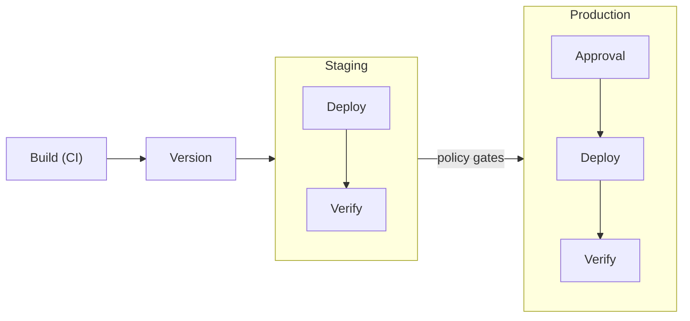

Ctrlplane's deployment system orchestrates releases across environments with
configurable policies, verification, and approval workflows.

## What is Deployment Orchestration?

Deployment orchestration manages how releases flow through your environments —
from build to production — with:

- **Gradual rollouts** — Deploy to targets sequentially with verification
  between each
- **Policy-driven gates** — Approvals, verification, and dependencies
- **Environment promotion** — Automated staging → production progression
- **Rollback & recovery** — Automatic rollback on verification failure



## Core Concepts

<CardGroup cols={2}>
  <Card title="Systems" icon="sitemap" href="../concepts/systems">
    Logical groupings of related deployments
  </Card>
  <Card title="Deployments" icon="rocket" href="../concepts/deployments">
    Services or applications to deploy
  </Card>
  <Card
    title="Releases & Jobs"
    icon="play"
    href="../concepts/releases-and-jobs"
  >
    Deployment execution units
  </Card>
  <Card
    title="Release Targets"
    icon="bullseye"
    href="../concepts/release-targets"
  >
    Deployment × Environment × Resource
  </Card>
</CardGroup>

## How It Works

### 1. CI Creates Versions

Your CI pipeline creates a version after successful builds:

```yaml
- name: Create Version
  env:
    CTRLPLANE_API_KEY: ${{ secrets.CTRLPLANE_API_KEY }}
  run: |
    ctrlc api upsert version \
      --workspace ${{ vars.CTRLPLANE_WORKSPACE }} \
      --deployment ${{ vars.CTRLPLANE_DEPLOYMENT_ID }} \
      --tag ${{ github.sha }} \
      --name "Build #${{ github.run_number }}" \
      --metadata git/commit=${{ github.sha }} \
      --metadata git/branch=${{ github.ref_name }}
```

### 2. Ctrlplane Creates Releases

For each release target (deployment × environment × resource), Ctrlplane:

1. Evaluates policies (approvals, gates, dependencies)
2. Creates a release with the new version
3. Dispatches a job to the job agent

### 3. Job Agents Execute

Job agents perform the actual deployment:

- **GitHub Actions** — Trigger workflows
- **ArgoCD** — Create/sync Applications
- **Terraform Cloud** — Create workspaces and runs

### 4. Verification Validates

After deployment, verification checks health metrics (error rates, latency,
etc.) and automatically determines whether the release should proceed or roll
back. See [Verification](../policies/verification/overview) for details.

## Defining a Deployment

A deployment connects _what_ (your service) with _how_ (the job agent that
executes it). You can define deployments via Terraform, CLI, or API.

<Tabs>
<Tab title="Terraform">
```hcl
resource "ctrlplane_deployment" "api" {
  name              = "API Service"
  resource_selector = "resource.kind == 'Kubernetes' && resource.metadata['status'] == 'running'"

  metadata = {
    team    = "backend"
    service = "api"
  }

  job_agent {
    id = ctrlplane_job_agent.github.id

    github {
      owner       = "my-org"
      repo        = "api-service"
      workflow_id = 12345678
    }
  }
}

resource "ctrlplane_deployment_system_link" "api" {
  deployment_id = ctrlplane_deployment.api.id
  system_id     = ctrlplane_system.example.id
}
```
</Tab>
<Tab title="API">
```bash
curl -X POST https://api.ctrlplane.com/v1/workspaces/{workspaceId}/deployments \
  -H "Authorization: Bearer $TOKEN" \
  -H "Content-Type: application/json" \
  -d '{
    "name": "API Service",
    "slug": "api-service",
    "resourceSelector": "resource.kind == '\''Kubernetes'\''",
    "jobAgents": [
      {
        "ref": "github-actions-agent",
        "config": {
          "owner": "my-org",
          "repo": "api-service",
          "workflow": "deploy.yml"
        }
      }
    ],
    "metadata": { "team": "backend" }
  }'
```
</Tab>
</Tabs>

See [Deployments](../concepts/deployments) for the full reference on
properties, versions, variables, and more.

## Policies

Policies control how releases flow through environments:

<CardGroup cols={2}>
  <Card title="Approval" icon="check" href="../policies/approval">
    Require sign-off before deployment
  </Card>
  <Card
    title="Environment Progression"
    icon="arrow-right"
    href="../policies/environment-progression"
  >
    Gate production on staging success
  </Card>
  <Card
    title="Gradual Rollouts"
    icon="chart-line"
    href="../policies/gradual-rollouts"
  >
    Stagger deployments across targets
  </Card>
  <Card
    title="Verification"
    icon="shield"
    href="../policies/verification/overview"
  >
    Validate deployment health
  </Card>
  <Card
    title="Deployment Dependency"
    icon="link"
    href="../policies/deployment-dependency"
  >
    Enforce ordering between deployments
  </Card>
  <Card
    title="Deployment Window"
    icon="clock"
    href="../policies/deployment-window"
  >
    Time-based deployment scheduling
  </Card>
  <Card
    title="Version Cooldown"
    icon="hourglass"
    href="../policies/version-cooldown"
  >
    Batch frequent releases
  </Card>
  <Card
    title="Version Selector"
    icon="filter"
    href="../policies/version-selector"
  >
    Control which versions can deploy
  </Card>
  <Card title="Retry" icon="rotate-right" href="../policies/retry">
    Automatic retry on failure
  </Card>
</CardGroup>

## Job Agents

Execute deployments on your infrastructure:

<CardGroup cols={3}>
  <Card
    title="GitHub Actions"
    icon="github"
    href="../integrations/job-agents/github"
  >
    Trigger workflow dispatch
  </Card>
  <Card title="ArgoCD" icon="rotate" href="../integrations/job-agents/argocd">
    GitOps deployments
  </Card>
  <Card
    title="Terraform Cloud"
    icon="cloud"
    href="../integrations/job-agents/terraform-cloud"
  >
    Infrastructure as code
  </Card>
</CardGroup>

## Key Benefits

| Benefit                | Description                           |
| ---------------------- | ------------------------------------- |
| **Consistent process** | Same workflow for all deployments     |
| **Policy enforcement** | Gates prevent unauthorized releases   |
| **Visibility**         | Track what's deployed where           |
| **Automatic rollback** | Failed verification triggers rollback |

## Next Steps

- [Systems](../concepts/systems) — Organize your deployments
- [CI/CD Integration](../integrations/cicd) — Connect your build pipeline
- [Policies](../policies/overview) — Configure deployment rules
- [Job Agents](../integrations/job-agents/github) — Set up execution
