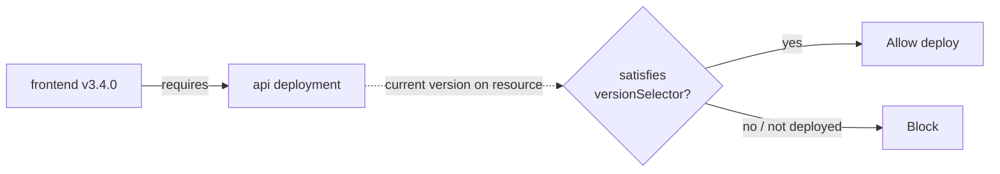

A **version dependency** is a hard, per-version edge from a deployment version
to another deployment. The version will only roll out to a resource when the
upstream deployment is *currently deployed* on that resource and its current
version satisfies a CEL `versionSelector`.

Use version dependencies to pin compatibility against a specific upstream cut
(e.g. `frontend v3.4.0` requires `api ≥ v2.1.0`) — without baking that rule
into a workspace-wide policy.

## How It Works



1. **Resolution is per-resource.** For each resource the version targets,
   Ctrlplane looks up the upstream deployment's current release on that same
   resource.
2. **Current = last successful release.** If the upstream has no successful
   release on the resource, the dependency is **unsatisfied** and the version
   is blocked on that target.
3. **CEL evaluation.** The `versionSelector` is evaluated against the
   upstream's current `version.*`. All declared edges must pass.
4. **Reconciliation.** When an upstream deployment successfully deploys a new
   version on a resource, every downstream version with an edge to it is
   re-evaluated for that resource — so a previously-blocked version can
   automatically unblock.

## Version Dependencies vs. Deployment-Dependency Policy

Both gate a deployment on another, but they're different tools:

| | Version Dependency | [Deployment Dependency Policy](../policies/deployment-dependency) |
|---|---|---|
| Lives on | A specific **version** | A **policy** matched by CEL `selector` |
| Pin granularity | Per-version (different versions can require different upstreams) | Per-deployment (uniform across all versions matching the policy) |
| CEL scope | `version.*` of upstream's current release | `deployment.*` and `version.*` of any successful upstream release on the resource |
| Typical author | CI / the build that produced the version | Platform / SRE author authoring a workspace rule |
| Edit after creation | Yes, via the dependency endpoints | Edit the policy |

Rule of thumb: if the requirement comes from the **build** itself
("this build of frontend needs api ≥ v2"), use a version dependency. If it
comes from an **operational rule** ("api always waits for db migrations"),
use a deployment-dependency policy.

## Creating Version Dependencies

### Inline at version creation

The `POST .../deployments/{deploymentId}/versions` endpoint accepts a
`dependencies` map keyed by **upstream deployment ID**. The dependency edges
are inserted in the same transaction as the version itself, so reconciliation
never sees a version with a missing edge.

```bash
curl -X POST "https://api.ctrlplane.com/v1/workspaces/$WORKSPACE_ID/deployments/$DEPLOYMENT_ID/versions" \
  -H "Authorization: Bearer $TOKEN" \
  -H "Content-Type: application/json" \
  -d '{
    "tag": "v3.4.0",
    "name": "Release 3.4.0",
    "status": "ready",
    "dependencies": {
      "dep_api_uuid": {
        "versionSelector": "version.tag.startsWith(\"v2.\")"
      },
      "dep_auth_uuid": {
        "versionSelector": "version.metadata.channel == \"stable\""
      }
    }
  }'
```

If any selector is malformed or any dependency deployment doesn't exist in the
workspace, the whole request 4xxs and no version is created.

### Upsert a single dependency

To add or change one edge after the version exists:

```bash
curl -X PUT "https://api.ctrlplane.com/v1/workspaces/$WORKSPACE_ID/deployment-versions/$VERSION_ID/dependencies/$DEPENDENCY_DEPLOYMENT_ID" \
  -H "Authorization: Bearer $TOKEN" \
  -H "Content-Type: application/json" \
  -d '{
    "versionSelector": "version.tag.startsWith(\"v2.\")"
  }'
```

Returns `202 Accepted`; downstream release targets are re-queued for
re-evaluation.

### List dependencies for a version

```bash
curl "https://api.ctrlplane.com/v1/workspaces/$WORKSPACE_ID/deployment-versions/$VERSION_ID/dependencies" \
  -H "Authorization: Bearer $TOKEN"
```

### Delete a dependency

```bash
curl -X DELETE "https://api.ctrlplane.com/v1/workspaces/$WORKSPACE_ID/deployment-versions/$VERSION_ID/dependencies/$DEPENDENCY_DEPLOYMENT_ID" \
  -H "Authorization: Bearer $TOKEN"
```

## `versionSelector` Reference

The selector is a CEL expression evaluated against the upstream deployment's
**current** version on the resource:

| Variable | Type | Description |
|---|---|---|
| `version.id` | string | Upstream version ID |
| `version.tag` | string | Upstream version tag (e.g. `v2.1.0`) |
| `version.name` | string | Upstream version name |
| `version.status` | string | Upstream version status |
| `version.metadata` | map | Upstream version metadata (`map<string,string>`) |
| `version.createdAt` | timestamp | When the upstream version was created |

`deployment.*` and `environment.*` are **not** in scope — this selector only
filters on the upstream version. Use a deployment-dependency policy if you
need to gate on `deployment.*` or `environment.*`.

### Common Selectors

```cel
// Require any v2.x release of the upstream
version.tag.startsWith("v2.")

// Require a specific minimum tag (lexicographic)
version.tag >= "v2.1.0"

// Require a stable channel
version.metadata.channel == "stable"

// Always require *some* successful upstream release (any version)
true

// Pin to a specific upstream version
version.tag == "v2.4.7"
```

## Constraints

- A version cannot depend on **its own deployment** (`400`).
- Both the version and every dependency deployment must live in the same
  workspace (`404` otherwise).
- The `(deploymentVersionId, dependencyDeploymentId)` pair is unique — `PUT`
  upserts the `versionSelector` for that pair.
- Edges cascade-delete with the version or the dependency deployment.

## Reconciliation Behavior

Version dependencies hook into the release-policy evaluator and the
job-dispatch downstream trigger:

- **At evaluation time**, every declared edge must pass; the first failing
  edge denies the release.
- **On upstream success**, each downstream deployment that has *any* version
  declaring an edge to the upstream is re-queued so previously-blocked
  versions can flip to allowed without manual intervention.

This means you can ship a frontend version that requires `api v2.x`
*before* the API has actually rolled out — it will sit blocked, and unblock
itself the moment the API reaches `v2.x` on each resource.

## Next Steps

- [Deployment Dependency Policy](../policies/deployment-dependency) — the
  policy-based, deployment-wide variant
- [Deployment Overview](./overview) — how versions become releases
- [CEL Reference](../reference/cel) — the expression language
