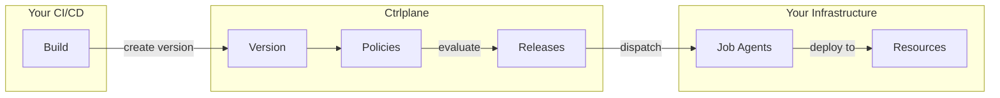
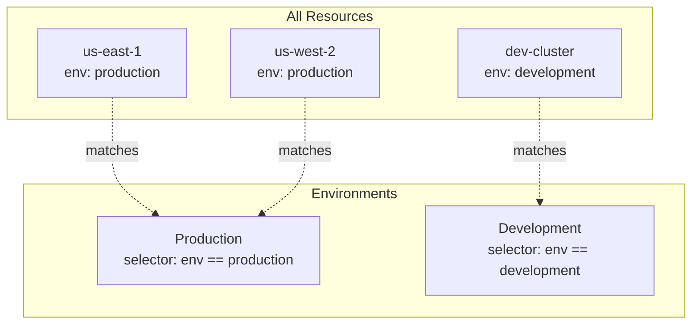

This page explains the mental model behind Ctrlplane—how the pieces fit together
and what happens when you deploy.

## The Big Picture

Ctrlplane sits between your CI/CD pipelines and your infrastructure, acting as
the orchestration layer that decides _when_, _where_, and _how_ deployments
happen.



## The Flow: What Happens When You Deploy

### Step 1: CI Creates a Version

After your CI pipeline builds and tests your code, it creates a **Version** in
Ctrlplane:

```bash
curl -X POST ".../deployments/{id}/versions" \
  -d '{"tag": "v1.2.3", "status": "ready"}'
```

A Version is a specific build of your service—think of it like a Docker image
tag or a Git SHA.

### Step 2: Ctrlplane Calculates Release Targets

Ctrlplane automatically figures out where this version needs to go by
calculating **Release Targets**:

```
Release Target = Deployment × Environment × Resource
```

**Example**: If your "API Service" deployment targets the "Production"
environment, and Production contains 3 Kubernetes clusters, Ctrlplane creates 3
release targets:

- API Service → Production → us-east-1 cluster
- API Service → Production → us-west-2 cluster
- API Service → Production → eu-west-1 cluster

### Step 3: Policies Are Evaluated

Before any deployment happens, Ctrlplane evaluates **Policies** for each release
target:

| Policy Type              | What It Does                                        |
| ------------------------ | --------------------------------------------------- |
| **Approval**             | Requires manual sign-off before deploying           |
| **Environment Progression** | Waits for staging to succeed before prod         |
| **Gradual Rollout**      | Deploys to targets one at a time with delays        |
| **Deployment Window**    | Only allows deployments during certain hours        |
| **Verification**         | Checks metrics after deployment before proceeding   |

If all policies pass, a **Release** is created and a **Job** is dispatched.

### Step 4: Job Agent Executes

A **Job Agent** receives the job and performs the actual deployment. Job agents
are the bridge to your infrastructure:

| Agent Type        | What It Does                                    |
| ----------------- | ----------------------------------------------- |
| **GitHub Actions** | Triggers a workflow dispatch                   |
| **ArgoCD**        | Creates or syncs an ArgoCD Application          |
| **Terraform Cloud** | Creates a workspace and triggers a run        |
| **Kubernetes**    | Applies manifests directly                      |

### Step 5: Verification Runs

After the deployment completes, **Verification** checks that everything is
healthy:

```yaml
verification:
  metrics:
    - name: error-rate
      provider:
        type: datadog
        query: "sum:errors{service:api}.as_rate()"
      successCondition: result.value < 0.01
```

If verification passes → the release is marked successful.
If verification fails → automatic rollback is triggered.

## Key Concepts at a Glance

| Concept            | What It Is                                                    |
| ------------------ | ------------------------------------------------------------- |
| **System**         | A workspace grouping related deployments (e.g., "E-commerce") |
| **Resource**       | A deployment target (K8s cluster, VM, Lambda function)        |
| **Environment**    | A logical stage (dev, staging, prod) that groups resources    |
| **Deployment**     | A service or app you want to deploy                           |
| **Version**        | A specific build of a deployment (created by CI)              |
| **Release Target** | Deployment × Environment × Resource                           |
| **Release**        | A version being deployed to a release target                  |
| **Job**            | The execution task sent to a job agent                        |
| **Job Agent**      | The executor (ArgoCD, GitHub Actions, etc.)                   |
| **Policy**         | Rules controlling when/how deployments happen                 |

## How Resources and Environments Work Together

Resources are your actual infrastructure—clusters, VMs, functions. Environments
are logical groupings that use **selectors** to dynamically include resources.

```yaml
# Environment definition
name: Production
resourceSelector: resource.metadata["env"] == "production"
```

When you add a new cluster with `env: production` metadata, it automatically
becomes part of the Production environment. No config changes needed.



## The Inventory: Your Source of Truth

Ctrlplane maintains a real-time **Inventory** of all your resources:

- **Synced from providers**: Kubernetes, AWS, GCP, or custom scripts
- **Rich metadata**: Region, team, tier, version—whatever you need
- **Version tracking**: See what's deployed where at any moment
- **Custom relationships**: Model dependencies between resources

This inventory powers the dynamic environment selectors and gives you visibility
across your entire infrastructure.

## Putting It All Together

Here's a complete example flow:

1. **You push code** to your main branch
2. **CI builds** and creates Version `v2.0.0` in Ctrlplane
3. **Ctrlplane plans**: "v2.0.0 needs to go to Staging (2 clusters) and
   Production (3 clusters)"
4. **Staging deploys first** (environment progression policy)
5. **Verification runs** on staging—checks error rates in Datadog
6. **Staging passes** → Production is unblocked
7. **Production requires approval** → Team lead approves
8. **Gradual rollout** → Deploy to 1 cluster, wait 10 min, next cluster...
9. **Verification runs** after each cluster
10. **Done** → All 5 clusters running v2.0.0

## Next Steps

<CardGroup cols={2}>
  <Card title="Quickstart" icon="rocket" href="./quickstart">
    Set up your first deployment pipeline
  </Card>
  <Card title="Core Concepts" icon="book" href="./concepts/introduction">
    Deep dive into each entity
  </Card>
  <Card title="Inventory" icon="server" href="./inventory/overview">
    Manage your infrastructure resources
  </Card>
  <Card title="Policies" icon="shield" href="./policies/overview">
    Configure deployment rules
  </Card>
</CardGroup>
