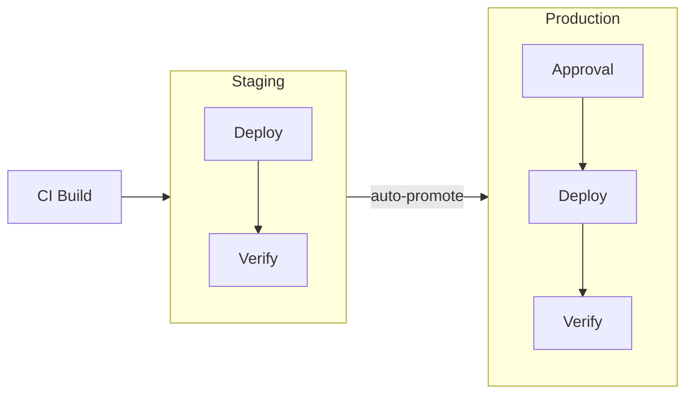
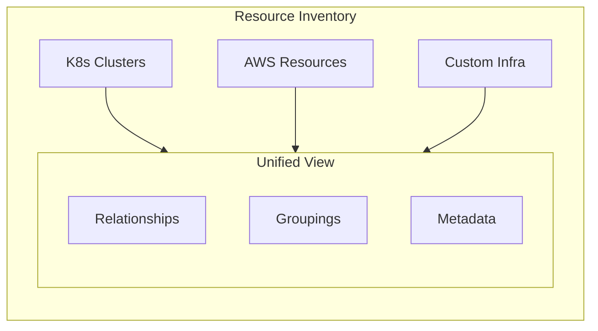

## What is Ctrlplane?

**Ctrlplane is the orchestration layer between your CI/CD pipelines and your
infrastructure.**

Your CI builds code. Your clusters run it. Ctrlplane decides _when_ releases are
ready, _where_ they should deploy, and _what gates_ they must pass—handling
environment promotion, verification, approvals, and rollbacks automatically.

```
Your CI/CD    ──►    Ctrlplane    ──►    Your Infrastructure
 (builds)          (orchestrates)           (deploys)
```

## The Problem

Most teams outgrow their deployment setup around 10-20 services. Common
symptoms:

- **Manual promotion**: Someone has to remember to deploy to prod after staging
  looks good
- **No verification**: Deployments succeed, but did the service actually work?
- **Scattered visibility**: "What version is running in eu-west-1 prod?"
  requires checking multiple dashboards
- **Inconsistent policies**: Some services require approval, some don't—it's
  tribal knowledge
- **Painful multi-region**: Deploying to 10 clusters means running 10 pipelines
- **No source of truth for infrastructure**: Resources are scattered across
  Kubernetes, cloud providers, and spreadsheets—no unified view
- **Static deployment targets**: Adding a new cluster means updating configs
  everywhere instead of having it automatically included

## How Ctrlplane Solves This

Ctrlplane provides two core systems:

### 1. Deployment Orchestration

Define _what_ should deploy _where_ and _when_—Ctrlplane handles the
coordination.

**Key Capabilities:**

- **Environment Progression** — Automatically promote from staging → production
  when verification passes
- **Policy Gates** — Require approvals, wait for dependencies, enforce
  deployment windows
- **Automated Verification** — Query Datadog, Prometheus, or HTTP endpoints to
  confirm deployments are healthy
- **Gradual Rollouts** — Deploy to targets sequentially with configurable
  intervals
- **Automatic Rollback** — If verification fails, roll back without manual
  intervention



**Common Use Cases:**

- Multi-region deployments with sequential promotion
- Platform teams managing deployments for 100+ microservices
- Enforcing deployment policies across engineering organizations
- Gating production deployments on staging verification

### 2. Infrastructure Inventory

A single source of truth for _what exists_ and _what's running where_ across
your entire infrastructure—regardless of provider.

**Key Capabilities:**

- **Resource Discovery** — Auto-sync resources from Kubernetes, AWS, GCP, or
  custom providers into a unified inventory
- **Dynamic Environments** — Define "production" as all resources with
  `env=prod` metadata—new clusters automatically join
- **Version Tracking** — See which version of each service is deployed to every
  resource in real-time
- **Custom Relationships** — Model dependencies, ownership, and connections
  between services and infrastructure
- **Rich Metadata** — Tag resources with arbitrary metadata for filtering,
  grouping, and policy targeting



**Common Use Cases:**

- Understanding service dependencies across your infrastructure
- Building dynamic deployment targets based on resource attributes
- Tracking which version is deployed where across all environments
- Creating custom views for different teams (backend services, data pipelines,
  etc.)

## Who Is Ctrlplane For?

| Team                     | Use Case                                                                    |
| ------------------------ | --------------------------------------------------------------------------- |
| **Platform Engineering** | Building an IDP with deployment orchestration and infrastructure visibility |
| **DevOps / SRE**         | Enforcing deployment policies and tracking what's running where             |
| **Scaling Startups**     | Moving from "we manually deploy" to automated, policy-driven releases       |
| **Multi-region Teams**   | Coordinating deployments across clusters/regions with a unified inventory   |
| **Multi-cloud Teams**    | Managing resources across AWS, GCP, Azure, and K8s from a single pane       |

## When to Use Ctrlplane

| Challenge                                   | How Ctrlplane Helps                                                 |
| ------------------------------------------- | ------------------------------------------------------------------- |
| Multi-environment promotion is manual       | Automated environment progression with policy gates                 |
| No visibility into what's deployed          | Real-time inventory of resources and their versions                 |
| Deployments lack verification               | Integrated verification with Datadog, Prometheus, HTTP checks       |
| Rollbacks are slow and manual               | Automatic rollback on verification failure                          |
| Infrastructure spread across providers      | Unified inventory synced from K8s, AWS, GCP, and custom sources     |
| Adding new clusters requires config changes | Dynamic environments auto-include resources matching selectors      |
| Different teams need different policies     | Flexible policy engine with environment/deployment selectors        |
| Scaling deployment orchestration            | Handle 1000s of release targets with a single deployment definition |

## Core Concepts

| Entity             | Description                                                     |
| ------------------ | --------------------------------------------------------------- |
| **System**         | Logical grouping of related deployments (e.g., "Payment Stack") |
| **Resource**       | A deployment target (K8s cluster, VM, Lambda function)          |
| **Environment**    | Logical stage that groups resources (dev, staging, prod)        |
| **Deployment**     | A service or application to deploy                              |
| **Version**        | A specific build/release of a deployment                        |
| **Release Target** | The combination of Deployment × Environment × Resource          |
| **Release**        | A version deployed to a release target                          |
| **Job**            | The execution unit that performs the deployment                 |
| **Policy**         | Rules governing approvals, progression, and verification        |

## How It Fits Your Stack

Ctrlplane doesn't replace your CI or your deployment tooling—it coordinates
them:

| Layer           | Tools                                           | What They Do                                  |
| --------------- | ----------------------------------------------- | --------------------------------------------- |
| **Build**       | GitHub Actions, GitLab CI, Jenkins              | Build artifacts, create versions in Ctrlplane |
| **Inventory**   | **Ctrlplane** + K8s, AWS, GCP, custom providers | Sync and track all resources in one place     |
| **Orchestrate** | **Ctrlplane**                                   | Decide when/where to deploy, enforce policies |
| **Execute**     | ArgoCD, K8s Jobs, GitHub Actions, Terraform     | Perform the actual deployment                 |
| **Monitor**     | Datadog, Prometheus                             | Provide metrics for verification              |

## Next Steps

<CardGroup cols={2}>
  <Card title="Quickstart" icon="rocket" href="./quickstart">
    Set up your first deployment pipeline in 10 minutes
  </Card>
  <Card title="Installation" icon="server" href="./installation">
    Self-host Ctrlplane or use the cloud offering
  </Card>
  <Card title="Inventory" icon="server" href="./inventory/overview">
    Manage your infrastructure resources
  </Card>
  <Card title="Deployment" icon="rocket" href="./deployment/overview">
    Orchestrate releases across environments
  </Card>
</CardGroup>
