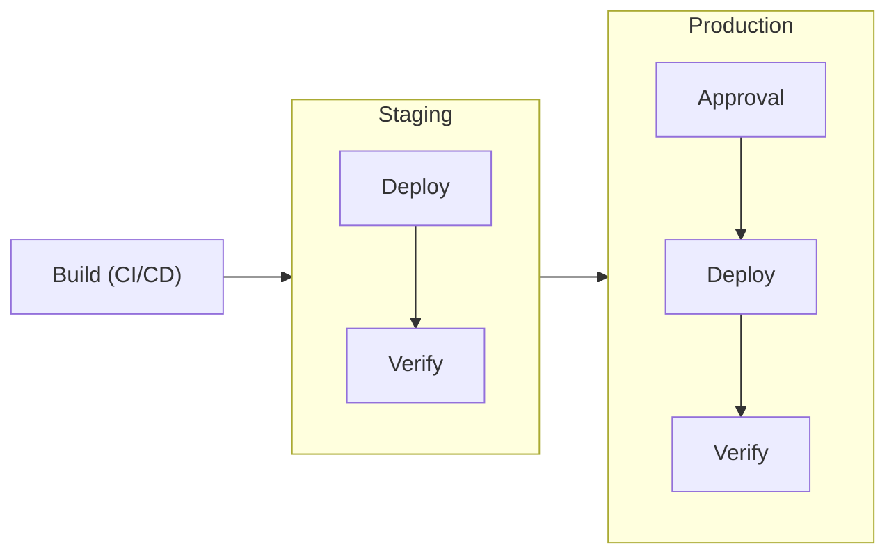
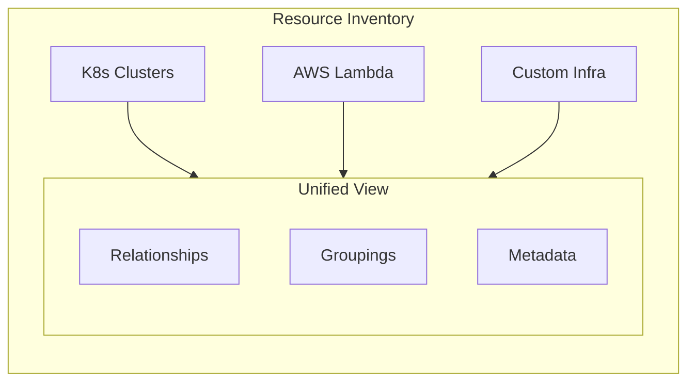

## What is Ctrlplane?

Ctrlplane is an open-source platform that solves two critical challenges for
platform and DevOps teams:

1. **Deployment Orchestration** — Progressive delivery with policy-driven
   environment promotion, approval workflows, and automated verification
2. **Infrastructure Inventory** — Unified visibility into resources across your
   entire stack with custom relationships and dynamic grouping

Think of it as the control plane that sits between your CI/CD pipelines and your
infrastructure, providing the orchestration layer for complex multi-environment
deployments and the visibility layer for understanding what's running where.

## The Two Systems

### 1. Deployment Orchestration

Ctrlplane's deployment system handles the complexity of promoting releases
through environments with configurable policies, gates, and verification.

**Key Capabilities:**

- **Progressive Delivery** — Canary rollouts, blue-green deployments, and phased
  environment promotion
- **Policy-Driven Workflows** — Define approval gates, environment sequencing,
  and deployment constraints
- **Automated Verification** — Integrate with Datadog, Prometheus, or custom
  endpoints to validate deployments before promotion
- **Environment Promotion** — Automatically promote successful releases from
  staging → production with configurable gates
- **Rollback & Recovery** — Automatic rollback when verification fails or manual
  intervention triggers

**Common Use Cases:**

- Multi-region deployments with sequential promotion
- Platform teams managing deployments for 100+ microservices
- Enforcing deployment policies across engineering organizations
- Gating production deployments on staging verification

### 2. Infrastructure Inventory

Ctrlplane provides a unified inventory of your resources with powerful
relationship modeling and dynamic grouping — giving you visibility that spans
Kubernetes clusters, cloud resources, and custom infrastructure.

**Key Capabilities:**

- **Resource Discovery** — Auto-sync resources from Kubernetes, AWS, GCP, or
  custom providers
- **Custom Relationships** — Model dependencies, ownership, and service
  connections between resources
- **Dynamic Grouping** — Use selectors to create views based on metadata,
  labels, or custom attributes
- **Rich Metadata** — Attach arbitrary metadata for filtering, grouping, and
  automation
- **Cross-Stack Visibility** — See Kubernetes deployments, cloud functions, VMs,
  and databases in one place

**Common Use Cases:**

- Understanding service dependencies across your infrastructure
- Building dynamic deployment targets based on resource attributes
- Tracking which version is deployed where across all environments
- Creating custom views for different teams (backend services, data pipelines,
  etc.)

## When to Use Ctrlplane

Ctrlplane is designed for platform teams who need:

| Challenge                               | How Ctrlplane Helps                                                 |
| --------------------------------------- | ------------------------------------------------------------------- |
| Multi-environment promotion is manual   | Automated environment progression with policy gates                 |
| No visibility into what's deployed      | Real-time inventory of resources and their versions                 |
| Deployments lack verification           | Integrated verification with Datadog, HTTP checks, etc.             |
| Rollbacks are slow and manual           | Automatic rollback on verification failure                          |
| Infrastructure spread across providers  | Unified inventory with custom relationships                         |
| Different teams need different policies | Flexible policy engine with environment/deployment selectors        |
| Scaling deployment orchestration        | Handle 1000s of release targets with a single deployment definition |

## Core Concepts

| Entity             | Description                                                     |
| ------------------ | --------------------------------------------------------------- |
| **System**         | Logical grouping of related deployments (e.g., "Payment Stack") |
| **Resource**       | A deployment target (K8s cluster, VM, Lambda function)          |
| **Environment**    | Logical stage that groups resources (dev, staging, prod)        |
| **Deployment**     | A service or application to deploy                              |
| **Version**        | A specific build/release of a deployment                        |
| **Release Target** | The combination of Deployment × Environment × Resource          |
| **Release**        | A version deployed to a release target                          |
| **Job**            | The execution unit that performs the deployment                 |
| **Policy**         | Rules governing approvals, progression, and verification        |

## Integration Points

Ctrlplane integrates with your existing stack:

**CI/CD Systems:**

- GitHub Actions, GitLab CI, Jenkins, CircleCI — create versions after builds

**Job Execution:**

- Kubernetes Jobs, GitHub Actions, ArgoCD — execute deployments

**Verification Providers:**

- Datadog, Prometheus, HTTP endpoints — validate deployment health

**Resource Providers:**

- Kubernetes, AWS, GCP, custom scripts — sync infrastructure inventory

## Next Steps

<CardGroup cols={2}>
  <Card title="Quickstart" icon="rocket" href="./quickstart">
    Set up your first deployment pipeline in 10 minutes
  </Card>
  <Card title="Installation" icon="server" href="./installation">
    Self-host Ctrlplane or use the cloud offering
  </Card>
  <Card title="Core Concepts" icon="book" href="./core-concepts">
    Deep dive into Ctrlplane's entity model
  </Card>
  <Card title="Policies" icon="shield" href="./policies/overview">
    Configure approval workflows and verification
  </Card>
</CardGroup>
