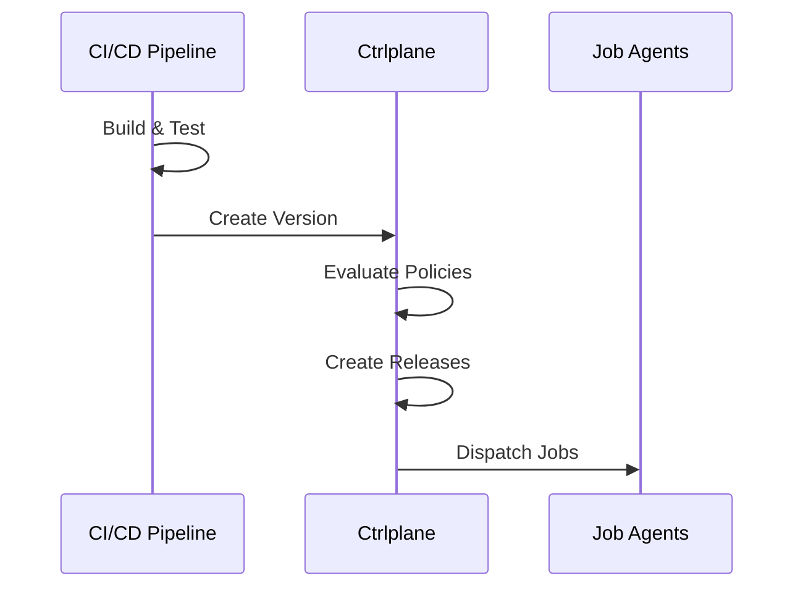

Connect your CI/CD pipeline to Ctrlplane to automatically create deployment
versions after successful builds. This triggers the deployment orchestration
flow.

## How It Works



1. Your CI/CD pipeline builds and tests your code
2. After success, CI creates a version in Ctrlplane
3. Ctrlplane evaluates policies for each release target
4. Jobs are dispatched to job agents
5. Deployments execute across your environments

## GitHub Actions

### Basic Integration

```yaml
name: Build and Deploy

on:
  push:
    branches: [main]

jobs:
  build:
    runs-on: ubuntu-latest
    steps:
      - uses: actions/checkout@v4

      - name: Build
        run: |
          # Your build steps
          docker build -t myapp:${{ github.sha }} .
          docker push myapp:${{ github.sha }}

      - name: Create Ctrlplane Version
        run: |
          curl -X POST \
            "https://app.ctrlplane.dev/api/v1/deployments/${{ vars.DEPLOYMENT_ID }}/versions" \
            -H "Authorization: Bearer ${{ secrets.CTRLPLANE_API_KEY }}" \
            -H "Content-Type: application/json" \
            -d '{
              "tag": "${{ github.sha }}",
              "name": "Build #${{ github.run_number }}",
              "status": "ready",
              "metadata": {
                "commit": "${{ github.sha }}",
                "branch": "${{ github.ref_name }}",
                "actor": "${{ github.actor }}",
                "run_url": "${{ github.server_url }}/${{ github.repository }}/actions/runs/${{ github.run_id }}"
              }
            }'
```

### Using the Ctrlplane Action

```yaml
- name: Create Ctrlplane Version
  uses: ctrlplanedev/create-version@v1
  with:
    api_key: ${{ secrets.CTRLPLANE_API_KEY }}
    deployment_id: ${{ vars.DEPLOYMENT_ID }}
    tag: ${{ github.sha }}
    name: "Build #${{ github.run_number }}"
    metadata: |
      commit: ${{ github.sha }}
      branch: ${{ github.ref_name }}
```

## GitLab CI

```yaml
stages:
  - build
  - deploy

build:
  stage: build
  script:
    - docker build -t myapp:$CI_COMMIT_SHA .
    - docker push myapp:$CI_COMMIT_SHA

create-version:
  stage: deploy
  script:
    - |
      curl -X POST \
        "https://app.ctrlplane.dev/api/v1/deployments/${DEPLOYMENT_ID}/versions" \
        -H "Authorization: Bearer ${CTRLPLANE_API_KEY}" \
        -H "Content-Type: application/json" \
        -d "{
          \"tag\": \"${CI_COMMIT_SHA}\",
          \"name\": \"Pipeline #${CI_PIPELINE_ID}\",
          \"status\": \"ready\",
          \"metadata\": {
            \"commit\": \"${CI_COMMIT_SHA}\",
            \"branch\": \"${CI_COMMIT_REF_NAME}\",
            \"pipeline_url\": \"${CI_PIPELINE_URL}\"
          }
        }"
  only:
    - main
```

## Jenkins

```groovy
pipeline {
    agent any

    environment {
        CTRLPLANE_API_KEY = credentials('ctrlplane-api-key')
        DEPLOYMENT_ID = 'your-deployment-id'
    }

    stages {
        stage('Build') {
            steps {
                sh 'docker build -t myapp:${GIT_COMMIT} .'
                sh 'docker push myapp:${GIT_COMMIT}'
            }
        }

        stage('Create Version') {
            steps {
                script {
                    def response = httpRequest(
                        url: "https://app.ctrlplane.dev/api/v1/deployments/${DEPLOYMENT_ID}/versions",
                        httpMode: 'POST',
                        customHeaders: [
                            [name: 'Authorization', value: "Bearer ${CTRLPLANE_API_KEY}"],
                            [name: 'Content-Type', value: 'application/json']
                        ],
                        requestBody: """{
                            "tag": "${GIT_COMMIT}",
                            "name": "Build #${BUILD_NUMBER}",
                            "status": "ready",
                            "metadata": {
                                "commit": "${GIT_COMMIT}",
                                "branch": "${GIT_BRANCH}",
                                "build_url": "${BUILD_URL}"
                            }
                        }"""
                    )
                }
            }
        }
    }
}
```

## CircleCI

```yaml
version: 2.1

jobs:
  build:
    docker:
      - image: cimg/base:stable
    steps:
      - checkout
      - setup_remote_docker
      - run:
          name: Build and Push
          command: |
            docker build -t myapp:${CIRCLE_SHA1} .
            docker push myapp:${CIRCLE_SHA1}
      - run:
          name: Create Ctrlplane Version
          command: |
            curl -X POST \
              "https://app.ctrlplane.dev/api/v1/deployments/${DEPLOYMENT_ID}/versions" \
              -H "Authorization: Bearer ${CTRLPLANE_API_KEY}" \
              -H "Content-Type: application/json" \
              -d "{
                \"tag\": \"${CIRCLE_SHA1}\",
                \"name\": \"Build #${CIRCLE_BUILD_NUM}\",
                \"status\": \"ready\",
                \"metadata\": {
                  \"commit\": \"${CIRCLE_SHA1}\",
                  \"branch\": \"${CIRCLE_BRANCH}\",
                  \"build_url\": \"${CIRCLE_BUILD_URL}\"
                }
              }"

workflows:
  build-deploy:
    jobs:
      - build:
          filters:
            branches:
              only: main
```

## Version API

### Create Version

```bash
POST /api/v1/deployments/{deploymentId}/versions
```

**Request Body:**

```json
{
  "tag": "v1.2.3",
  "name": "Release 1.2.3",
  "status": "ready",
  "metadata": {
    "commit": "abc123",
    "branch": "main"
  }
}
```

| Field      | Required | Description                             |
| ---------- | -------- | --------------------------------------- |
| `tag`      | Yes      | Unique version identifier               |
| `name`     | No       | Human-readable version name             |
| `status`   | No       | `ready` (default), `building`, `failed` |
| `metadata` | No       | Arbitrary key-value metadata            |

**Response:**

```json
{
  "id": "version-uuid",
  "tag": "v1.2.3",
  "name": "Release 1.2.3",
  "status": "ready",
  "metadata": {
    "commit": "abc123",
    "branch": "main"
  },
  "createdAt": "2024-01-15T10:30:00Z"
}
```

## Best Practices

### Semantic Versioning

Use semantic versions for release branches:

```yaml
- name: Create Version
  run: |
    VERSION=$(cat version.txt)
    curl -X POST ... -d "{\"tag\": \"${VERSION}\"}"
```

### Include Build Metadata

Add useful context to help with debugging:

```json
{
  "metadata": {
    "commit": "abc123",
    "branch": "main",
    "build_number": "42",
    "build_url": "https://ci.example.com/builds/42",
    "actor": "developer@example.com",
    "triggered_by": "push"
  }
}
```

### Handle Failures

Check the API response:

```yaml
- name: Create Version
  run: |
    RESPONSE=$(curl -s -w "\n%{http_code}" -X POST ...)
    HTTP_CODE=$(echo "$RESPONSE" | tail -n1)
    BODY=$(echo "$RESPONSE" | sed '$d')

    if [ "$HTTP_CODE" != "201" ]; then
      echo "Failed to create version: $BODY"
      exit 1
    fi
```

### Idempotency

Version tags are unique per deployment. Creating a version with an existing tag
will return an error. Handle this in CI:

```yaml
- name: Create Version
  run: |
    RESPONSE=$(curl -s -o /dev/null -w "%{http_code}" -X POST ...)
    if [ "$RESPONSE" = "409" ]; then
      echo "Version already exists, skipping"
    elif [ "$RESPONSE" != "201" ]; then
      echo "Failed to create version"
      exit 1
    fi
```
