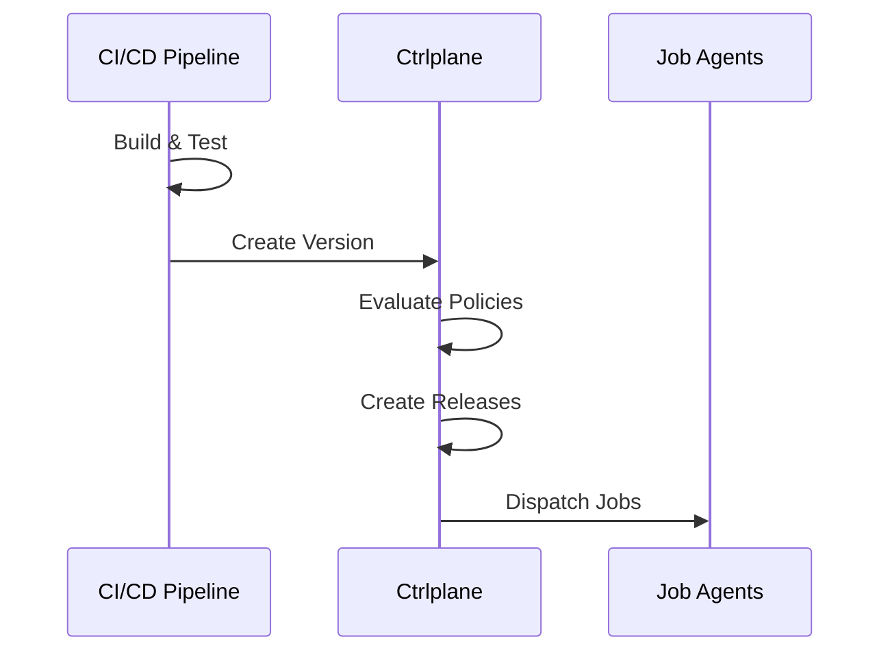

Connect your CI/CD pipeline to Ctrlplane to automatically create deployment
versions after successful builds. This triggers the deployment orchestration
flow.

## How It Works



1. Your CI/CD pipeline builds and tests your code
2. After success, CI creates a version in Ctrlplane
3. Ctrlplane evaluates policies for each release target
4. Jobs are dispatched to job agents
5. Deployments execute across your environments

## GitHub Actions

### Basic Integration

```yaml
name: Build and Deploy

on:
  push:
    branches: [main]

jobs:
  build:
    runs-on: ubuntu-latest
    steps:
      - uses: actions/checkout@v4

      - name: Build
        run: |
          # Your build steps
          docker build -t myapp:${{ github.sha }} .
          docker push myapp:${{ github.sha }}

      - name: Create Ctrlplane Version
        env:
          CTRLPLANE_API_KEY: ${{ secrets.CTRLPLANE_API_KEY }}
        run: |
          ctrlc api upsert version \
            --workspace ${{ vars.CTRLPLANE_WORKSPACE }} \
            --deployment ${{ vars.CTRLPLANE_DEPLOYMENT_ID }} \
            --tag ${{ github.sha }} \
            --name "Build #${{ github.run_number }}" \
            --metadata git/commit=${{ github.sha }} \
            --metadata git/branch=${{ github.ref_name }} \
            --metadata github/actor=${{ github.actor }} \
            --metadata github/run-url=${{ github.server_url }}/${{ github.repository }}/actions/runs/${{ github.run_id }}
```

### Using the Ctrlplane Action

```yaml
- name: Create Ctrlplane Version
  uses: ctrlplanedev/create-version@v1
  with:
    api_key: ${{ secrets.CTRLPLANE_API_KEY }}
    deployment_id: ${{ vars.DEPLOYMENT_ID }}
    tag: ${{ github.sha }}
    name: "Build #${{ github.run_number }}"
    metadata: |
      commit: ${{ github.sha }}
      branch: ${{ github.ref_name }}
```

## GitLab CI

```yaml
stages:
  - build
  - deploy

build:
  stage: build
  script:
    - docker build -t myapp:$CI_COMMIT_SHA .
    - docker push myapp:$CI_COMMIT_SHA

create-version:
  stage: deploy
  script:
    - |
      ctrlc api upsert version \
        --workspace ${CTRLPLANE_WORKSPACE} \
        --deployment ${CTRLPLANE_DEPLOYMENT_ID} \
        --tag ${CI_COMMIT_SHA} \
        --name "Pipeline #${CI_PIPELINE_ID}" \
        --metadata git/commit=${CI_COMMIT_SHA} \
        --metadata git/branch=${CI_COMMIT_REF_NAME} \
        --metadata gitlab/pipeline-url=${CI_PIPELINE_URL}
  only:
    - main
```

## Jenkins

```groovy
pipeline {
    agent any

    environment {
        CTRLPLANE_API_KEY = credentials('ctrlplane-api-key')
        CTRLPLANE_WORKSPACE = 'your-workspace'
        CTRLPLANE_DEPLOYMENT_ID = 'your-deployment-id'
    }

    stages {
        stage('Build') {
            steps {
                sh 'docker build -t myapp:${GIT_COMMIT} .'
                sh 'docker push myapp:${GIT_COMMIT}'
            }
        }

        stage('Create Version') {
            steps {
                sh '''
                    ctrlc api upsert version \
                        --workspace ${CTRLPLANE_WORKSPACE} \
                        --deployment ${CTRLPLANE_DEPLOYMENT_ID} \
                        --tag ${GIT_COMMIT} \
                        --name "Build #${BUILD_NUMBER}" \
                        --metadata git/commit=${GIT_COMMIT} \
                        --metadata git/branch=${GIT_BRANCH} \
                        --metadata jenkins/build-url=${BUILD_URL}
                '''
            }
        }
    }
}
```

## CircleCI

```yaml
version: 2.1

jobs:
  build:
    docker:
      - image: cimg/base:stable
    steps:
      - checkout
      - setup_remote_docker
      - run:
          name: Build and Push
          command: |
            docker build -t myapp:${CIRCLE_SHA1} .
            docker push myapp:${CIRCLE_SHA1}
      - run:
          name: Create Ctrlplane Version
          command: |
            ctrlc api upsert version \
              --workspace ${CTRLPLANE_WORKSPACE} \
              --deployment ${CTRLPLANE_DEPLOYMENT_ID} \
              --tag ${CIRCLE_SHA1} \
              --name "Build #${CIRCLE_BUILD_NUM}" \
              --metadata git/commit=${CIRCLE_SHA1} \
              --metadata git/branch=${CIRCLE_BRANCH} \
              --metadata circleci/build-url=${CIRCLE_BUILD_URL}

workflows:
  build-deploy:
    jobs:
      - build:
          filters:
            branches:
              only: main
```

## Installing ctrlc

The `ctrlc` CLI is the recommended way to interact with Ctrlplane from CI/CD pipelines.

```bash
# Download and install
curl -fsSL https://get.ctrlplane.dev | sh

# Or using npm
npm install -g @ctrlplane/cli
```

Set the `CTRLPLANE_API_KEY` environment variable in your CI secrets.

## CLI Reference

### Create Version

```bash
ctrlc api upsert version \
  --workspace <workspace> \
  --deployment <deployment-id> \
  --tag <version-tag> \
  --name "<version-name>" \
  --metadata key=value \
  --metadata another/key=value
```

| Flag           | Required | Description                             |
| -------------- | -------- | --------------------------------------- |
| `--workspace`  | Yes      | Workspace name or ID                    |
| `--deployment` | Yes      | Deployment ID                           |
| `--tag`        | Yes      | Unique version identifier               |
| `--name`       | No       | Human-readable version name             |
| `--metadata`   | No       | Key-value metadata (repeatable)         |

## REST API

For environments where the CLI isn't available, use the REST API:

```bash
POST /api/v1/deployments/{deploymentId}/versions

curl -X POST \
  "https://app.ctrlplane.dev/api/v1/deployments/{deploymentId}/versions" \
  -H "Authorization: Bearer $CTRLPLANE_API_KEY" \
  -H "Content-Type: application/json" \
  -d '{
    "tag": "v1.2.3",
    "name": "Release 1.2.3",
    "status": "ready",
    "metadata": {
      "commit": "abc123",
      "branch": "main"
    }
  }'
```

## Best Practices

### Semantic Versioning

Use semantic versions for release branches:

```yaml
- name: Create Version
  run: |
    VERSION=$(cat version.txt)
    ctrlc api upsert version \
      --workspace $CTRLPLANE_WORKSPACE \
      --deployment $CTRLPLANE_DEPLOYMENT_ID \
      --tag $VERSION
```

### Include Build Metadata

Add useful context to help with debugging:

```yaml
- name: Create Version
  run: |
    ctrlc api upsert version \
      --workspace $CTRLPLANE_WORKSPACE \
      --deployment $CTRLPLANE_DEPLOYMENT_ID \
      --tag ${{ github.sha }} \
      --metadata git/commit=${{ github.sha }} \
      --metadata git/branch=${{ github.ref_name }} \
      --metadata build/number=${{ github.run_number }} \
      --metadata build/url=${{ github.server_url }}/${{ github.repository }}/actions/runs/${{ github.run_id }} \
      --metadata build/actor=${{ github.actor }} \
      --metadata build/trigger=${{ github.event_name }}
```

### Idempotency

The `ctrlc api upsert version` command is idempotent — it creates or updates the
version if it already exists. This makes it safe to retry failed CI runs without
worrying about duplicate version errors.
