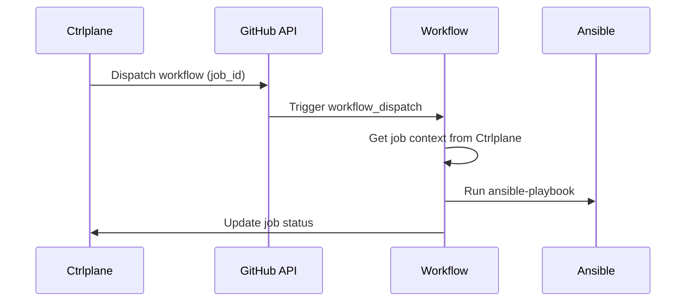

Use the GitHub Actions job agent to dispatch workflows that execute Ansible
playbooks. This lets you keep your existing Ansible automation while Ctrlplane
orchestrates environments, approvals, and verification.

## How It Works



1. Ctrlplane creates a job and dispatches it to GitHub
2. GitHub triggers your workflow with `workflow_dispatch`
3. The workflow fetches job context (version, environment, resource)
4. Ansible runs the playbook against the target inventory
5. Job status is reported back to Ctrlplane

## Prerequisites

- GitHub App installed in your organization
- Workflow file with `workflow_dispatch` trigger
- Repository permissions for the GitHub App
- Ansible available on the runner (or install via pip)

## Configuration

### Job Agent Setup

Create a job agent with type `github-app`:

```yaml
type: JobAgent
name: ansible
agentType: github-app
```

### Deployment Configuration

Configure the deployment to dispatch the workflow:

```yaml
type: Deployment
name: ansible-playbook
jobAgent: ansible
jobAgentConfig:
  installationId: 12345678
  owner: your-org
  repo: your-repo
  workflowId: 12345678
  ref: main # optional, defaults to main
```

| Field            | Required | Description                                |
| ---------------- | -------- | ------------------------------------------ |
| `installationId` | Yes      | GitHub App installation ID                 |
| `owner`          | Yes      | Repository owner (org or user)             |
| `repo`           | Yes      | Repository name                            |
| `workflowId`     | Yes      | Workflow ID (numeric)                      |
| `ref`            | No       | Git ref to run workflow on (default: main) |

## Workflow Setup

Create a workflow file in your repository:

```yaml
# .github/workflows/ansible-deploy.yml
name: Ansible Deploy

on:
  workflow_dispatch:
    inputs:
      job_id:
        description: "Ctrlplane Job ID"
        required: true

jobs:
  deploy:
    runs-on: ubuntu-latest
    steps:
      - uses: actions/checkout@v4

      - name: Set up Python
        uses: actions/setup-python@v5
        with:
          python-version: "3.11"

      - name: Install Ansible
        run: pip install ansible

      - name: Get job context
        uses: ctrlplanedev/get-job-inputs@v1
        id: job
        with:
          job_id: ${{ inputs.job_id }}
          api_key: ${{ secrets.CTRLPLANE_API_KEY }}

      - name: Build inventory
        run: |
          echo '${{ steps.job.outputs.resource_config }}' | jq -r '.hosts[]' > inventory.txt

      - name: Run playbook
        run: |
          ansible-playbook \
            -i inventory.txt \
            playbooks/deploy.yml \
            --extra-vars "version=${{ steps.job.outputs.version_tag }} env=${{ steps.job.outputs.environment_name }}"
```

## Resource Config Example

Store inventory targets on the resource so each release target can map to a
different Ansible inventory:

```yaml
type: Resource
identifier: prod-web-1
kind: Server
name: prod-web-1
version: infra/servers/v1
config:
  hosts:
    - web-01.example.com
    - web-02.example.com
```

## Templating

You can use Go templates in your job agent config to select repositories,
workflows, or refs dynamically:

```yaml
jobAgentConfig:
  installationId: "{{.variables.github_installation_id}}"
  owner: "{{.variables.github_org}}"
  repo: "{{.deployment.slug}}"
  workflowId: "{{.variables.workflow_id}}"
  ref: "{{.version.tag}}"
```

## Status Reporting

The workflow should update job status. You can use the Ctrlplane API:

```yaml
- name: Mark job successful
  if: success()
  run: |
    curl -X PATCH "https://app.ctrlplane.dev/api/v1/jobs/${{ inputs.job_id }}" \
      -H "Authorization: Bearer ${{ secrets.CTRLPLANE_API_KEY }}" \
      -H "Content-Type: application/json" \
      -d '{"status": "successful"}'

- name: Mark job failed
  if: failure()
  run: |
    curl -X PATCH "https://app.ctrlplane.dev/api/v1/jobs/${{ inputs.job_id }}" \
      -H "Authorization: Bearer ${{ secrets.CTRLPLANE_API_KEY }}" \
      -H "Content-Type: application/json" \
      -d '{"status": "failure"}'
```
