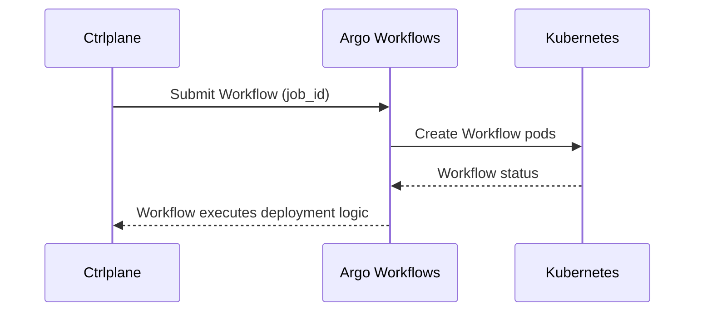

The Argo Workflows job agent submits Workflow manifests to an Argo Workflows
server so you can run deployment logic in Kubernetes.

## How It Works



1. Ctrlplane renders a Workflow manifest from your template
2. The Workflow is created via the Argo Workflows API
3. Your workflow runs deployment steps in Kubernetes
4. The workflow reports job status back to Ctrlplane

## Prerequisites

- Argo Workflows server with API access
- API token with workflow create permissions
- Network connectivity from Ctrlplane to Argo Workflows

## Configuration

### Job Agent Setup

Create a job agent with type `argo-workflows`:

```yaml
type: JobAgent
name: argo-workflows
agentType: argo-workflows
```

### Deployment Configuration

```yaml
type: Deployment
name: api-service
jobAgent: argo-workflows
jobAgentConfig:
  serverUrl: argo.example.com:443
  apiKey: "{{.variables.argo_token}}"
  template: |
    apiVersion: argoproj.io/v1alpha1
    kind: Workflow
    metadata:
      generateName: {{.deployment.slug}}-{{.environment.name}}-
    spec:
      entrypoint: deploy
      arguments:
        parameters:
          - name: job_id
            value: "{{.job.id}}"
      templates:
        - name: deploy
          container:
            image: alpine:3.20
            command: [sh, -c]
            args:
              - |
                echo "Deploying {{.version.tag}} to {{.resource.name}}"
```

| Field       | Required | Description                                                  |
| ----------- | -------- | ------------------------------------------------------------ |
| `serverUrl` | Yes      | Argo Workflows server URL (host:port or URL)                 |
| `apiKey`    | Yes      | Argo Workflows API token                                     |
| `namespace` | No       | Kubernetes namespace for workflow execution (default: `default`) |
| `template`  | Yes      | Go template for the Argo Workflow manifest                   |

## Template Context

The template has access to the same job context as other job agents. See the
[ArgoCD template context](./argocd#template-context) for the full list of
available values.

## Status Reporting

Argo Workflows does not automatically update Ctrlplane job status. Your
workflow should report success or failure by calling the Ctrlplane API:

```yaml
templates:
  - name: deploy
    container:
      image: curlimages/curl:8.10.1
      command: [sh, -c]
      args:
        - |
          # Deployment logic here

          # Mark job successful
          curl -X PATCH "https://app.ctrlplane.dev/api/v1/jobs/{{workflow.parameters.job_id}}" \
            -H "Authorization: Bearer $CTRLPLANE_API_KEY" \
            -H "Content-Type: application/json" \
            -d '{"status": "successful"}'
```

## Tips

- Use `metadata.generateName` to let Argo generate unique workflow names.
- Include `job_id` as a parameter so your workflow can report status.
- Use Go templates to inject deployment metadata into workflow steps.
