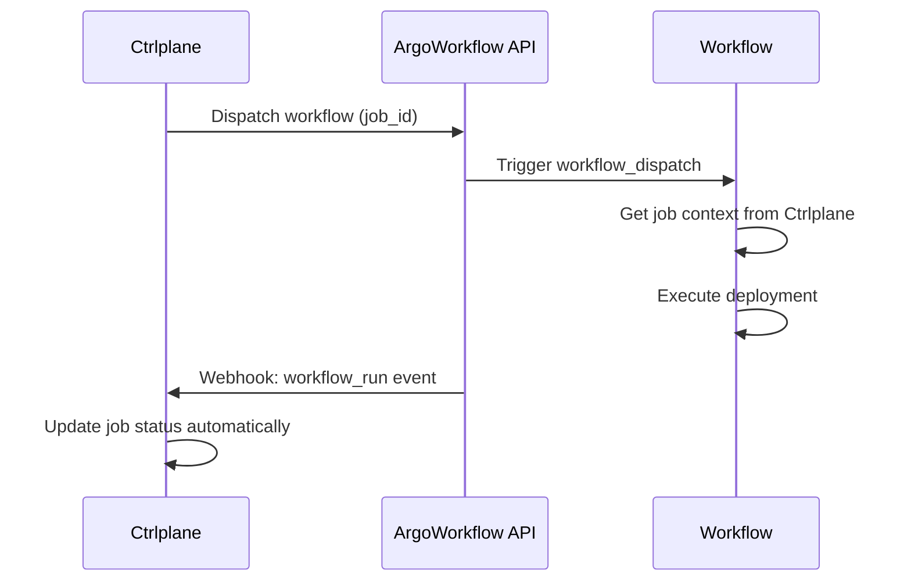

The Argo Workflow job agent triggers workflow dispatch events to execute your
deployments. This is ideal for teams that use github for non git event triggered workflows.



```mermaid
sequenceDiagram
    participant C as Ctrlplane
    participant G as ArgoWorkflow API
    participant W as Workflow

    C->>G: Dispatch workflow (job_id)
    G->>W: Trigger workflow_dispatch
    W->>W: Get job context from Ctrlplane
    W->>W: Execute deployment
    G->>C: Webhook: workflow_run event
    C->>C: Update job status automatically
```

1. Ctrlplane creates a job and dispatches it to ArgoWorkflows
2. ArgoEvents triggers your workflow with
3. Your workflow fetches job context (version, environment, resource)
4. Your workflow executes the deployment
5. ArgoWorkflows sends a webhook event to Ctrlplane as the run progresses
6. Ctrlplane automatically updates the job status (in progress, successful, failure, etc.)

## Prerequisites

- ArgoWorkflows server with API access
- API token with application create/update permissions
- Network connectivity from Ctrlplane to ArgoWorkflows

## Configuration

### Job Agent Setup

Create a job agent with type `argo-cd`:

```yaml
type: JobAgent
name: argo-workflows
agentType: argo-workflow
```

### Deployment Configuration

```yaml
type: Deployment
name: api-service
jobAgent: argo-workflow
jobAgentConfig:
  serverUrl: argocd.example.com:443
  apiKey: "{{.variables.argoworkflow_token}}"
  template: |
  ---
  apiVersion: argoproj.io/v1alpha1
  kind: Workflow
  metadata:
    generateName: go-build-
    namespace: argo
   spec:
     entrypoint: main
     templates:
       - name: main
         container:
           image: alpine:3.19
           command: ["sh", "-c"]
           args: ["echo hello"]
```

| Field       | Required      | Description                        |
| ----------- | --------------|--------------------------------------------------------------------------- |
| `serverUrl` | Yes           | ArgoWorkflow server URL (host:port)                                        |
| `apiKey`    | Yes           | ArgoWorkflow API token                                                     |
| `template`  | Yes           | Go template for ArgoWorkflow Application                                   |
| `name`      | Yes           | Go template for ArgoWorkflow Application                                   |
| `inline`    | No            | Boolean for if you're suppling an inline workflow ArgoWorkflow Application |
| `namespace` | If not Inline | If not supplying an inline template this is required                       |

## Template Context

The template has access to all job context. Variables are accessed using Go template
syntax: `{{.variable.property}}`. The job context is derived from the resources
returned by the deployment selector (and narrowed by the environment selector),
so the data available to the template reflects that specific target.

### Top-Level Variables

| Variable       | Description                                     |
| -------------- | ----------------------------------------------- |
| `.job`         | Current job details                             |
| `.version`     | Version being deployed (shortcut)               |
| `.deployment`  | User-defined deployment configuration and properties |
| `.environment` | User-defined environment you deploy into and its properties |
| `.resource`    | User-defined resource you deploy against and its properties |
| `.variables`   | Merged deployment variables (key-value strings) |

### Resource Properties

Each job invocation is tied to a specific resource instance returned by
your selector, so the `.resource` values can differ for every ArgoWorkflows
template invocation.

| Property               | Type              | Description                           |
| ---------------------- | ----------------- | ------------------------------------- |
| `.resource.id`         | string            | Unique resource ID                    |
| `.resource.name`       | string            | Display name                          |
| `.resource.identifier` | string            | Unique identifier within workspace    |
| `.resource.kind`       | string            | Resource kind (e.g., KubernetesCluster) |
| `.resource.version`    | string            | Resource schema version               |
| `.resource.config`     | object            | Arbitrary configuration data          |
| `.resource.metadata`   | map[string]string | Key-value metadata labels             |
| `.resource.workspaceId`| string            | Parent workspace ID                   |
| `.resource.providerId` | string            | Resource provider ID (if any)         |
| `.resource.createdAt`  | timestamp         | Creation timestamp                    |
| `.resource.updatedAt`  | timestamp         | Last update timestamp                 |
| `.resource.lockedAt`   | timestamp         | Lock timestamp (if locked)            |

### Deployment Properties

Each job invocation is tied to a specific deployment, so `.deployment` values can differ 
for every ArgoWorkflow template invocation.

| Property                      | Type              | Description                        |
| ----------------------------- | ----------------- | ---------------------------------- |
| `.deployment.id`              | string            | Unique deployment ID               |
| `.deployment.name`            | string            | Display name                       |
| `.deployment.slug`            | string            | URL-friendly identifier            |
| `.deployment.description`     | string            | Optional description               |
| `.deployment.systemId`        | string            | Parent system ID                   |
| `.deployment.jobAgentId`      | string            | Associated job agent ID            |
| `.deployment.jobAgentConfig`  | object            | Job agent configuration            |
| `.deployment.resourceSelector`| object            | Resource selector for targeting    |

### Environment Properties

Each job invocation is tied to a specific environment, so `.environment` values can differ 
for every ArgoWorkflow template invocation.

| Property                        | Type      | Description                     |
| ------------------------------- | --------- | ------------------------------- |
| `.environment.id`               | string    | Unique environment ID           |
| `.environment.name`             | string    | Display name                    |
| `.environment.description`      | string    | Optional description            |
| `.environment.systemId`         | string    | Parent system ID                |
| `.environment.resourceSelector` | object    | Resource selector               |
| `.environment.createdAt`        | timestamp | Creation timestamp              |

### Version Properties

Access via `.version`:

| Property               | Type              | Description                      |
| ---------------------- | ----------------- | -------------------------------- |
| `.version.id`          | string            | Unique version ID                |
| `.version.tag`         | string            | Version tag (e.g., v1.2.3)       |
| `.version.name`        | string            | Display name                     |
| `.version.message`     | string            | Optional commit/release message  |
| `.version.status`      | string            | Version status                   |
| `.version.config`      | object            | Version-specific configuration   |
| `.version.metadata`    | map[string]string | Version metadata                 |
| `.version.jobAgentConfig`| object          | Version-level job agent config   |
| `.version.deploymentId`| string            | Parent deployment ID             |
| `.version.createdAt`   | timestamp         | Creation timestamp               |

### Job Properties

| Property            | Type              | Description                        |
| ------------------- | ----------------- | ---------------------------------- |
| `.job.id`           | string            | Unique job ID                      |
| `.job.status`       | string            | Current status                     |
| `.job.message`      | string            | Status message                     |
| `.job.externalId`   | string            | External system reference          |
| `.job.metadata`     | map[string]string | Job metadata                       |
| `.job.jobAgentId`   | string            | Executing job agent ID             |
| `.job.releaseId`    | string            | Associated release ID              |
| `.job.createdAt`    | timestamp         | Creation timestamp                 |
| `.job.startedAt`    | timestamp         | Execution start timestamp          |
| `.job.completedAt`  | timestamp         | Completion timestamp               |
| `.job.updatedAt`    | timestamp         | Last update timestamp              |

### Variables

The `.variables` map contains all resolved deployment variables as strings:

```yaml
template: |
  metadata:
    annotations:
      replicas: "{{.variables.replica_count}}"
      db-host: "{{.variables.database_host}}"
```

### Accessing Nested Config

Resource and version configs are arbitrary objects. Access nested properties:

```yaml
template: |
  spec:
    destination:
      server: {{.resource.config.cluster_url}}
      namespace: {{.resource.config.namespaces.app}}
    source:
      helm:
        parameters:
          - name: image.tag
            value: {{.version.config.imageTag}}
```

## Template Functions

The template supports [Sprig](http://masterminds.github.io/sprig/) functions:

```yaml
template: |
  apiVersion: argoproj.io/v1alpha1
  kind: Workflow
  metadata:
    name: {{ .deployment.slug | lower | replace "_" "-" }}
    labels:
      version: {{ .version.tag | trunc 63 }}
      deployed-at: {{ now | date "2006-01-02" }}
```

## Automatic Verification

When an ArgoWorkflows job is created, Ctrlplane automatically listens for webhooks from the argo server

- Application sync status is `Synced`
- Application health status is `Healthy` or `Progressing`

## Example: Inline vs Triggering a Template

```yaml
type: argo-workflow
name: api-service
jobAgent: argo-workflow
jobAgentConfig:
  serverUrl: argoworkflows.example.com:443
  apiKey: "{{.variables.argoworkflow_token}}"
  template: |
  ---
  apiVersion: argoproj.io/v1alpha1
  kind: Workflow
  metadata:
    generateName: go-build-
    namespace: argo
   spec:
     entrypoint: main
     templates:
       - name: main
         container:
           image: alpine:3.19
           command: ["sh", "-c"]
           args: ["echo hello"]
```

```json
type: argo-workflow
name: api-service
jobAgent: argo-workflow
jobAgentConfig:
  serverUrl: argoworkflows.example.com:443
  apiKey: "{{.variables.argoworkflow_token}}"
  inline: false
  type: argo-workflow
  namespace: mynamespace
  template: |
  {
     "repo": "${variables.repo}}"
     "branch": "${variables.branch}}"
  }
```

