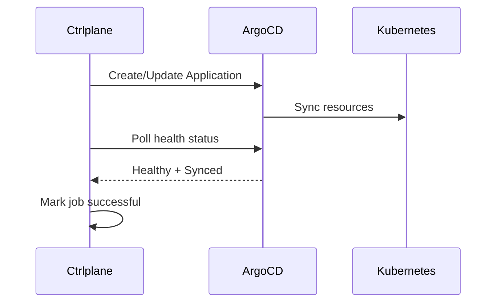

The ArgoCD job agent creates and syncs ArgoCD Applications, enabling
GitOps-style deployments with automatic health verification.

## How It Works



1. Ctrlplane renders an ArgoCD Application from your template
2. The Application is created or updated via ArgoCD API
3. ArgoCD syncs the application to Kubernetes
4. Ctrlplane verifies the application reaches `Healthy` + `Synced` status
5. Job is marked successful when verification passes

## Prerequisites

- ArgoCD server with API access
- API token with application create/update permissions
- Network connectivity from Ctrlplane to ArgoCD

## Configuration

### Job Agent Setup

Create a job agent with type `argo-cd`:

```yaml
type: JobAgent
name: argocd
agentType: argo-cd
```

### Deployment Configuration

```yaml
type: Deployment
name: api-service
jobAgent: argocd
jobAgentConfig:
  serverUrl: argocd.example.com:443
  apiKey: "{{.variables.argocd_token}}"
  template: |
    apiVersion: argoproj.io/v1alpha1
    kind: Application
    metadata:
      name: {{.deployment.slug}}-{{.environment.name}}
      namespace: argocd
    spec:
      project: default
      source:
        repoURL: https://github.com/your-org/your-repo
        targetRevision: {{.version.tag}}
        path: k8s/{{.environment.name}}
      destination:
        server: {{.resource.config.server}}
        namespace: {{.resource.config.namespace}}
      syncPolicy:
        automated:
          prune: true
          selfHeal: true
```

| Field       | Required | Description                        |
| ----------- | -------- | ---------------------------------- |
| `serverUrl` | Yes      | ArgoCD server URL (host:port)      |
| `apiKey`    | Yes      | ArgoCD API token                   |
| `template`  | Yes      | Go template for ArgoCD Application |

## Template Context

The template has access to all job context. Variables are accessed using Go template
syntax: `{{.variable.property}}`.

### Top-Level Variables

| Variable       | Description                                     |
| -------------- | ----------------------------------------------- |
| `.job`         | Current job details                             |
| `.version`     | Version being deployed (shortcut)               |
| `.deployment`  | User-defined deployment configuration and properties |
| `.environment` | User-defined environment you deploy into and its properties |
| `.resource`    | User-defined resource you deploy against and its properties |
| `.variables`   | Merged deployment variables (key-value strings) |

### Resource Properties

| Property               | Type              | Description                           |
| ---------------------- | ----------------- | ------------------------------------- |
| `.resource.id`         | string            | Unique resource ID                    |
| `.resource.name`       | string            | Display name                          |
| `.resource.identifier` | string            | Unique identifier within workspace    |
| `.resource.kind`       | string            | Resource kind (e.g., KubernetesCluster) |
| `.resource.version`    | string            | Resource schema version               |
| `.resource.config`     | object            | Arbitrary configuration data          |
| `.resource.metadata`   | map[string]string | Key-value metadata labels             |
| `.resource.workspaceId`| string            | Parent workspace ID                   |
| `.resource.providerId` | string            | Resource provider ID (if any)         |
| `.resource.createdAt`  | timestamp         | Creation timestamp                    |
| `.resource.updatedAt`  | timestamp         | Last update timestamp                 |
| `.resource.lockedAt`   | timestamp         | Lock timestamp (if locked)            |

### Deployment Properties

| Property                      | Type              | Description                        |
| ----------------------------- | ----------------- | ---------------------------------- |
| `.deployment.id`              | string            | Unique deployment ID               |
| `.deployment.name`            | string            | Display name                       |
| `.deployment.slug`            | string            | URL-friendly identifier            |
| `.deployment.description`     | string            | Optional description               |
| `.deployment.systemId`        | string            | Parent system ID                   |
| `.deployment.jobAgentId`      | string            | Associated job agent ID            |
| `.deployment.jobAgentConfig`  | object            | Job agent configuration            |
| `.deployment.resourceSelector`| object            | Resource selector for targeting    |

### Environment Properties

| Property                        | Type      | Description                     |
| ------------------------------- | --------- | ------------------------------- |
| `.environment.id`               | string    | Unique environment ID           |
| `.environment.name`             | string    | Display name                    |
| `.environment.description`      | string    | Optional description            |
| `.environment.systemId`         | string    | Parent system ID                |
| `.environment.resourceSelector` | object    | Resource selector               |
| `.environment.createdAt`        | timestamp | Creation timestamp              |

### Version Properties

Access via `.version`:

| Property               | Type              | Description                      |
| ---------------------- | ----------------- | -------------------------------- |
| `.version.id`          | string            | Unique version ID                |
| `.version.tag`         | string            | Version tag (e.g., v1.2.3)       |
| `.version.name`        | string            | Display name                     |
| `.version.message`     | string            | Optional commit/release message  |
| `.version.status`      | string            | Version status                   |
| `.version.config`      | object            | Version-specific configuration   |
| `.version.metadata`    | map[string]string | Version metadata                 |
| `.version.jobAgentConfig`| object          | Version-level job agent config   |
| `.version.deploymentId`| string            | Parent deployment ID             |
| `.version.createdAt`   | timestamp         | Creation timestamp               |

### Job Properties

| Property            | Type              | Description                        |
| ------------------- | ----------------- | ---------------------------------- |
| `.job.id`           | string            | Unique job ID                      |
| `.job.status`       | string            | Current status                     |
| `.job.message`      | string            | Status message                     |
| `.job.externalId`   | string            | External system reference          |
| `.job.metadata`     | map[string]string | Job metadata                       |
| `.job.jobAgentId`   | string            | Executing job agent ID             |
| `.job.releaseId`    | string            | Associated release ID              |
| `.job.createdAt`    | timestamp         | Creation timestamp                 |
| `.job.startedAt`    | timestamp         | Execution start timestamp          |
| `.job.completedAt`  | timestamp         | Completion timestamp               |
| `.job.updatedAt`    | timestamp         | Last update timestamp              |

### Variables

The `.variables` map contains all resolved deployment variables as strings:

```yaml
template: |
  metadata:
    annotations:
      replicas: "{{.variables.replica_count}}"
      db-host: "{{.variables.database_host}}"
```

### Accessing Nested Config

Resource and version configs are arbitrary objects. Access nested properties:

```yaml
template: |
  spec:
    destination:
      server: {{.resource.config.cluster_url}}
      namespace: {{.resource.config.namespaces.app}}
    source:
      helm:
        parameters:
          - name: image.tag
            value: {{.version.config.imageTag}}
```

## Template Functions

The template supports [Sprig](http://masterminds.github.io/sprig/) functions:

```yaml
template: |
  apiVersion: argoproj.io/v1alpha1
  kind: Application
  metadata:
    name: {{ .deployment.slug | lower | replace "_" "-" }}
    labels:
      version: {{ .version.tag | trunc 63 }}
      deployed-at: {{ now | date "2006-01-02" }}
```

## Automatic Verification

When an ArgoCD Application is created, Ctrlplane automatically starts a
verification that checks:

- Application sync status is `Synced`
- Application health status is `Healthy` or `Progressing`

The verification polls the ArgoCD API every 10 seconds for 5 iterations.

## Example: Multi-Environment Setup

```yaml
type: Deployment
name: frontend
jobAgent: argocd
jobAgentConfig:
  serverUrl: "{{.variables.argocd_server}}"
  apiKey: "{{.variables.argocd_token}}"
  template: |
    apiVersion: argoproj.io/v1alpha1
    kind: Application
    metadata:
      name: frontend-{{.environment.name | lower}}
      namespace: argocd
      labels:
        app: frontend
        env: {{.environment.name | lower}}
        version: {{.version.tag}}
      finalizers:
        - resources-finalizer.argocd.argoproj.io
    spec:
      project: {{.environment.name | lower}}
      source:
        repoURL: https://github.com/your-org/frontend
        targetRevision: {{.version.tag}}
        path: deploy/{{.environment.name | lower}}
        helm:
          valueFiles:
            - values.yaml
            - values-{{.environment.name | lower}}.yaml
          parameters:
            - name: image.tag
              value: {{.version.tag}}
            - name: replicas
              value: "{{.resource.config.replicas | default 2}}"
      destination:
        server: {{.resource.config.cluster_url}}
        namespace: frontend
      syncPolicy:
        automated:
          prune: true
          selfHeal: true
        syncOptions:
          - CreateNamespace=true
```

## Example: Kustomize Overlay

```yaml
template: |
  apiVersion: argoproj.io/v1alpha1
  kind: Application
  metadata:
    name: {{.deployment.slug}}-{{.resource.identifier}}
    namespace: argocd
  spec:
    project: default
    source:
      repoURL: https://github.com/your-org/{{.deployment.slug}}
      targetRevision: {{.version.tag}}
      path: overlays/{{.environment.name}}
      kustomize:
        images:
          - {{.deployment.slug}}={{.variables.registry}}/{{.deployment.slug}}:{{.version.tag}}
    destination:
      server: {{.resource.config.server}}
      namespace: {{.deployment.slug}}
```

## Troubleshooting

### Application not syncing

- Check ArgoCD server logs
- Verify the repository is accessible from ArgoCD
- Check the target revision exists

### Authentication errors

- Verify the API token is valid
- Check token has correct permissions
- Ensure `serverUrl` includes the correct port

### Verification failing

- Check ArgoCD Application status in the UI
- Review sync errors in ArgoCD
- Verify destination cluster is accessible

