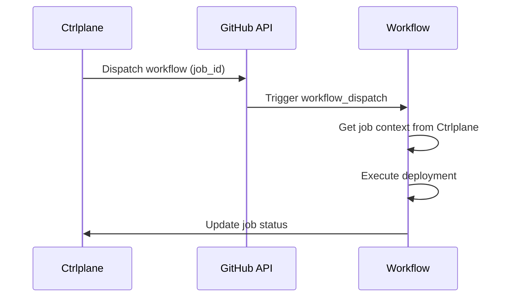

The GitHub Actions job agent triggers workflow dispatch events to execute your
deployments. This is ideal for teams already using GitHub Actions for CI/CD.

## How It Works



1. Ctrlplane creates a job and dispatches it to GitHub
2. GitHub triggers your workflow with `workflow_dispatch`
3. Your workflow fetches job context (version, environment, resource)
4. Your workflow executes the deployment
5. Job status is reported back to Ctrlplane

## Prerequisites

- GitHub App installed in your organization
- Workflow file with `workflow_dispatch` trigger
- Repository permissions for the GitHub App

## Configuration

### Job Agent Setup

Create a job agent with type `github-app`:

```yaml
type: JobAgent
name: github-actions
agentType: github-app
```

### Deployment Configuration

Configure the deployment to use GitHub Actions:

```yaml
type: Deployment
name: api-service
jobAgent: github-actions
jobAgentConfig:
  installationId: 12345678
  owner: your-org
  repo: your-repo
  workflowId: 12345678
  ref: main # optional, defaults to main
```

| Field            | Required | Description                                |
| ---------------- | -------- | ------------------------------------------ |
| `installationId` | Yes      | GitHub App installation ID                 |
| `owner`          | Yes      | Repository owner (org or user)             |
| `repo`           | Yes      | Repository name                            |
| `workflowId`     | Yes      | Workflow ID (numeric)                      |
| `ref`            | No       | Git ref to run workflow on (default: main) |

### Finding Your Workflow ID

Use the GitHub API to find your workflow ID:

```bash
curl -H "Authorization: Bearer $GITHUB_TOKEN" \
  https://api.github.com/repos/OWNER/REPO/actions/workflows
```

## Workflow Setup

Create a workflow file in your repository:

```yaml
# .github/workflows/deploy.yml
name: Deploy

on:
  workflow_dispatch:
    inputs:
      job_id:
        description: "Ctrlplane Job ID"
        required: true

jobs:
  deploy:
    runs-on: ubuntu-latest
    steps:
      - uses: actions/checkout@v4

      - name: Get job context
        uses: ctrlplanedev/get-job-inputs@v1
        id: job
        with:
          job_id: ${{ inputs.job_id }}
          api_key: ${{ secrets.CTRLPLANE_API_KEY }}

      - name: Deploy
        run: |
          echo "Deploying ${{ steps.job.outputs.version_tag }}"
          echo "Environment: ${{ steps.job.outputs.environment_name }}"
          echo "Resource: ${{ steps.job.outputs.resource_identifier }}"

          # Your deployment commands here
```

## Available Job Context

The `get-job-inputs` action provides these outputs:

| Output                 | Description                 |
| ---------------------- | --------------------------- |
| `job_id`               | The Ctrlplane job ID        |
| `version_tag`          | Version tag being deployed  |
| `version_name`         | Version name                |
| `environment_name`     | Target environment name     |
| `environment_id`       | Target environment ID       |
| `resource_identifier`  | Target resource identifier  |
| `resource_name`        | Target resource name        |
| `resource_kind`        | Target resource kind        |
| `resource_config`      | Resource config (JSON)      |
| `deployment_name`      | Deployment name             |
| `deployment_variables` | Deployment variables (JSON) |

## Templating

You can use Go templates in your job agent config to dynamically configure
workflows:

```yaml
jobAgentConfig:
  installationId: "{{.variables.github_installation_id}}"
  owner: "{{.variables.github_org}}"
  repo: "{{.deployment.slug}}"
  workflowId: "{{.variables.workflow_id}}"
  ref: "{{.version.tag}}"
```

## Status Reporting

The workflow should update job status. You can use the Ctrlplane CLI or API:

```yaml
- name: Mark job successful
  if: success()
  run: |
    curl -X PATCH "https://app.ctrlplane.dev/api/v1/jobs/${{ inputs.job_id }}" \
      -H "Authorization: Bearer ${{ secrets.CTRLPLANE_API_KEY }}" \
      -H "Content-Type: application/json" \
      -d '{"status": "successful"}'

- name: Mark job failed
  if: failure()
  run: |
    curl -X PATCH "https://app.ctrlplane.dev/api/v1/jobs/${{ inputs.job_id }}" \
      -H "Authorization: Bearer ${{ secrets.CTRLPLANE_API_KEY }}" \
      -H "Content-Type: application/json" \
      -d '{"status": "failure"}'
```

## Example: Kubernetes Deployment

```yaml
name: Deploy to Kubernetes

on:
  workflow_dispatch:
    inputs:
      job_id:
        required: true

jobs:
  deploy:
    runs-on: ubuntu-latest
    steps:
      - uses: actions/checkout@v4

      - name: Get job context
        uses: ctrlplanedev/get-job-inputs@v1
        id: job
        with:
          job_id: ${{ inputs.job_id }}
          api_key: ${{ secrets.CTRLPLANE_API_KEY }}

      - name: Configure kubectl
        uses: azure/k8s-set-context@v3
        with:
          kubeconfig: ${{ secrets.KUBECONFIG }}

      - name: Deploy
        run: |
          kubectl set image deployment/${{ steps.job.outputs.deployment_name }} \
            app=${{ steps.job.outputs.version_tag }} \
            -n ${{ fromJson(steps.job.outputs.resource_config).namespace }}
```
