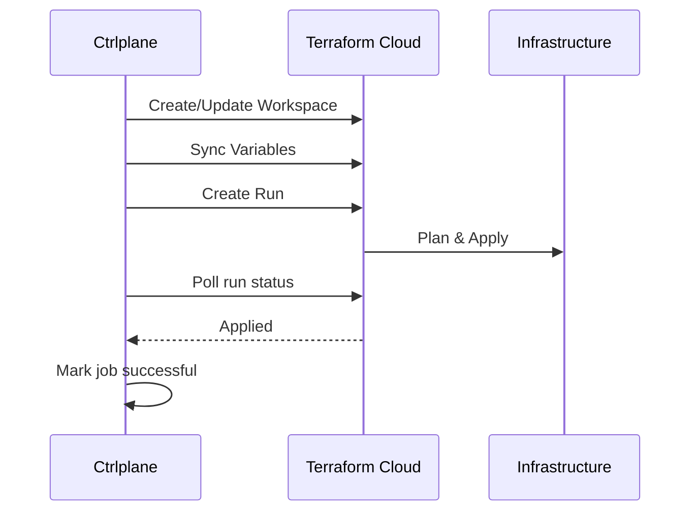

The Terraform Cloud job agent creates workspaces and triggers runs, enabling
infrastructure-as-code deployments with automatic run verification.

## How It Works



1. Ctrlplane renders a workspace configuration from your template
2. The workspace is created or updated via Terraform Cloud API
3. Variables are synced to match your template
4. A run is triggered with auto-apply
5. Ctrlplane verifies the run reaches `applied` status
6. Job is marked successful when verification passes

## Prerequisites

- Terraform Cloud or Terraform Enterprise account
- API token with workspace and run permissions
- VCS connection (optional, for Git-based workflows)

## Configuration

### Job Agent Setup

Create a job agent with type `tfe`:

```yaml
type: JobAgent
name: terraform-cloud
agentType: tfe
```

### Deployment Configuration

```yaml
type: Deployment
name: infrastructure
jobAgent: terraform-cloud
jobAgentConfig:
  organization: your-org
  address: https://app.terraform.io
  token: "{{.variables.tfe_token}}"
  template: |
    name: {{.deployment.slug}}-{{.resource.identifier}}
    description: "Managed by Ctrlplane"
    execution_mode: remote
    auto_apply: true
    terraform_version: "1.6.0"
    working_directory: environments/{{.environment.name}}
    vcs_repo:
      identifier: your-org/infrastructure
      branch: main
      oauth_token_id: ot-xxxxxxxxxx
    variables:
      - key: environment
        value: {{.environment.name}}
        category: terraform
      - key: version
        value: {{.version.tag}}
        category: terraform
```

| Field          | Required | Description                             |
| -------------- | -------- | --------------------------------------- |
| `organization` | Yes      | Terraform Cloud organization            |
| `address`      | Yes      | Terraform Cloud/Enterprise URL          |
| `token`        | Yes      | API token                               |
| `template`     | Yes      | Go template for workspace configuration |

## Workspace Template

The template defines the Terraform Cloud workspace:

| Field               | Type   | Description                      |
| ------------------- | ------ | -------------------------------- |
| `name`              | string | Workspace name (required)        |
| `description`       | string | Workspace description            |
| `execution_mode`    | string | `remote`, `local`, or `agent`    |
| `auto_apply`        | bool   | Auto-apply after plan            |
| `terraform_version` | string | Terraform version to use         |
| `working_directory` | string | Subdirectory for Terraform files |
| `vcs_repo`          | object | VCS repository settings          |
| `variables`         | array  | Workspace variables              |

### VCS Repository Settings

```yaml
vcs_repo:
  identifier: org/repo
  branch: main
  oauth_token_id: ot-xxxxxxxxxx
  ingress_submodules: false
  tags_regex: ""
```

### Variable Configuration

```yaml
variables:
  - key: aws_region
    value: us-east-1
    category: terraform # or "env"
    hcl: false
    sensitive: false
    description: "AWS region"
```

## Template Context

The template has access to all job context:

| Variable       | Description                 |
| -------------- | --------------------------- |
| `.job`         | Job details                 |
| `.version`     | Version being deployed      |
| `.deployment`  | Deployment details          |
| `.environment` | Environment details         |
| `.resource`    | Target resource             |
| `.variables`   | Merged deployment variables |

## Automatic Verification

When a run is created, Ctrlplane automatically starts a verification that
monitors the run status:

**Success conditions:**

- `applied` - Run completed successfully
- `planned_and_finished` - Plan-only run completed
- `planned_and_saved` - Plan saved for later apply

**Failure conditions:**

- `canceled` - Run was canceled
- `discarded` - Run was discarded
- `errored` - Run failed with error

The verification polls every 60 seconds for up to 100 iterations.

## Example: Multi-Environment Infrastructure

```yaml
type: Deployment
name: vpc-infrastructure
jobAgent: terraform-cloud
jobAgentConfig:
  organization: "{{.variables.tfe_org}}"
  address: "{{.variables.tfe_address}}"
  token: "{{.variables.tfe_token}}"
  template: |
    name: vpc-{{.environment.name}}-{{.resource.metadata.region}}
    description: "VPC for {{.environment.name}} in {{.resource.metadata.region}}"
    execution_mode: remote
    auto_apply: {{if eq .environment.name "production"}}false{{else}}true{{end}}
    terraform_version: "1.6.0"
    working_directory: modules/vpc

    vcs_repo:
      identifier: {{.variables.github_org}}/infrastructure
      branch: {{.version.tag}}
      oauth_token_id: {{.variables.vcs_oauth_token}}

    variables:
      - key: environment
        value: {{.environment.name}}
        category: terraform
      - key: region
        value: {{.resource.metadata.region}}
        category: terraform
      - key: vpc_cidr
        value: {{.resource.config.vpc_cidr}}
        category: terraform
      - key: AWS_ACCESS_KEY_ID
        value: {{.variables.aws_access_key}}
        category: env
        sensitive: true
      - key: AWS_SECRET_ACCESS_KEY
        value: {{.variables.aws_secret_key}}
        category: env
        sensitive: true
```

## Example: Agent-Based Execution

For private infrastructure, use agent execution mode:

```yaml
template: |
  name: private-{{.resource.identifier}}
  execution_mode: agent
  agent_pool_id: {{.variables.agent_pool_id}}
  auto_apply: true

  variables:
    - key: target_host
      value: {{.resource.config.host}}
      category: terraform
```

## Troubleshooting

### Workspace creation fails

- Verify organization name is correct
- Check API token has workspace:write permission
- Ensure workspace name is valid (alphanumeric, hyphens, underscores)

### VCS connection errors

- Verify OAuth token ID is correct
- Check repository exists and is accessible
- Ensure branch or tag exists

### Run fails to start

- Check workspace has valid configuration
- Verify VCS connection is working
- Review workspace settings in Terraform Cloud UI

### Variables not updating

- Verify variable keys match expected format
- Check for duplicate variable definitions
- Sensitive variables won't show values in UI
