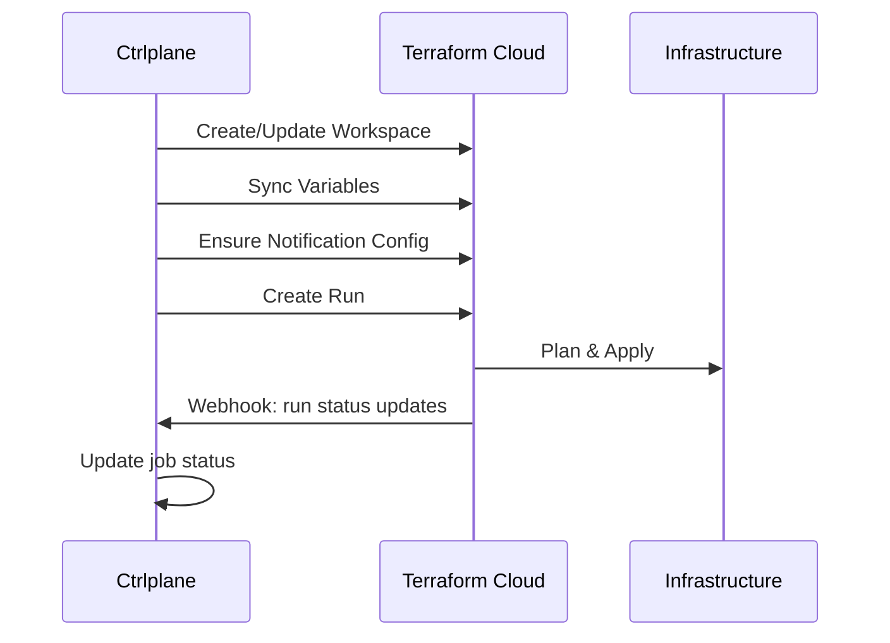

The Terraform Cloud job agent creates workspaces and triggers runs, enabling
infrastructure-as-code deployments with webhook-based status tracking.

## How It Works


```mermaid
sequenceDiagram
    participant C as Ctrlplane
    participant T as Terraform Cloud
    participant I as Infrastructure

    C->>T: Create/Update Workspace
    C->>T: Sync Variables
    C->>T: Ensure Notification Config
    C->>T: Create Run
    T->>I: Plan & Apply
    T->>C: Webhook: run status updates
    C->>C: Update job status
```

1. Ctrlplane renders a workspace configuration from your template
2. The workspace is created or updated via Terraform Cloud API
3. Variables are synced to match your template
4. A webhook notification configuration (`ctrlplane-webhook`) is created on the workspace (idempotent)
5. A run is triggered with auto-apply
6. Terraform Cloud sends webhook notifications as the run progresses
7. The ctrlplane API receives webhooks and updates job status in the database

This is a **fire-and-forget** dispatch model — the workspace-engine does not poll
or maintain long-running goroutines. Status tracking is handled entirely by
TFC webhooks, making it resilient to engine restarts.

## Prerequisites

- Terraform Cloud or Terraform Enterprise account
- API token with workspace, run, and notification configuration permissions
- VCS connection (optional, for Git-based workflows)
- A reachable webhook endpoint (the ctrlplane API must be accessible from TFC)

## Configuration

### Job Agent Setup

Create a job agent with type `tfe`:

```yaml
type: JobAgent
name: terraform-cloud
agentType: tfe
```

### Deployment Configuration

```yaml
type: Deployment
name: infrastructure
jobAgent: terraform-cloud
jobAgentConfig:
  organization: your-org
  address: https://app.terraform.io
  webhookUrl: https://ctrlplane.example.com/api/tfe/webhook
  triggerRunOnChange: true
  template: |
    name: {{.deployment.slug}}-{{.resource.identifier}}
    description: "Managed by Ctrlplane"
    execution_mode: remote
    auto_apply: true
    terraform_version: "1.6.0"
    working_directory: environments/{{.environment.name}}
    vcs_repo:
      identifier: your-org/infrastructure
      branch: main
      oauth_token_id: ot-xxxxxxxxxx
    variables:
      - key: environment
        value: {{.environment.name}}
        category: terraform
      - key: version
        value: {{.version.tag}}
        category: terraform
```

| Field                | Required | Default | Description                                                                 |
| -------------------- | -------- | ------- | --------------------------------------------------------------------------- |
| `organization`       | Yes      |         | Terraform Cloud organization                                                |
| `address`            | Yes      |         | Terraform Cloud/Enterprise URL                                              |
| `template`           | Yes      |         | Go template for workspace configuration                                     |
| `webhookUrl`         | Yes      |         | Ctrlplane API endpoint for TFC notifications (e.g. `https://ctrlplane.example.com/api/tfe/webhook`) |
| `triggerRunOnChange` | No       | `true`  | Whether to create a TFC run on dispatch. When `false`, only the workspace and variables are synced. |

### Environment Variables

| Variable             | Where            | Description                                              |
| -------------------- | ---------------- | -------------------------------------------------------- |
| `TFE_TOKEN`          | Workspace Engine | Terraform Cloud API token for authenticating API calls   |
| `TFE_WEBHOOK_SECRET` | API              | HMAC secret for verifying incoming TFC webhooks          |
| `TFE_WEBHOOK_SECRET` | Workspace Engine | Same secret, used when creating notification configs on TFC |

Both the API and workspace-engine must share the same `TFE_WEBHOOK_SECRET`.

## Webhook Status Mapping

When TFC sends a notification, the webhook handler maps the trigger to a
ctrlplane job status:

| TFC Trigger          | Example Run Status        | Ctrlplane Status  |
| -------------------- | ------------------------- | ----------------- |
| `run:created`        | pending                   | `pending`         |
| `run:planning`       | planning                  | `inProgress`      |
| `run:needs_attention`| planned (confirmable), policy_override | `actionRequired` |
| `run:applying`       | applying                  | `inProgress`      |
| `run:completed`      | applied, planned_and_finished | `successful`   |
| `run:errored`        | errored                   | `failure`         |

## Workspace Template

The template defines the Terraform Cloud workspace:

| Field               | Type   | Description                      |
| ------------------- | ------ | -------------------------------- |
| `name`              | string | Workspace name (required)        |
| `description`       | string | Workspace description            |
| `execution_mode`    | string | `remote`, `local`, or `agent`    |
| `auto_apply`        | bool   | Auto-apply after plan            |
| `terraform_version` | string | Terraform version to use         |
| `working_directory` | string | Subdirectory for Terraform files |
| `vcs_repo`          | object | VCS repository settings          |
| `variables`         | array  | Workspace variables              |

### VCS Repository Settings

```yaml
vcs_repo:
  identifier: org/repo
  branch: main
  oauth_token_id: ot-xxxxxxxxxx
  ingress_submodules: false
  tags_regex: ""
```

### Variable Configuration

```yaml
variables:
  - key: aws_region
    value: us-east-1
    category: terraform # or "env"
    hcl: false
    sensitive: false
    description: "AWS region"
```

## Template Context

The template has access to the full dispatch context:

| Variable       | Description                         |
| -------------- | ----------------------------------- |
| `.deployment`  | Deployment details                  |
| `.environment` | Environment details                 |
| `.resource`    | Target resource (config, metadata)  |
| `.release`     | Release details                     |
| `.version`     | Deployment version (tag, name)      |
| `.variables`   | Merged deployment variables         |

## `triggerRunOnChange: false`

When `triggerRunOnChange` is set to `false`, the dispatcher will:

1. Upsert the workspace
2. Sync variables
3. Ensure the notification config exists
4. **Skip** creating a run

This is useful when you want VCS pushes to trigger runs instead of ctrlplane
creating them directly. The webhook notification config is still created so
that run status updates flow back to ctrlplane.

> **Note:** Correlating VCS-triggered runs back to ctrlplane jobs (by workspace
> name/ID instead of run ID) is a planned follow-up.

## Example: Multi-Environment Infrastructure

```yaml
type: Deployment
name: vpc-infrastructure
jobAgent: terraform-cloud
jobAgentConfig:
  organization: "{{.variables.tfe_org}}"
  address: "{{.variables.tfe_address}}"
  webhookUrl: "{{.variables.ctrlplane_webhook_url}}"
  template: |
    name: vpc-{{.environment.name}}-{{.resource.metadata.region}}
    description: "VPC for {{.environment.name}} in {{.resource.metadata.region}}"
    execution_mode: remote
    auto_apply: {{if eq .environment.name "production"}}false{{else}}true{{end}}
    terraform_version: "1.6.0"
    working_directory: modules/vpc

    vcs_repo:
      identifier: {{.variables.github_org}}/infrastructure
      branch: {{.version.tag}}
      oauth_token_id: {{.variables.vcs_oauth_token}}

    variables:
      - key: environment
        value: {{.environment.name}}
        category: terraform
      - key: region
        value: {{.resource.metadata.region}}
        category: terraform
      - key: vpc_cidr
        value: {{.resource.config.vpc_cidr}}
        category: terraform
      - key: AWS_ACCESS_KEY_ID
        value: {{.variables.aws_access_key}}
        category: env
        sensitive: true
      - key: AWS_SECRET_ACCESS_KEY
        value: {{.variables.aws_secret_key}}
        category: env
        sensitive: true
```

## Example: Agent-Based Execution

For private infrastructure, use agent execution mode:

```yaml
template: |
  name: private-{{.resource.identifier}}
  execution_mode: agent
  agent_pool_id: {{.variables.agent_pool_id}}
  auto_apply: true

  variables:
    - key: target_host
      value: {{.resource.config.host}}
      category: terraform
```

## Terraform Provider Configuration

When using the ctrlplane Terraform provider:

```hcl
resource "ctrlplane_job_agent" "tfc" {
  name = "terraform-cloud"

  terraform_cloud {
    address            = "https://app.terraform.io"
    organization       = "your-org"
    webhook_url        = "https://ctrlplane.example.com/api/tfe/webhook"
    trigger_run_on_change = true
    template           = file("workspace-template.yaml")
  }
}
```

## Troubleshooting

### Workspace creation fails

- Verify organization name is correct
- Check API token has workspace:write permission
- Ensure workspace name is valid (alphanumeric, hyphens, underscores)

### VCS connection errors

- Verify OAuth token ID is correct
- Check repository exists and is accessible
- Ensure branch or tag exists

### Run fails to start

- Check workspace has valid configuration
- Verify VCS connection is working
- Review workspace settings in Terraform Cloud UI

### Variables not updating

- Verify variable keys match expected format
- Check for duplicate variable definitions
- Sensitive variables won't show values in UI

### Webhook returns 401

- Check `TFE_WEBHOOK_SECRET` is set on the API
- Verify the same secret was used when creating the notification config on TFC
- Ensure the `x-tfe-notification-signature` header is present

### No webhook notifications received

- Verify the `webhookUrl` is reachable from Terraform Cloud
- Check the notification config exists on the TFC workspace (Settings > Notifications)
- Review TFC's notification delivery log for errors
- For local development, use smee.io or localtunnel to expose your API

### Job stays in `inProgress`

- Verify webhooks are reaching the API (check API logs for `POST /api/tfe/webhook`)
- Check the TFC run status directly in the TFC UI
