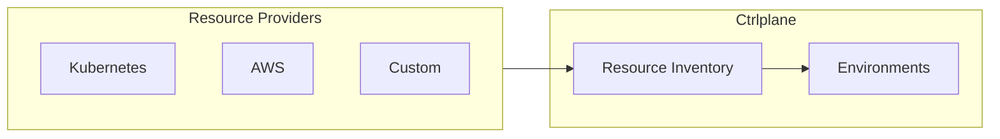

Resource providers automatically discover and sync your infrastructure into
Ctrlplane's resource inventory. This enables dynamic environment targeting based
on resource metadata.

## How It Works



1. Resource providers scan your infrastructure
2. Resources are created/updated in Ctrlplane's inventory
3. Environments use selectors to dynamically match resources
4. When resources change, environments automatically update

## Built-in Providers

### Kubernetes

Sync Kubernetes clusters as resources:

```yaml
type: ResourceProvider
name: kubernetes-clusters
provider: kubernetes
config:
  kubeconfig: /path/to/kubeconfig
  # Or use in-cluster config
  inCluster: true
resourceKind: Kubernetes/Cluster
metadataMapping:
  region: metadata.labels.region
  environment: metadata.labels.environment
  provider: metadata.labels.cloud-provider
```

### AWS

Sync AWS resources:

```yaml
type: ResourceProvider
name: aws-resources
provider: aws
config:
  region: us-east-1
  accessKeyId: "{{.variables.aws_access_key}}"
  secretAccessKey: "{{.variables.aws_secret_key}}"
resources:
  - type: ec2:instance
    resourceKind: AWS/EC2
  - type: lambda:function
    resourceKind: AWS/Lambda
  - type: ecs:cluster
    resourceKind: AWS/ECS
```

## Custom Resource Providers

Create custom providers using the Ctrlplane API or SDK.

### Using the API

```bash
# Create or update a resource
curl -X PUT "https://app.ctrlplane.dev/api/v1/workspaces/{workspaceId}/resources" \
  -H "Authorization: Bearer $CTRLPLANE_API_KEY" \
  -H "Content-Type: application/json" \
  -d '{
    "identifier": "my-server-1",
    "name": "Production Server 1",
    "kind": "Server",
    "version": "1.0.0",
    "metadata": {
      "environment": "production",
      "region": "us-east-1",
      "team": "platform"
    },
    "config": {
      "host": "10.0.1.100",
      "port": 22
    }
  }'
```

### Using the Node.js SDK

```typescript
import { Ctrlplane } from "@ctrlplane/node-sdk";

const client = new Ctrlplane({ apiKey: process.env.CTRLPLANE_API_KEY });

// Sync resources from your infrastructure
async function syncResources() {
  const servers = await discoverServers(); // Your discovery logic

  for (const server of servers) {
    await client.resources.upsert({
      workspaceId: "your-workspace-id",
      identifier: server.id,
      name: server.hostname,
      kind: "Server",
      version: "1.0.0",
      metadata: {
        environment: server.environment,
        region: server.region,
        team: server.team,
      },
      config: {
        host: server.ip,
        port: 22,
      },
    });
  }
}
```

### Using a Script

Run a script periodically to sync resources:

```bash
#!/bin/bash
# sync-resources.sh

# Discover resources (example: from cloud provider)
INSTANCES=$(aws ec2 describe-instances --query 'Reservations[].Instances[]')

# Sync each instance to Ctrlplane
echo "$INSTANCES" | jq -c '.[]' | while read instance; do
  INSTANCE_ID=$(echo "$instance" | jq -r '.InstanceId')
  NAME=$(echo "$instance" | jq -r '.Tags[] | select(.Key=="Name") | .Value')
  ENV=$(echo "$instance" | jq -r '.Tags[] | select(.Key=="Environment") | .Value')
  REGION=$(echo "$instance" | jq -r '.Placement.AvailabilityZone' | sed 's/.$//')

  curl -X PUT "https://app.ctrlplane.dev/api/v1/workspaces/${WORKSPACE_ID}/resources" \
    -H "Authorization: Bearer ${CTRLPLANE_API_KEY}" \
    -H "Content-Type: application/json" \
    -d "{
      \"identifier\": \"${INSTANCE_ID}\",
      \"name\": \"${NAME}\",
      \"kind\": \"AWS/EC2\",
      \"version\": \"1.0.0\",
      \"metadata\": {
        \"environment\": \"${ENV}\",
        \"region\": \"${REGION}\"
      }
    }"
done
```

## Resource Schema

| Field        | Required | Description                                |
| ------------ | -------- | ------------------------------------------ |
| `identifier` | Yes      | Unique identifier for the resource         |
| `name`       | Yes      | Human-readable name                        |
| `kind`       | Yes      | Resource type (e.g., `Kubernetes/Cluster`) |
| `version`    | Yes      | Resource version/schema version            |
| `metadata`   | No       | Key-value pairs for filtering              |
| `config`     | No       | Configuration data for job agents          |

### Metadata vs Config

- **Metadata**: Used for filtering and environment selectors
- **Config**: Passed to job agents for deployment execution

```yaml
# Good: metadata for filtering
metadata:
  environment: production
  region: us-east-1
  team: platform

# Good: config for deployment details
config:
  kubeconfig: "base64-encoded-config"
  namespace: my-app
  server: https://k8s.example.com
```

## Environment Selectors

Environments use selectors to match resources:

```yaml
type: Environment
name: Production US-East
resourceSelector: |
  resource.metadata["environment"] == "production" &&
  resource.metadata["region"] == "us-east-1"
```

When resources are added or updated, environments automatically re-evaluate
their selectors.

## Resource Lifecycle

### Creating Resources

Resources are created via the API. Duplicate identifiers update the existing
resource.

### Updating Resources

When resource metadata or config changes, Ctrlplane:

1. Updates the resource in the inventory
2. Re-evaluates environment selectors
3. Updates release targets if needed

### Deleting Resources

```bash
curl -X DELETE \
  "https://app.ctrlplane.dev/api/v1/resources/{resourceId}" \
  -H "Authorization: Bearer $CTRLPLANE_API_KEY"
```

When a resource is deleted:

1. It's removed from all environments
2. Active releases are marked as orphaned
3. Jobs are not automatically canceled (handle gracefully)

## Best Practices

### Use Consistent Naming

```yaml
# Good: consistent kind naming
kind: Kubernetes/Cluster
kind: AWS/Lambda
kind: GCP/CloudRun

# Bad: inconsistent
kind: k8s
kind: aws-lambda
kind: cloud-run
```

### Include Essential Metadata

```yaml
metadata:
  environment: production # Required for environment selection
  region: us-east-1 # Useful for regional deployments
  team: platform # Useful for access control
  cost-center: eng-123 # Useful for tracking
```

### Keep Config Minimal

Only include config needed for deployments:

```yaml
# Good: minimal config
config:
  namespace: my-app
  cluster_url: https://k8s.example.com

# Bad: too much config
config:
  namespace: my-app
  cluster_url: https://k8s.example.com
  all_pods: [...]  # Don't include large datasets
  cluster_metrics: {...}  # Don't include monitoring data
```

### Sync Frequently

Run resource sync on a schedule to keep inventory current:

```yaml
# Kubernetes CronJob example
apiVersion: batch/v1
kind: CronJob
metadata:
  name: sync-resources
spec:
  schedule: "*/5 * * * *" # Every 5 minutes
  jobTemplate:
    spec:
      template:
        spec:
          containers:
            - name: sync
              image: your-sync-image
              command: ["/sync-resources.sh"]
          restartPolicy: OnFailure
```
