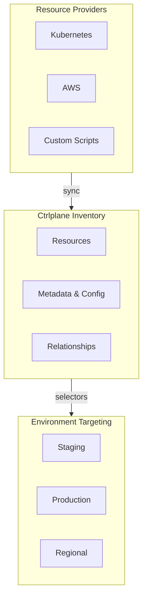

Ctrlplane's inventory system provides a centralized view of all your
infrastructure resources with custom relationships and dynamic grouping.

## What is the Inventory?

The inventory is a real-time database of your deployment targets — Kubernetes
clusters, cloud functions, VMs, databases, or any custom infrastructure. It
enables:

- **Unified visibility** across providers (AWS, GCP, Kubernetes, custom)
- **Dynamic environments** that automatically include matching resources
- **Custom relationships** to model dependencies and ownership
- **Rich metadata** for filtering, grouping, and automation



## Core Concepts

<CardGroup cols={2}>
  <Card title="Resources" icon="server" href="../concepts/resources">
    Deployment targets with metadata and configuration
  </Card>
  <Card title="Environments" icon="layer-group" href="../concepts/environments">
    Dynamic groups of resources using selectors
  </Card>
  <Card title="Relationships" icon="diagram-project" href="./relationships">
    Model dependencies between resources
  </Card>
  <Card title="Selectors" icon="filter" href="../concepts/selectors">
    Query language for matching resources
  </Card>
  <Card
    title="Resource Providers"
    icon="rotate"
    href="../integrations/resource-providers/overview"
  >
    Sync infrastructure into the inventory
  </Card>
</CardGroup>

## How It Works

### 1. Resources are Synced

Resources are synced into Ctrlplane via resource providers or API:

```yaml
type: Resource
name: production-cluster-us-east
kind: KubernetesCluster
identifier: k8s-prod-useast1
metadata:
  environment: production
  region: us-east-1
  team: platform
config:
  server: https://k8s.example.com
  namespace: default
```

### 2. Environments Match Resources

Environments use selectors to dynamically include resources:

```yaml
type: Environment
name: Production US-East
resourceSelector: |
  resource.metadata["environment"] == "production" &&
  resource.metadata["region"] == "us-east-1"
```

When new resources are added that match the selector, they're automatically
included in the environment.

### 3. Deployments Target Environments

Deployments create release targets for each resource in each environment:

```
Deployment × Environment × Resource = Release Target
```

## Key Benefits

| Benefit                    | Description                                        |
| -------------------------- | -------------------------------------------------- |
| **Single source of truth** | All resources visible in one place                 |
| **Dynamic targeting**      | Environments auto-update as infrastructure changes |
| **Rich metadata**          | Filter and group by any attribute                  |
| **Cross-provider**         | Kubernetes, cloud, and custom in one view          |

## Next Steps

- [Resources](../concepts/resources) — Understand resource structure and
  lifecycle
- [Relationships](./relationships) — Model dependencies between resources
- [Environments](../concepts/environments) — Create dynamic resource groups
- [Selectors](../concepts/selectors) — Write powerful resource queries
- [Resource Providers](../integrations/resource-providers/overview) — Sync your
  infrastructure
