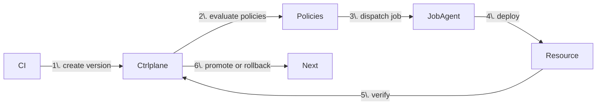
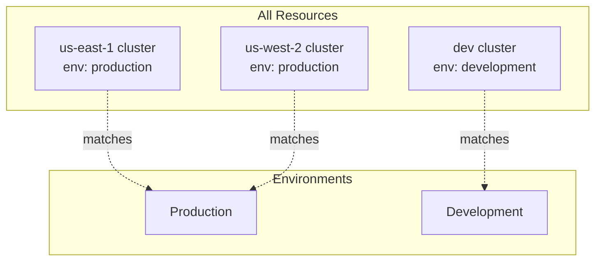
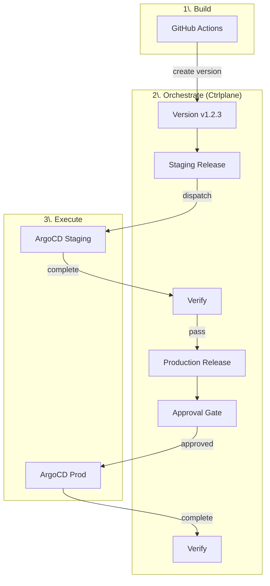

## The Core Flow

Every deployment in Ctrlplane follows this flow:



1. **CI creates a version** — After building, your CI tells Ctrlplane about the new version
2. **Policies are evaluated** — Ctrlplane checks if approvals, dependencies, and gates are satisfied
3. **Job is dispatched** — Ctrlplane tells your job agent (ArgoCD, GitHub Actions, etc.) to deploy
4. **Deployment executes** — The job agent performs the actual deployment
5. **Verification runs** — Ctrlplane checks metrics (Datadog, Prometheus, HTTP) to confirm health
6. **Promote or rollback** — If verification passes, continue; if it fails, roll back

## The Key Entities

You only need to understand 5 things:

| Entity | What It Is | Example |
|--------|-----------|---------|
| **Resource** | A deployment target | `prod-us-east-1` K8s cluster |
| **Environment** | A group of resources | "Production" = all clusters with `env: prod` |
| **Deployment** | A service you deploy | "API Gateway" |
| **Version** | A specific build | `v1.2.3` or `sha-abc123` |
| **Policy** | Rules for deployment | "Require approval for production" |

### How They Connect

```
Deployment × Environment × Resource = Release Target
```

When you deploy "API Gateway" to "Production" (which has 3 clusters), Ctrlplane creates 3 **release targets**:
- API Gateway → Production → us-east-1
- API Gateway → Production → us-west-2
- API Gateway → Production → eu-west-1

Each release target can have its own policies, verification, and rollout timing.

## Dynamic Environments

Environments use **selectors** to automatically include resources:

```yaml
type: Environment
name: Production
resourceSelector: resource.metadata["env"] == "production"
```

When you add a new cluster with `env: production` metadata, it automatically becomes part of the Production environment. No config changes needed.



## Policies Control Everything

Policies define rules for when deployments can happen:

| Policy | What It Does |
|--------|-------------|
| **Approval** | Require sign-off before deploying |
| **Environment Progression** | Wait for staging before prod |
| **Gradual Rollout** | Deploy to targets one at a time |
| **Verification** | Check Datadog/Prometheus metrics |
| **Deployment Window** | Only deploy during certain hours |

Policies use selectors to target specific releases:

```yaml
type: Policy
name: production-approval-policy
description: Production Approval Policy
selectors:
  - environments: environment.metadata['requires-approval'] == 'true'
rules:
  - approval:
      required: 1
```

## Job Agents Execute Deployments

Ctrlplane doesn't deploy directly—it tells **job agents** what to do:

| Agent | What It Does |
|-------|-------------|
| **GitHub Actions** | Triggers workflow dispatch |
| **ArgoCD** | Creates/syncs ArgoCD Applications |
| **Terraform Cloud** | Triggers Terraform runs |
| **Kubernetes** | Applies manifests directly |

This means Ctrlplane works with your existing deployment tooling.

## A Complete Example



1. GitHub Actions builds `v1.2.3` and creates a version in Ctrlplane
2. Ctrlplane creates a release for staging
3. ArgoCD deploys to staging
4. Verification checks Datadog metrics
5. Staging passes → production release is unblocked
6. Production requires approval → team lead approves
7. ArgoCD deploys to production
8. Verification confirms production is healthy

## What's Next?

<CardGroup cols={2}>
  <Card title="Quickstart" icon="rocket" href="./quickstart">
    Build this pipeline yourself in 15 minutes
  </Card>
  <Card title="Use Cases" icon="lightbulb" href="./use-cases/multi-region">
    See specific deployment scenarios
  </Card>
</CardGroup>
