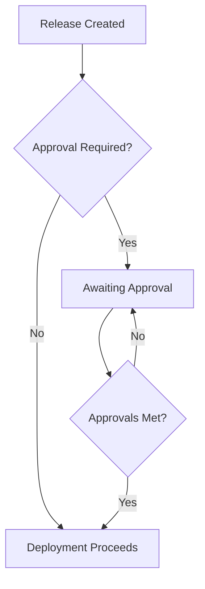

**Approval rules** require manual approval from authorized users before a
deployment can proceed. This adds a human checkpoint to your deployment pipeline
for high-risk changes.

## Overview



## Why Use Approval Rules?

Approval rules help you:

- **Add human oversight** - Require sign-off for production deployments
- **Enforce compliance** - Meet regulatory requirements for change management
- **Coordinate releases** - Ensure stakeholders are aware before deployment
- **Reduce risk** - Catch issues that automated checks might miss

## Configuration

<Tabs>
<Tab title="Terraform">
```hcl
resource "ctrlplane_policy" "production_approval" {
  name        = "Production Approval Policy"
  description = "Require approval for production deployments"

  selector = "environment.metadata['requires-approval'] == 'true'"

  any_approval {
    min_approvals = 1
  }
}
```
</Tab>
<Tab title="API">
```bash
curl -X POST https://api.ctrlplane.com/v1/workspaces/{workspaceId}/policies \
  -H "Authorization: Bearer $TOKEN" \
  -H "Content-Type: application/json" \
  -d '{
    "name": "Production Approval Policy",
    "description": "Require approval for production deployments",
    "selector": "environment.metadata['\''requires-approval'\''] == '\''true'\''",
    "rules": [
      {
        "anyApproval": {
          "minApprovals": 1
        }
      }
    ]
  }'
```
</Tab>
</Tabs>

## Properties

<ParamField path="anyApproval.minApprovals" type="integer" required>
  Minimum number of approvals required before the deployment can proceed.
</ParamField>

## Grandfathering

Versions that were created **before** an approval rule was added to a policy are
automatically allowed through (grandfathered in). This prevents newly added
approval rules from blocking already-in-flight releases.

## Common Patterns

### Single Approval for Production

Basic approval gate for production deployments:

<Tabs>
<Tab title="Terraform">
```hcl
resource "ctrlplane_policy" "production_gate" {
  name     = "Production Gate Policy"
  selector = "environment.metadata['requires-approval'] == 'true'"

  any_approval {
    min_approvals = 1
  }
}
```
</Tab>
<Tab title="API">
```json
{
  "name": "Production Gate Policy",
  "selector": "environment.metadata['requires-approval'] == 'true'",
  "rules": [
    {
      "anyApproval": { "minApprovals": 1 }
    }
  ]
}
```
</Tab>
</Tabs>

### Multiple Approvals for Critical Services

Require multiple sign-offs for high-risk deployments:

<Tabs>
<Tab title="Terraform">
```hcl
resource "ctrlplane_policy" "critical_service_approval" {
  name     = "Critical Service Approval Policy"
  selector = "environment.metadata['requires-approval'] == 'true'"

  any_approval {
    min_approvals = 2
  }
}
```
</Tab>
<Tab title="API">
```json
{
  "name": "Critical Service Approval Policy",
  "selector": "environment.metadata['requires-approval'] == 'true'",
  "rules": [
    {
      "anyApproval": { "minApprovals": 2 }
    }
  ]
}
```
</Tab>
</Tabs>

### Approval with Gradual Rollout

Approve once, then roll out gradually:

<Tabs>
<Tab title="Terraform">
```hcl
resource "ctrlplane_policy" "controlled_production_release" {
  name     = "Controlled Production Release"
  selector = "environment.metadata['requires-approval'] == 'true'"

  any_approval {
    min_approvals = 1
  }

  gradual_rollout {
    rollout_type        = "linear"
    time_scale_interval = 300
  }
}
```
</Tab>
<Tab title="API">
```json
{
  "name": "Controlled Production Release",
  "selector": "environment.metadata['requires-approval'] == 'true'",
  "rules": [
    {
      "anyApproval": { "minApprovals": 1 }
    },
    {
      "gradualRollout": {
        "rolloutType": "linear",
        "timeScaleInterval": 300
      }
    }
  ]
}
```
</Tab>
</Tabs>

## Approval Workflow

### 1. Release Created

When a new release is created that matches an approval policy, it enters an
"awaiting approval" state.

### 2. Approval Requested

Users with appropriate permissions can view pending approvals in the Ctrlplane
UI or via API.

### 3. Approval Granted

Authorized users approve (or reject) the release. Each approval is recorded with
the user and timestamp.

### 4. Deployment Proceeds

Once the required number of approvals is met, the deployment continues through
any remaining policy rules.

## Best Practices

### Environment-Based Approvals

| Environment | Approvals | Notes                        |
| ----------- | --------- | ---------------------------- |
| Development | 0         | No approval needed           |
| QA          | 0         | Automated testing sufficient |
| Staging     | 0-1       | Optional for visibility      |
| Production  | 1-2       | Always require approval      |

### Recommendations

- ✅ Require approvals for production environments
- ✅ Use multiple approvals for critical services
- ✅ Combine with verification for defense in depth
- ✅ Document approval requirements in runbooks
- ✅ Set up notifications for pending approvals

## Next Steps

- [Policies Overview](./overview) - Learn about policy structure
- [Gradual Rollouts](./gradual-rollouts) - Control deployment pace
- [Environment Progression](./environment-progression) - Enforce deployment order
