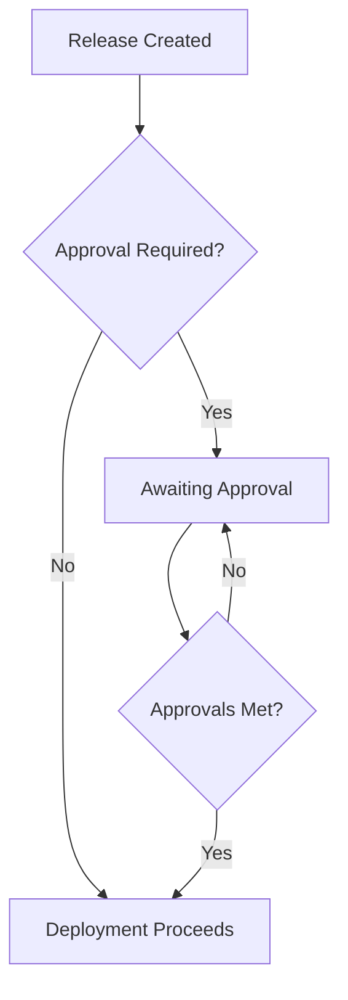

**Approval rules** require manual approval from authorized users before a
deployment can proceed. This adds a human checkpoint to your deployment pipeline
for high-risk changes.

## Overview



## Why Use Approval Rules?

Approval rules help you:

- **Add human oversight** - Require sign-off for production deployments
- **Enforce compliance** - Meet regulatory requirements for change management
- **Coordinate releases** - Ensure stakeholders are aware before deployment
- **Reduce risk** - Catch issues that automated checks might miss

## Configuration

Add an approval rule to your policy:

```yaml
policies:
  - name: production-approval
    selectors:
      - environment: environment.name == "production"
    rules:
      - approval:
          required: 1
```

## Properties

| Property   | Type    | Required | Description                 |
| ---------- | ------- | -------- | --------------------------- |
| `required` | integer | Yes      | Minimum number of approvals |

## Common Patterns

### Single Approval for Production

Basic approval gate for production deployments:

```yaml
policies:
  - name: production-gate
    selectors:
      - environment: environment.name == "production"
    rules:
      - approval:
          required: 1
```

### Multiple Approvals for Critical Services

Require multiple sign-offs for high-risk deployments:

```yaml
policies:
  - name: critical-service-approval
    selectors:
      - deployment: deployment.metadata.tier == "critical"
      - environment: environment.name == "production"
    rules:
      - approval:
          required: 2
```

### Approval with Verification

Combine approval with post-deployment verification:

```yaml
policies:
  - name: production-full-gates
    selectors:
      - environment: environment.name == "production"
    rules:
      - approval:
          required: 1
      - verification:
          metrics:
            - name: health-check
              interval: 30s
              count: 5
              provider:
                type: http
                url: "http://{{.resource.name}}/health"
              successCondition: result.ok
```

### Approval with Gradual Rollout

Approve once, then roll out gradually:

```yaml
policies:
  - name: controlled-production-release
    selectors:
      - environment: environment.name == "production"
    rules:
      - approval:
          required: 1
      - gradualRollout:
          rolloutType: linear
          timeScaleInterval: 300
```

## Approval Workflow

### 1. Release Created

When a new release is created that matches an approval policy, it enters an
"awaiting approval" state.

### 2. Approval Requested

Users with appropriate permissions can view pending approvals in the Ctrlplane
UI or via API.

### 3. Approval Granted

Authorized users approve (or reject) the release. Each approval is recorded with
the user and timestamp.

### 4. Deployment Proceeds

Once the required number of approvals is met, the deployment continues through
any remaining policy rules.

## Best Practices

### Environment-Based Approvals

| Environment | Approvals | Notes                        |
| ----------- | --------- | ---------------------------- |
| Development | 0         | No approval needed           |
| QA          | 0         | Automated testing sufficient |
| Staging     | 0-1       | Optional for visibility      |
| Production  | 1-2       | Always require approval      |

### Recommendations

- ✅ Require approvals for production environments
- ✅ Use multiple approvals for critical services
- ✅ Combine with verification for defense in depth
- ✅ Document approval requirements in runbooks
- ✅ Set up notifications for pending approvals

## Next Steps

- [Policies Overview](./overview) - Learn about policy structure
- [Verification](./verification) - Add automated health checks
- [Gradual Rollouts](./gradual-rollouts) - Control deployment pace
