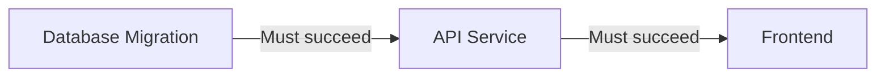

**Deployment dependency rules** ensure that one deployment succeeds before
another can proceed. Use them to coordinate related services, enforce deployment
order across microservices, or manage infrastructure dependencies.

## Overview



## Why Use Deployment Dependencies?

Deployment dependency rules help you:

- **Coordinate services** - Deploy database before API, API before frontend
- **Manage infrastructure** - Infrastructure changes before application updates
- **Enforce order** - Shared libraries before dependent services
- **Reduce failures** - Prevent cascading failures from out-of-order deploys

## Configuration

<Tabs>
<Tab title="Terraform">
```hcl
resource "ctrlplane_policy" "api_requires_database" {
  name     = "API Requires Database"
  selector = "deployment.name == 'api-service'"

  deployment_dependency {
    depends_on_selector = "deployment.name == 'database-migration'"
  }
}
```
</Tab>
<Tab title="API">
```bash
curl -X POST https://api.ctrlplane.com/v1/workspaces/{workspaceId}/policies \
  -H "Authorization: Bearer $TOKEN" \
  -H "Content-Type: application/json" \
  -d '{
    "name": "API Requires Database",
    "selector": "deployment.name == '\''api-service'\''",
    "rules": [
      {
        "deploymentDependency": {
          "dependsOn": "deployment.name == '\''database-migration'\''"
        }
      }
    ]
  }'
```
</Tab>
</Tabs>

## Properties

<ParamField path="deploymentDependency.dependsOn" type="string" required>
  CEL expression to match upstream release targets that must exist before this
  deployment can proceed. The expression can reference both **deployment** and
  **version** properties of the currently deployed upstream release.
</ParamField>

### Available CEL Variables

The `dependsOn` expression is evaluated against each release target on the same
resource that has a successful release. Both `deployment.*` and `version.*`
fields are available:

| Variable | Type | Description |
|---|---|---|
| `deployment.id` | string | Deployment ID |
| `deployment.name` | string | Deployment name |
| `deployment.slug` | string | Deployment slug |
| `deployment.metadata` | map | Deployment metadata key-value pairs |
| `version.id` | string | Deployed version ID |
| `version.tag` | string | Version tag (e.g. `v2.1.0`) |
| `version.name` | string | Version name |
| `version.status` | string | Version status |
| `version.metadata` | map | Version metadata key-value pairs |
| `version.createdAt` | timestamp | When the version was created |

## How It Works

1. **Release created** - A new version is released for a deployment with
   dependency rules.
2. **Same-resource resolution** - Ctrlplane finds all release targets on the
   **same resource** as the current target.
3. **Version resolution** - For each release target, Ctrlplane resolves the
   deployment and its currently deployed version (from the latest successful
   job).
4. **CEL evaluation** - The `dependsOn` expression is evaluated against each
   `{deployment, version}` pair.
5. **Deployment allowed** - If at least one upstream release target matches the
   selector, the deployment can proceed.

## Common Patterns

### Database Before API

Ensure database migrations complete before API deploys:

<Tabs>
<Tab title="Terraform">
```hcl
resource "ctrlplane_policy" "api_requires_db" {
  name     = "API Requires DB Migration"
  selector = "deployment.name == 'api-service'"

  deployment_dependency {
    depends_on_selector = "deployment.name == 'database-migration'"
  }
}
```
</Tab>
<Tab title="API">
```json
{
  "name": "API Requires DB Migration",
  "selector": "deployment.name == 'api-service'",
  "rules": [
    {
      "deploymentDependency": {
        "dependsOn": "deployment.name == 'database-migration'"
      }
    }
  ]
}
```
</Tab>
</Tabs>

### Service Dependency Chain

Create a chain of dependencies:

<Tabs>
<Tab title="Terraform">
```hcl
resource "ctrlplane_policy" "api_depends_on_db" {
  name     = "API Depends on DB"
  selector = "deployment.name == 'api-service'"

  deployment_dependency {
    depends_on_selector = "deployment.name == 'database-migration'"
  }
}

resource "ctrlplane_policy" "frontend_depends_on_api" {
  name     = "Frontend Depends on API"
  selector = "deployment.name == 'frontend'"

  deployment_dependency {
    depends_on_selector = "deployment.name == 'api-service'"
  }
}
```
</Tab>
<Tab title="API">
```json
[
  {
    "name": "API Depends on DB",
    "selector": "deployment.name == 'api-service'",
    "rules": [
      {
        "deploymentDependency": {
          "dependsOn": "deployment.name == 'database-migration'"
        }
      }
    ]
  },
  {
    "name": "Frontend Depends on API",
    "selector": "deployment.name == 'frontend'",
    "rules": [
      {
        "deploymentDependency": {
          "dependsOn": "deployment.name == 'api-service'"
        }
      }
    ]
  }
]
```
</Tab>
</Tabs>

### Shared Library Dependencies

Ensure shared libraries are deployed before dependent services:

```hcl
resource "ctrlplane_policy" "services_require_shared_lib" {
  name     = "Services Require Shared Lib"
  selector = "deployment.metadata['usesSharedLib'] == 'true'"

  deployment_dependency {
    depends_on_selector = "deployment.metadata['type'] == 'shared-library'"
  }
}
```

### Version-Scoped Dependencies

Require a specific version range of an upstream deployment:

<Tabs>
<Tab title="Terraform">
```hcl
resource "ctrlplane_policy" "api_requires_db_v2" {
  name     = "API Requires DB Migration v2"
  selector = "deployment.name == 'api-service'"

  deployment_dependency {
    depends_on_selector = "deployment.name == 'database-migration' && version.tag.startsWith('v2.')"
  }
}
```
</Tab>
<Tab title="API">
```json
{
  "name": "API Requires DB Migration v2",
  "selector": "deployment.name == 'api-service'",
  "rules": [
    {
      "deploymentDependency": {
        "dependsOn": "deployment.name == 'database-migration' && version.tag.startsWith('v2.')"
      }
    }
  ]
}
```
</Tab>
</Tabs>

### Version Metadata Filtering

Depend on an upstream deployment running a version with specific metadata:

```hcl
resource "ctrlplane_policy" "frontend_requires_stable_api" {
  name     = "Frontend Requires Stable API"
  selector = "deployment.name == 'frontend'"

  deployment_dependency {
    depends_on_selector = "deployment.name == 'api-service' && version.metadata.channel == 'stable'"
  }
}
```

### Infrastructure First

Deploy infrastructure changes before application updates:

```hcl
resource "ctrlplane_policy" "app_requires_infrastructure" {
  name     = "App Requires Infrastructure"
  selector = "deployment.metadata['type'] == 'application'"

  deployment_dependency {
    depends_on_selector = "deployment.metadata['type'] == 'infrastructure'"
  }
}
```

### Multi-Service Dependency

Depend on multiple services using CEL `in` operator:

```hcl
resource "ctrlplane_policy" "gateway_requires_services" {
  name     = "Gateway Requires Backend Services"
  selector = "deployment.name == 'api-gateway'"

  deployment_dependency {
    depends_on_selector = "deployment.name in ['auth-service', 'user-service', 'billing-service']"
  }
}
```

## Combining with Other Rules

### With Environment Progression

<Tabs>
<Tab title="Terraform">
```hcl
resource "ctrlplane_policy" "api_full_gates" {
  name     = "API Full Gates"
  selector = "deployment.name == 'api-service' && environment.name == 'production'"

  deployment_dependency {
    depends_on_selector = "deployment.name == 'database-migration'"
  }

  environment_progression {
    depends_on_environment_selector = "environment.name == 'staging'"
  }

  any_approval {
    min_approvals = 1
  }
}
```
</Tab>
<Tab title="API">
```json
{
  "name": "API Full Gates",
  "selector": "deployment.name == 'api-service' && environment.name == 'production'",
  "rules": [
    {
      "deploymentDependency": {
        "dependsOn": "deployment.name == 'database-migration'"
      }
    },
    {
      "environmentProgression": {
        "dependsOnEnvironmentSelector": "environment.name == 'staging'"
      }
    },
    {
      "anyApproval": { "minApprovals": 1 }
    }
  ]
}
```
</Tab>
</Tabs>

### With Gradual Rollout

```hcl
resource "ctrlplane_policy" "frontend_controlled_release" {
  name     = "Frontend Controlled Release"
  selector = "deployment.name == 'frontend'"

  deployment_dependency {
    depends_on_selector = "deployment.name == 'api-service'"
  }

  gradual_rollout {
    rollout_type        = "linear"
    time_scale_interval = 300
  }
}
```

## Best Practices

### Dependency Design

| Pattern                    | Use Case                              |
| -------------------------- | ------------------------------------- |
| Database → API             | Schema changes before code            |
| API → Frontend             | API contracts before consumers        |
| Infrastructure → App       | Platform changes before workloads     |
| Shared lib → Services      | Common code before dependents         |
| Config → Application       | Configuration before apps             |

### Recommendations

- ✅ Keep dependency chains short (2-3 levels max)
- ✅ Use metadata to group related deployments
- ✅ Document why dependencies exist
- ✅ Test dependency resolution in staging
- ✅ Monitor for circular dependency issues

### Anti-Patterns

- ❌ Deep dependency chains (> 3 levels)
- ❌ Circular dependencies (A → B → A)
- ❌ Over-coupling unrelated services
- ❌ Using dependencies when environment progression would suffice

## Troubleshooting

### Deployment Blocked

If a deployment is blocked waiting for dependencies:

1. Check the dependency deployment's status
2. Verify the CEL expression matches the expected deployment
3. Remember that dependencies are resolved **per-resource** -- the upstream
   deployment must have a successful release on the same resource
4. Review the dependency deployment's success status

### Circular Dependencies

If you encounter circular dependency errors:

1. Review the dependency graph
2. Break the cycle by removing one dependency
3. Consider using environment progression instead

## Next Steps

- [Policies Overview](./overview) - Learn about policy structure
- [Environment Progression](./environment-progression) - Cross-environment gates
- [Gradual Rollouts](./gradual-rollouts) - Control deployment pace
