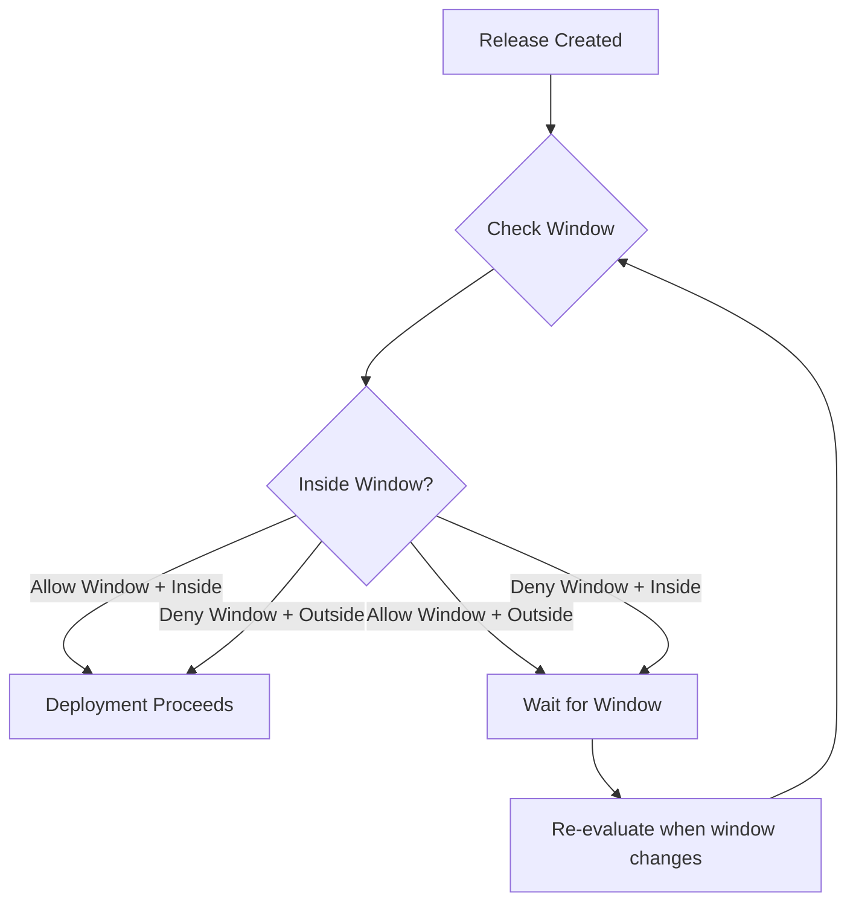

**Deployment window rules** define specific time periods when deployments are
allowed or blocked. Using RFC 5545 recurrence rules (rrules), you can create
flexible schedules like "weekdays 9am-5pm" or "block deployments during
maintenance windows."

## Overview



## Why Use Deployment Windows?

Deployment windows help you:

- **Reduce risk** - Only deploy during business hours when teams are available
- **Coordinate operations** - Block deployments during maintenance windows
- **Meet compliance** - Enforce change control windows required by regulations
- **Protect stability** - Prevent deployments during high-traffic periods

## Configuration

<Tabs>
<Tab title="Terraform">
```hcl
resource "ctrlplane_policy" "business_hours_only" {
  name     = "Business Hours Only"
  selector = "environment.name == 'production'"

  deployment_window {
    rrule            = "FREQ=WEEKLY;BYDAY=MO,TU,WE,TH,FR;BYHOUR=9;BYMINUTE=0"
    duration_minutes = 480
    timezone         = "America/New_York"
    allow_window     = true
  }
}
```
</Tab>
<Tab title="API">
```bash
curl -X POST https://api.ctrlplane.com/v1/workspaces/{workspaceId}/policies \
  -H "Authorization: Bearer $TOKEN" \
  -H "Content-Type: application/json" \
  -d '{
    "name": "Business Hours Only",
    "selector": "environment.name == '\''production'\''",
    "rules": [
      {
        "deploymentWindow": {
          "rrule": "FREQ=WEEKLY;BYDAY=MO,TU,WE,TH,FR;BYHOUR=9;BYMINUTE=0",
          "durationMinutes": 480,
          "timezone": "America/New_York",
          "allowWindow": true
        }
      }
    ]
  }'
```
</Tab>
</Tabs>

## Properties

<ParamField path="deploymentWindow.rrule" type="string" required>
  RFC 5545 recurrence rule defining when windows start.
</ParamField>

<ParamField path="deploymentWindow.durationMinutes" type="integer" required>
  Duration of each window in minutes.
</ParamField>

<ParamField path="deploymentWindow.timezone" type="string" default="UTC">
  IANA timezone for the rrule (e.g., `"America/New_York"`).
</ParamField>

<ParamField path="deploymentWindow.allowWindow" type="boolean" default="true">
  If `true`, deployments are only allowed during the window. If `false`,
  deployments are blocked during the window (deny window).
</ParamField>

## Understanding rrules

RFC 5545 recurrence rules define repeating patterns. Common components:

| Component  | Description             | Example                      |
| ---------- | ----------------------- | ---------------------------- |
| `FREQ`     | Frequency of recurrence | `DAILY`, `WEEKLY`, `MONTHLY` |
| `BYDAY`    | Days of the week        | `MO,TU,WE,TH,FR`             |
| `BYHOUR`   | Hours of the day (0-23) | `9` (9am)                    |
| `BYMINUTE` | Minutes of the hour     | `0`, `30`                    |

### Example rrules

| Pattern                  | rrule                                                  |
| ------------------------ | ------------------------------------------------------ |
| Weekdays at 9am          | `FREQ=WEEKLY;BYDAY=MO,TU,WE,TH,FR;BYHOUR=9;BYMINUTE=0` |
| Daily at 2am             | `FREQ=DAILY;BYHOUR=2;BYMINUTE=0`                       |
| Every Sunday at midnight | `FREQ=WEEKLY;BYDAY=SU;BYHOUR=0;BYMINUTE=0`             |
| First Monday of month    | `FREQ=MONTHLY;BYDAY=1MO;BYHOUR=9;BYMINUTE=0`           |

## Window Types

### Allow Windows

When `allowWindow: true` (default), deployments are **only allowed during** the
defined window:

<Tabs>
<Tab title="Terraform">
```hcl
deployment_window {
  rrule            = "FREQ=WEEKLY;BYDAY=MO,TU,WE,TH,FR;BYHOUR=9;BYMINUTE=0"
  duration_minutes = 480
  timezone         = "America/New_York"
  allow_window     = true
}
```
</Tab>
<Tab title="API">
```json
{
  "deploymentWindow": {
    "rrule": "FREQ=WEEKLY;BYDAY=MO,TU,WE,TH,FR;BYHOUR=9;BYMINUTE=0",
    "durationMinutes": 480,
    "timezone": "America/New_York",
    "allowWindow": true
  }
}
```
</Tab>
</Tabs>

### Deny Windows (Blackouts)

When `allowWindow: false`, deployments are **blocked during** the defined
window:

<Tabs>
<Tab title="Terraform">
```hcl
deployment_window {
  rrule            = "FREQ=WEEKLY;BYDAY=SU;BYHOUR=0;BYMINUTE=0"
  duration_minutes = 360
  timezone         = "America/New_York"
  allow_window     = false
}
```
</Tab>
<Tab title="API">
```json
{
  "deploymentWindow": {
    "rrule": "FREQ=WEEKLY;BYDAY=SU;BYHOUR=0;BYMINUTE=0",
    "durationMinutes": 360,
    "timezone": "America/New_York",
    "allowWindow": false
  }
}
```
</Tab>
</Tabs>

## Common Patterns

### Business Hours Only

Allow deployments only during business hours:

```hcl
resource "ctrlplane_policy" "business_hours_deployments" {
  name     = "Business Hours Deployments"
  selector = "environment.name == 'production'"

  deployment_window {
    rrule            = "FREQ=WEEKLY;BYDAY=MO,TU,WE,TH,FR;BYHOUR=9;BYMINUTE=0"
    duration_minutes = 480
    timezone         = "America/New_York"
  }
}
```

### Maintenance Window Blackout

Block deployments during scheduled maintenance:

```hcl
resource "ctrlplane_policy" "maintenance_blackout" {
  name     = "Maintenance Blackout"
  selector = "environment.name == 'production'"

  deployment_window {
    rrule            = "FREQ=WEEKLY;BYDAY=SU;BYHOUR=2;BYMINUTE=0"
    duration_minutes = 240
    timezone         = "UTC"
    allow_window     = false
  }
}
```

### Weekend Freeze

Prevent deployments over weekends:

```hcl
resource "ctrlplane_policy" "weekend_freeze" {
  name     = "Weekend Freeze"
  selector = "environment.name == 'production'"

  deployment_window {
    rrule            = "FREQ=WEEKLY;BYDAY=SA;BYHOUR=0;BYMINUTE=0"
    duration_minutes = 2880
    timezone         = "America/New_York"
    allow_window     = false
  }
}
```

### Late Night Deployments Only

For services that require off-peak deployments:

```hcl
resource "ctrlplane_policy" "off_peak_deployments" {
  name     = "Off-Peak Deployments"
  selector = "deployment.metadata['requires_off_peak'] == 'true'"

  deployment_window {
    rrule            = "FREQ=DAILY;BYHOUR=2;BYMINUTE=0"
    duration_minutes = 180
    timezone         = "America/New_York"
  }
}
```

### Combined with Other Rules

Use deployment windows alongside other policy rules:

<Tabs>
<Tab title="Terraform">
```hcl
resource "ctrlplane_policy" "production_controlled_release" {
  name     = "Production Controlled Release"
  selector = "environment.name == 'production'"

  any_approval {
    min_approvals = 1
  }

  deployment_window {
    rrule            = "FREQ=WEEKLY;BYDAY=MO,TU,WE,TH,FR;BYHOUR=9;BYMINUTE=0"
    duration_minutes = 480
    timezone         = "America/New_York"
  }

  gradual_rollout {
    rollout_type        = "linear"
    time_scale_interval = 300
  }
}
```
</Tab>
<Tab title="API">
```json
{
  "name": "Production Controlled Release",
  "selector": "environment.name == 'production'",
  "rules": [
    { "anyApproval": { "minApprovals": 1 } },
    {
      "deploymentWindow": {
        "rrule": "FREQ=WEEKLY;BYDAY=MO,TU,WE,TH,FR;BYHOUR=9;BYMINUTE=0",
        "durationMinutes": 480,
        "timezone": "America/New_York",
        "allowWindow": true
      }
    },
    {
      "gradualRollout": {
        "rolloutType": "linear",
        "timeScaleInterval": 300
      }
    }
  ]
}
```
</Tab>
</Tabs>

## Behavior Details

### First Deployment Exemption

If a release target has never had a deployment before, deployment window rules
are bypassed. This ensures that initial deployments are not blocked by window
restrictions.

### Window Evaluation

- Deployments are evaluated against the current time
- If outside an allow window (or inside a deny window), the deployment waits
- Ctrlplane automatically re-evaluates when the window state changes, using the
  computed `nextEvaluationTime`

### Gradual Rollout Integration

When combined with gradual rollout rules:

- **Allow windows**: Rollout start time is adjusted to the next window opening
- **Deny windows**: Individual deployments within a rollout respect the deny
  period

### Timezone Handling

- Always specify a timezone for predictable behavior
- If omitted, UTC is used
- Use IANA timezone names (e.g., "America/New_York", "Europe/London")

## Best Practices

### Environment-Based Windows

| Environment | Window Type             | Notes                        |
| ----------- | ----------------------- | ---------------------------- |
| Development | None                    | Deploy anytime               |
| QA          | None                    | Deploy anytime               |
| Staging     | Optional business hours | Mirror production if desired |
| Production  | Strict business hours   | When support is available    |

### Recommendations

- ✅ Use timezones matching your operational team's location
- ✅ Account for holidays with deny windows
- ✅ Provide adequate window duration for rollouts to complete
- ✅ Combine with approval rules for additional oversight
- ✅ Test rrule patterns in staging before production
- ❌ Don't create windows too narrow for deployments to complete
- ❌ Don't forget to account for gradual rollout duration

## Next Steps

- [Policies Overview](./overview) - Learn about policy structure
- [Gradual Rollouts](./gradual-rollouts) - Control deployment pace
- [Approval](./approval) - Add human approval gates
