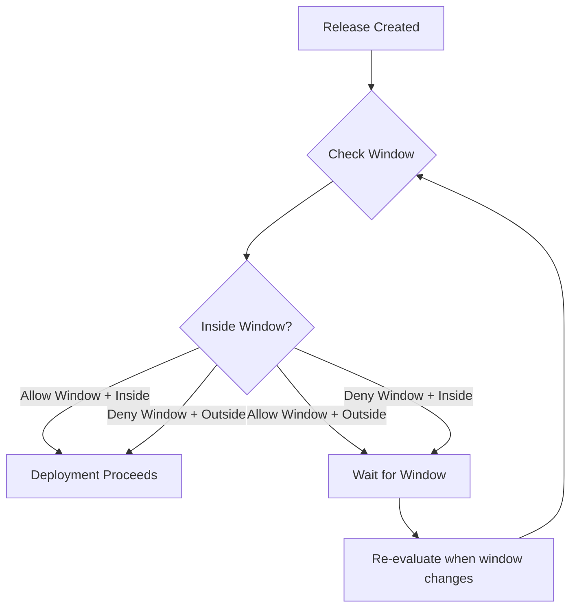

**Deployment window rules** define specific time periods when deployments are
allowed or blocked. Using RFC 5545 recurrence rules (rrules), you can create
flexible schedules like "weekdays 9am-5pm" or "block deployments during
maintenance windows."

## Overview



## Why Use Deployment Windows?

Deployment windows help you:

- **Reduce risk** - Only deploy during business hours when teams are available
- **Coordinate operations** - Block deployments during maintenance windows
- **Meet compliance** - Enforce change control windows required by regulations
- **Protect stability** - Prevent deployments during high-traffic periods

## Configuration

Add a deployment window rule to your policy:

```yaml
policies:
  - name: business-hours-only
    selectors:
      - environment: environment.name == "production"
    rules:
      - deploymentWindow:
          rrule: "FREQ=WEEKLY;BYDAY=MO,TU,WE,TH,FR;BYHOUR=9;BYMINUTE=0"
          durationMinutes: 480 # 8 hours (9am-5pm)
          timezone: "America/New_York"
          allowWindow: true
```

## Properties

| Property          | Type    | Required | Default | Description                                                                                  |
| ----------------- | ------- | -------- | ------- | -------------------------------------------------------------------------------------------- |
| `rrule`           | string  | Yes      | -       | RFC 5545 recurrence rule defining when windows start                                         |
| `durationMinutes` | integer | Yes      | -       | Duration of each window in minutes                                                           |
| `timezone`        | string  | No       | UTC     | IANA timezone for the rrule (e.g., "America/New_York")                                       |
| `allowWindow`     | boolean | No       | true    | If true, deployments only allowed during window. If false, deployments blocked during window |

## Understanding rrules

RFC 5545 recurrence rules define repeating patterns. Common components:

| Component  | Description             | Example                      |
| ---------- | ----------------------- | ---------------------------- |
| `FREQ`     | Frequency of recurrence | `DAILY`, `WEEKLY`, `MONTHLY` |
| `BYDAY`    | Days of the week        | `MO,TU,WE,TH,FR`             |
| `BYHOUR`   | Hours of the day (0-23) | `9` (9am)                    |
| `BYMINUTE` | Minutes of the hour     | `0`, `30`                    |

### Example rrules

| Pattern                  | rrule                                                  |
| ------------------------ | ------------------------------------------------------ |
| Weekdays at 9am          | `FREQ=WEEKLY;BYDAY=MO,TU,WE,TH,FR;BYHOUR=9;BYMINUTE=0` |
| Daily at 2am             | `FREQ=DAILY;BYHOUR=2;BYMINUTE=0`                       |
| Every Sunday at midnight | `FREQ=WEEKLY;BYDAY=SU;BYHOUR=0;BYMINUTE=0`             |
| First Monday of month    | `FREQ=MONTHLY;BYDAY=1MO;BYHOUR=9;BYMINUTE=0`           |

## Window Types

### Allow Windows

When `allowWindow: true` (default), deployments are **only allowed during** the
defined window:

```yaml
rules:
  - deploymentWindow:
      rrule: "FREQ=WEEKLY;BYDAY=MO,TU,WE,TH,FR;BYHOUR=9;BYMINUTE=0"
      durationMinutes: 480
      timezone: "America/New_York"
      allowWindow: true # Deployments only during 9am-5pm weekdays
```

### Deny Windows (Blackouts)

When `allowWindow: false`, deployments are **blocked during** the defined
window:

```yaml
rules:
  - deploymentWindow:
      rrule: "FREQ=WEEKLY;BYDAY=SU;BYHOUR=0;BYMINUTE=0"
      durationMinutes: 360
      timezone: "America/New_York"
      allowWindow: false # Block deployments Sunday 12am-6am
```

## Common Patterns

### Business Hours Only

Allow deployments only during business hours:

```yaml
policies:
  - name: business-hours-deployments
    selectors:
      - environment: environment.name == "production"
    rules:
      - deploymentWindow:
          rrule: "FREQ=WEEKLY;BYDAY=MO,TU,WE,TH,FR;BYHOUR=9;BYMINUTE=0"
          durationMinutes: 480
          timezone: "America/New_York"
```

### Maintenance Window Blackout

Block deployments during scheduled maintenance:

```yaml
policies:
  - name: maintenance-blackout
    selectors:
      - environment: environment.name == "production"
    rules:
      - deploymentWindow:
          rrule: "FREQ=WEEKLY;BYDAY=SU;BYHOUR=2;BYMINUTE=0"
          durationMinutes: 240 # 4-hour maintenance window
          timezone: "UTC"
          allowWindow: false
```

### Weekend Freeze

Prevent deployments over weekends:

```yaml
policies:
  - name: weekend-freeze
    selectors:
      - environment: environment.name == "production"
    rules:
      - deploymentWindow:
          rrule: "FREQ=WEEKLY;BYDAY=SA;BYHOUR=0;BYMINUTE=0"
          durationMinutes: 2880 # 48 hours (entire weekend)
          timezone: "America/New_York"
          allowWindow: false
```

### Late Night Deployments Only

For services that require off-peak deployments:

```yaml
policies:
  - name: off-peak-deployments
    selectors:
      - deployment: deployment.metadata.requires_off_peak == "true"
    rules:
      - deploymentWindow:
          rrule: "FREQ=DAILY;BYHOUR=2;BYMINUTE=0"
          durationMinutes: 180 # 2am-5am daily
          timezone: "America/New_York"
```

### Multiple Windows

Combine multiple window rules for complex schedules:

```yaml
policies:
  # Primary deployment window
  - name: primary-window
    selectors:
      - environment: environment.name == "production"
    rules:
      - deploymentWindow:
          rrule: "FREQ=WEEKLY;BYDAY=TU,WE,TH;BYHOUR=10;BYMINUTE=0"
          durationMinutes: 360
          timezone: "America/New_York"

  # Maintenance blackout
  - name: maintenance-blackout
    selectors:
      - environment: environment.name == "production"
    rules:
      - deploymentWindow:
          rrule: "FREQ=WEEKLY;BYDAY=SU;BYHOUR=0;BYMINUTE=0"
          durationMinutes: 360
          timezone: "America/New_York"
          allowWindow: false
```

### Combined with Other Rules

Use deployment windows alongside other policy rules:

```yaml
policies:
  - name: production-controlled-release
    selectors:
      - environment: environment.name == "production"
    rules:
      - approval:
          required: 1
      - deploymentWindow:
          rrule: "FREQ=WEEKLY;BYDAY=MO,TU,WE,TH,FR;BYHOUR=9;BYMINUTE=0"
          durationMinutes: 480
          timezone: "America/New_York"
      - gradualRollout:
          rolloutType: linear
          timeScaleInterval: 300
```

## Behavior Details

### Window Evaluation

- Deployments are evaluated against the current time
- If outside an allow window (or inside a deny window), the deployment waits
- Ctrlplane automatically re-evaluates when the window state changes

### Gradual Rollout Integration

When combined with gradual rollout rules:

- **Allow windows**: Rollout start time is adjusted to the next window opening
- **Deny windows**: Individual deployments within a rollout respect the deny
  period

### Timezone Handling

- Always specify a timezone for predictable behavior
- If omitted, UTC is used
- Use IANA timezone names (e.g., "America/New_York", "Europe/London")

## Best Practices

### Environment-Based Windows

| Environment | Window Type             | Notes                        |
| ----------- | ----------------------- | ---------------------------- |
| Development | None                    | Deploy anytime               |
| QA          | None                    | Deploy anytime               |
| Staging     | Optional business hours | Mirror production if desired |
| Production  | Strict business hours   | When support is available    |

### Recommendations

- ✅ Use timezones matching your operational team's location
- ✅ Account for holidays with deny windows
- ✅ Provide adequate window duration for rollouts to complete
- ✅ Combine with approval rules for additional oversight
- ✅ Test rrule patterns in staging before production
- ❌ Don't create windows too narrow for deployments to complete
- ❌ Don't forget to account for gradual rollout duration

## Next Steps

- [Policies Overview](./overview) - Learn about policy structure
- [Gradual Rollouts](./gradual-rollouts) - Control deployment pace
- [Approval](./approval) - Add human approval gates
