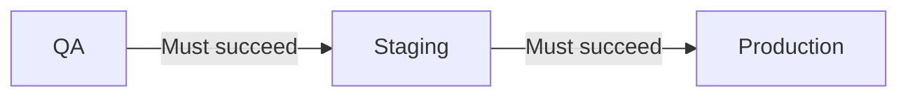

**Environment progression rules** ensure that releases are deployed to
prerequisite environments before they can proceed to downstream environments.
This enforces a deployment pipeline where changes must pass through QA before
staging, and staging before production.

## Overview



## Why Use Environment Progression?

Environment progression rules help you:

- **Enforce deployment order** - Prevent skipping environments in your pipeline
- **Catch issues early** - Problems surface in lower environments first
- **Build confidence** - Each environment validates before the next
- **Meet compliance** - Satisfy audit requirements for change promotion

## Configuration

Add an environment progression rule to your policy:

```yaml
policies:
  - name: staging-requires-qa
    selectors:
      - environment: environment.name == "staging"
    rules:
      - environmentProgression:
          dependsOnEnvironmentSelector:
            matchLabels:
              name: qa
```

## Properties

| Property                       | Type     | Required | Default | Description                                              |
| ------------------------------ | -------- | -------- | ------- | -------------------------------------------------------- |
| `dependsOnEnvironmentSelector` | Selector | Yes      | -       | Selector for the prerequisite environment(s)             |
| `minimumSuccessPercentage`     | float    | No       | 100     | Percentage of targets that must succeed (0-100)          |
| `successStatuses`              | array    | No       | -       | Job statuses considered successful                       |
| `minimumSoakTimeMinutes`       | integer  | No       | 0       | Minutes to wait after dependency succeeds                |
| `maximumAgeHours`              | integer  | No       | -       | Maximum age of dependency deployment before blocking     |

## Common Patterns

### Simple Linear Progression

Enforce QA → Staging → Production order:

```yaml
policies:
  # Staging requires QA success
  - name: staging-requires-qa
    selectors:
      - environment: environment.name == "staging"
    rules:
      - environmentProgression:
          dependsOnEnvironmentSelector:
            matchLabels:
              name: qa

  # Production requires Staging success
  - name: production-requires-staging
    selectors:
      - environment: environment.name == "production"
    rules:
      - environmentProgression:
          dependsOnEnvironmentSelector:
            matchLabels:
              name: staging
```

### Soak Time Requirements

Require the release to "soak" in staging before production:

```yaml
policies:
  - name: production-soak-requirement
    selectors:
      - environment: environment.name == "production"
    rules:
      - environmentProgression:
          dependsOnEnvironmentSelector:
            matchLabels:
              name: staging
          minimumSoakTimeMinutes: 60 # 1 hour soak in staging
```

### Freshness Requirements

Block promotion if the staging deployment is too old:

```yaml
policies:
  - name: production-freshness
    selectors:
      - environment: environment.name == "production"
    rules:
      - environmentProgression:
          dependsOnEnvironmentSelector:
            matchLabels:
              name: staging
          maximumAgeHours: 24 # Must be deployed to staging within last 24 hours
```

### Partial Success Threshold

Allow promotion when most (not all) targets succeed:

```yaml
policies:
  - name: staging-partial-success
    selectors:
      - environment: environment.name == "staging"
    rules:
      - environmentProgression:
          dependsOnEnvironmentSelector:
            matchLabels:
              name: qa
          minimumSuccessPercentage: 80 # 80% of QA targets must succeed
```

### Complete Pipeline with All Options

Full-featured production gate:

```yaml
policies:
  - name: production-full-gate
    selectors:
      - environment: environment.name == "production"
    rules:
      - approval:
          required: 1
      - environmentProgression:
          dependsOnEnvironmentSelector:
            matchLabels:
              name: staging
          minimumSuccessPercentage: 100
          minimumSoakTimeMinutes: 30
          maximumAgeHours: 48
      - gradualRollout:
          rolloutType: linear
          timeScaleInterval: 300
```

## Progression Lifecycle

### 1. Version Created

A new deployment version is created and ready for release.

### 2. Lower Environment Deployment

The version is deployed to the prerequisite environment (e.g., QA).

### 3. Success Evaluation

Ctrlplane evaluates if the deployment meets success criteria:

- Job status matches `successStatuses`
- Success percentage meets `minimumSuccessPercentage`

### 4. Soak Time (if configured)

If `minimumSoakTimeMinutes` is set, the clock starts after success.

### 5. Progression Allowed

Once all criteria are met, the version can proceed to the next environment.

## Environment Selector Examples

### By Name

```yaml
dependsOnEnvironmentSelector:
  matchLabels:
    name: staging
```

### By Multiple Names

```yaml
dependsOnEnvironmentSelector:
  matchExpression:
    - key: name
      operator: In
      values: ["qa", "integration"]
```

### By Metadata

```yaml
dependsOnEnvironmentSelector:
  matchLabels:
    tier: lower
```

## Best Practices

### Timing Guidelines

| Transition           | Soak Time    | Max Age  | Notes                          |
| -------------------- | ------------ | -------- | ------------------------------ |
| Dev → QA             | 0            | -        | Fast iteration                 |
| QA → Staging         | 0-15 min     | 24h      | Quick validation               |
| Staging → Production | 30-60 min    | 48h      | Thorough soak                  |
| Critical services    | 2-4 hours    | 24h      | Extended observation           |

### Recommendations

- ✅ Start with simple progression, add soak time later
- ✅ Use `maximumAgeHours` to prevent stale promotions
- ✅ Combine with verification for automated quality gates
- ✅ Use lower `minimumSuccessPercentage` for environments with flaky tests
- ✅ Document your progression requirements for the team

## Next Steps

- [Policies Overview](./overview) - Learn about policy structure
- [Verification](./verification) - Add automated health checks
- [Gradual Rollouts](./gradual-rollouts) - Control deployment pace

