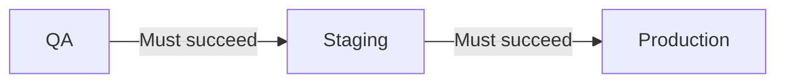

**Environment progression rules** ensure that releases are deployed to
prerequisite environments before they can proceed to downstream environments.
This enforces a deployment pipeline where changes must pass through QA before
staging, and staging before production.

## Overview



## Why Use Environment Progression?

Environment progression rules help you:

- **Enforce deployment order** - Prevent skipping environments in your pipeline
- **Catch issues early** - Problems surface in lower environments first
- **Build confidence** - Each environment validates before the next
- **Meet compliance** - Satisfy audit requirements for change promotion

## Configuration

<Tabs>
<Tab title="Terraform">
```hcl
resource "ctrlplane_policy" "staging_requires_qa" {
  name     = "Staging Requires QA"
  selector = "environment.name == 'staging'"

  environment_progression {
    depends_on_environment_selector = "environment.name == 'qa'"
  }
}
```
</Tab>
<Tab title="API">
```bash
curl -X POST https://api.ctrlplane.com/v1/workspaces/{workspaceId}/policies \
  -H "Authorization: Bearer $TOKEN" \
  -H "Content-Type: application/json" \
  -d '{
    "name": "Staging Requires QA",
    "selector": "environment.name == '\''staging'\''",
    "rules": [
      {
        "environmentProgression": {
          "dependsOnEnvironmentSelector": "environment.name == '\''qa'\''"
        }
      }
    ]
  }'
```
</Tab>
</Tabs>

## Properties

<ParamField
  path="environmentProgression.dependsOnEnvironmentSelector"
  type="string"
  required
>
  CEL expression or selector matching the prerequisite environment(s). The
  release must be successfully deployed to environments matching this selector
  before proceeding.
</ParamField>

<ParamField
  path="environmentProgression.minimumSuccessPercentage"
  type="float"
  default="100"
>
  Percentage of targets in the prerequisite environment that must succeed
  (0-100). Use a lower value if some targets are expected to be unavailable.
</ParamField>

<ParamField path="environmentProgression.successStatuses" type="array">
  Job statuses considered successful. Defaults to `["successful"]`.
</ParamField>

<ParamField
  path="environmentProgression.minimumSoakTimeMinutes"
  type="integer"
  default="0"
>
  Minutes to wait after the dependency succeeds before allowing progression. Use
  this to ensure the release has time to stabilize.
</ParamField>

<ParamField path="environmentProgression.maximumAgeHours" type="integer">
  Maximum age (in hours) of the dependency deployment. If the prerequisite
  deployment is older than this, progression is blocked until redeployed.
</ParamField>

## How It Works

1. **Find dependency environments** - Ctrlplane finds all environments matching
   the selector that share at least one system with the current environment.
   This prevents cross-system dependency issues.
2. **Evaluate pass rate** - For each dependency environment, Ctrlplane checks
   if the success percentage of release targets meets the threshold.
3. **Check soak time** - If `minimumSoakTimeMinutes` is configured, Ctrlplane
   verifies that enough time has elapsed since the most recent successful job.
4. **Check freshness** - If `maximumAgeHours` is configured, Ctrlplane ensures
   the dependency deployment is not too old.
5. **OR logic across environments** - If the selector matches multiple
   environments, the rule passes if **at least one** of them satisfies all
   criteria.

## Common Patterns

### Simple Linear Progression

Enforce QA → Staging → Production order:

<Tabs>
<Tab title="Terraform">
```hcl
resource "ctrlplane_policy" "staging_requires_qa" {
  name     = "Staging Requires QA"
  selector = "environment.name == 'staging'"

  environment_progression {
    depends_on_environment_selector = "environment.name == 'qa'"
  }
}

resource "ctrlplane_policy" "production_requires_staging" {
  name     = "Production Requires Staging"
  selector = "environment.name == 'production'"

  environment_progression {
    depends_on_environment_selector = "environment.name == 'staging'"
  }
}
```
</Tab>
<Tab title="API">
```json
[
  {
    "name": "Staging Requires QA",
    "selector": "environment.name == 'staging'",
    "rules": [
      {
        "environmentProgression": {
          "dependsOnEnvironmentSelector": "environment.name == 'qa'"
        }
      }
    ]
  },
  {
    "name": "Production Requires Staging",
    "selector": "environment.name == 'production'",
    "rules": [
      {
        "environmentProgression": {
          "dependsOnEnvironmentSelector": "environment.name == 'staging'"
        }
      }
    ]
  }
]
```
</Tab>
</Tabs>

### Soak Time Requirements

Require the release to "soak" in staging before production:

<Tabs>
<Tab title="Terraform">
```hcl
resource "ctrlplane_policy" "production_soak_requirement" {
  name     = "Production Soak Requirement"
  selector = "environment.name == 'production'"

  environment_progression {
    depends_on_environment_selector = "environment.name == 'staging'"
    minimum_sock_time_minutes       = 60
  }
}
```
</Tab>
<Tab title="API">
```json
{
  "name": "Production Soak Requirement",
  "selector": "environment.name == 'production'",
  "rules": [
    {
      "environmentProgression": {
        "dependsOnEnvironmentSelector": "environment.name == 'staging'",
        "minimumSockTimeMinutes": 60
      }
    }
  ]
}
```
</Tab>
</Tabs>

### Freshness Requirements

Block promotion if the staging deployment is too old:

<Tabs>
<Tab title="Terraform">
```hcl
resource "ctrlplane_policy" "production_freshness" {
  name     = "Production Freshness"
  selector = "environment.name == 'production'"

  environment_progression {
    depends_on_environment_selector = "environment.name == 'staging'"
    maximum_age_hours               = 24
  }
}
```
</Tab>
<Tab title="API">
```json
{
  "name": "Production Freshness",
  "selector": "environment.name == 'production'",
  "rules": [
    {
      "environmentProgression": {
        "dependsOnEnvironmentSelector": "environment.name == 'staging'",
        "maximumAgeHours": 24
      }
    }
  ]
}
```
</Tab>
</Tabs>

### Partial Success Threshold

Allow promotion when most (not all) targets succeed:

```hcl
resource "ctrlplane_policy" "staging_partial_success" {
  name     = "Staging Partial Success"
  selector = "environment.name == 'staging'"

  environment_progression {
    depends_on_environment_selector = "environment.name == 'qa'"
    minimum_success_percentage      = 80
  }
}
```

### Complete Pipeline with All Options

Full-featured production gate:

<Tabs>
<Tab title="Terraform">
```hcl
resource "ctrlplane_policy" "production_full_gate" {
  name     = "Production Full Gate"
  selector = "environment.name == 'production'"

  any_approval {
    min_approvals = 1
  }

  environment_progression {
    depends_on_environment_selector = "environment.name == 'staging'"
    minimum_success_percentage      = 100
    minimum_sock_time_minutes       = 30
    maximum_age_hours               = 48
  }

  gradual_rollout {
    rollout_type        = "linear"
    time_scale_interval = 300
  }
}
```
</Tab>
<Tab title="API">
```json
{
  "name": "Production Full Gate",
  "selector": "environment.name == 'production'",
  "rules": [
    { "anyApproval": { "minApprovals": 1 } },
    {
      "environmentProgression": {
        "dependsOnEnvironmentSelector": "environment.name == 'staging'",
        "minimumSuccessPercentage": 100,
        "minimumSockTimeMinutes": 30,
        "maximumAgeHours": 48
      }
    },
    {
      "gradualRollout": {
        "rolloutType": "linear",
        "timeScaleInterval": 300
      }
    }
  ]
}
```
</Tab>
</Tabs>

## Progression Lifecycle

### 1. Version Created

A new deployment version is created and ready for release.

### 2. Lower Environment Deployment

The version is deployed to the prerequisite environment (e.g., QA).

### 3. Success Evaluation

Ctrlplane evaluates if the deployment meets success criteria:

- Job status matches `successStatuses`
- Success percentage meets `minimumSuccessPercentage`

### 4. Soak Time (if configured)

If `minimumSoakTimeMinutes` is set, the clock starts after success.

### 5. Progression Allowed

Once all criteria are met, the version can proceed to the next environment.

## Best Practices

### Timing Guidelines

| Transition           | Soak Time | Max Age | Notes                |
| -------------------- | --------- | ------- | -------------------- |
| Dev → QA             | 0         | -       | Fast iteration       |
| QA → Staging         | 0-15 min  | 24h     | Quick validation     |
| Staging → Production | 30-60 min | 48h     | Thorough soak        |
| Critical services    | 2-4 hours | 24h     | Extended observation |

### Recommendations

- ✅ Start with simple progression, add soak time later
- ✅ Use `maximumAgeHours` to prevent stale promotions
- ✅ Combine with verification for automated quality gates
- ✅ Use lower `minimumSuccessPercentage` for environments with flaky tests
- ✅ Document your progression requirements for the team

## Next Steps

- [Policies Overview](./overview) - Learn about policy structure
- [Gradual Rollouts](./gradual-rollouts) - Control deployment pace
- [Deployment Dependency](./deployment-dependency) - Cross-deployment gates
