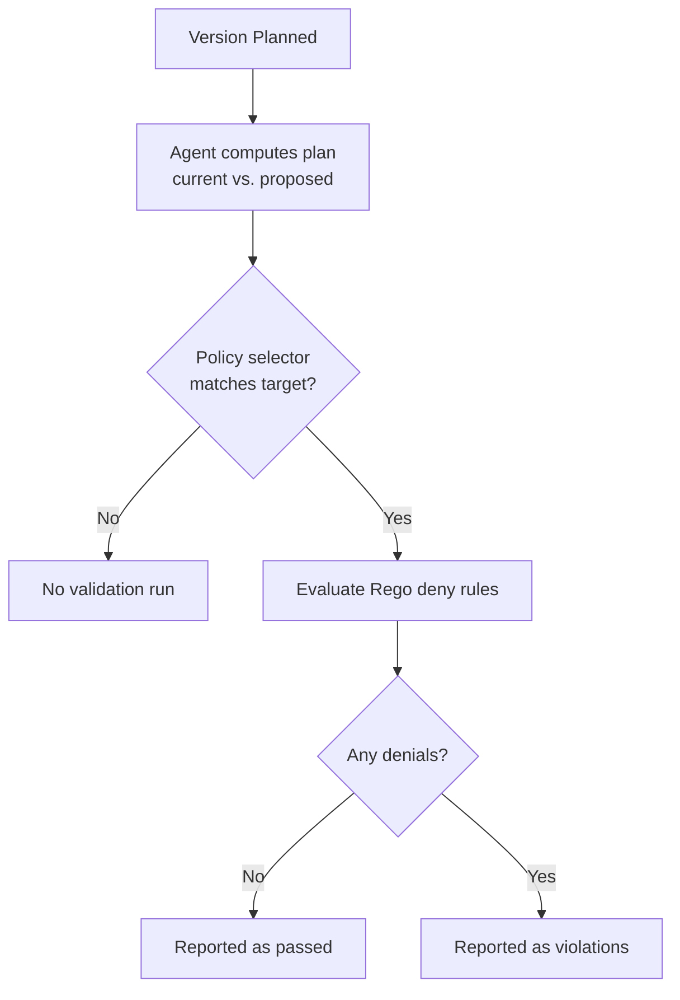

**Plan validation rules** run [OPA](https://www.openpolicyagent.org/) (Open
Policy Agent) policies against a deployment **plan** — the diff between what is
currently deployed and what a new version proposes — and report any violations
back to you.

<Note>
  Plan validation is **non-blocking**. It does **not** gate or stop a
  deployment. It exists to give you a preview: when a new version is planned,
  you can see whether the proposed changes pass your policies before you decide
  to roll them out. Violations are surfaced on the deployment's GitHub check and
  in the ctrlplane UI, but the deployment is never automatically held back.
</Note>

## Overview



A plan validation rule is a normal **policy rule**, so it shares the policy's
CEL `selector` that decides which release targets it applies to. The difference
is that instead of approvals or windows, the rule carries a snippet of **Rego**
that inspects the computed plan.

## When does it run?

Validation runs after an agent finishes computing a plan. Only agents that
produce a plan are evaluated:

- **ArgoCD** — the rendered manifest diff
- **Terraform Cloud** — the speculative plan output

If a deployment uses an agent that does not support plan operations, no
validation is run for that target.

## Why use plan validation?

- **Preview before you ship** — confirm a proposed change looks right before
  promoting it.
- **Catch risky diffs** — flag deletions, replacements, or scaling changes in a
  Terraform plan.
- **Guard against secrets or forbidden values** in rendered manifests.
- **Codify review checklists** that your team would otherwise eyeball by hand.

## Configuration

<Tabs>
<Tab title="Terraform">
```hcl
resource "ctrlplane_policy" "no_destroy_in_prod" {
  name     = "No destructive changes in production"
  selector = "environment.name == 'production'"

  plan_validation_opa {
    name        = "no-resource-deletions"
    description = "Flag plans that delete resources"
    rego        = <<-EOT
      package ctrlplane

      import rego.v1

      deny contains msg if {
        input.agentType == "terraform-cloud"
        plan := json.unmarshal(input.proposed)
        change := plan.resource_changes[_]
        change.change.actions[_] == "delete"
        msg := sprintf("resource %q would be deleted", [change.address])
      }
    EOT
  }
}
```
</Tab>
<Tab title="API">
```bash
curl -X POST https://api.ctrlplane.com/v1/workspaces/{workspaceId}/policies \
  -H "Authorization: Bearer $TOKEN" \
  -H "Content-Type: application/json" \
  -d '{
    "name": "No destructive changes in production",
    "selector": "environment.name == '\''production'\''",
    "rules": [
      {
        "planValidationOpa": {
          "name": "no-resource-deletions",
          "description": "Flag plans that delete resources",
          "rego": "package ctrlplane\n\nimport rego.v1\n\ndeny contains msg if {\n  input.agentType == \"terraform-cloud\"\n  plan := json.unmarshal(input.proposed)\n  change := plan.resource_changes[_]\n  change.change.actions[_] == \"delete\"\n  msg := sprintf(\"resource %q would be deleted\", [change.address])\n}"
        }
      }
    ]
  }'
```
</Tab>
</Tabs>

## Properties

<ParamField path="planValidationOpa.name" type="string" required>
  Human-readable rule name. Shown in the check output to identify which rule
  produced a violation.
</ParamField>

<ParamField path="planValidationOpa.description" type="string">
  Optional human-readable explanation of what the rule does.
</ParamField>

<ParamField path="planValidationOpa.rego" type="string" required>
  Rego v1 source code. Must define a `deny` rule set following the
  [Conftest](https://www.conftest.dev/) convention
  (`deny contains msg if { ... }`). Each member of the `deny` set becomes one
  violation message. An empty `deny` set means the plan passed.
</ParamField>

## Writing the Rego

Policies must be **Rego v1** (include `import rego.v1`) and define a `deny` rule
set. The package name can be anything — ctrlplane detects it automatically.

```rego
package ctrlplane

import rego.v1

deny contains msg if {
    input.environment.name == "production"
    msg := "changes to production require manual review"
}
```

- The set is **empty by default** → the plan passes.
- Every string you add to `deny` becomes a separate violation line.
- Use the OPA standard library (`json.unmarshal`, `yaml.unmarshal`, `contains`,
  `sprintf`, regex, etc.) to parse and inspect the plan.

<Warning>
  If a policy contains invalid Rego (for example, a syntax error), it cannot be
  evaluated and no validation result is recorded for that plan. Test your
  policies with the [OPA playground](https://play.openpolicyagent.org/) or
  `opa eval` before saving them.
</Warning>

## The `input` document

Your Rego policy is evaluated against an `input` document with the following
fields:

| Field                  | Type    | Description                                                              |
| ---------------------- | ------- | ------------------------------------------------------------------------ |
| `input.current`        | string  | The currently deployed state (raw, agent-specific format)               |
| `input.proposed`       | string  | The proposed state from the new version (raw, agent-specific format)    |
| `input.hasChanges`     | boolean | Whether the plan contains any changes                                    |
| `input.agentType`      | string  | The agent that produced the plan (e.g. `argo-cd`, `terraform-cloud`)    |
| `input.environment`    | object  | The target environment                                                   |
| `input.resource`       | object  | The target resource                                                      |
| `input.deployment`     | object  | The deployment                                                           |
| `input.proposedVersion`| object  | The deployment version being planned (the new version)                  |
| `input.currentVersion` | object  | The version currently deployed to this target (may be null)             |

<Note>
  `input.current` and `input.proposed` are **strings**, not parsed objects,
  because the format is agent-specific (Terraform JSON plan, rendered Kubernetes
  YAML, etc.). Parse them inside your policy with `json.unmarshal` or
  `yaml.unmarshal`.
</Note>

## Examples

### Flag resource deletions in a Terraform plan

```rego
package ctrlplane

import rego.v1

deny contains msg if {
    input.agentType == "terraform-cloud"
    plan := json.unmarshal(input.proposed)
    change := plan.resource_changes[_]
    change.change.actions[_] == "delete"
    msg := sprintf("resource %q would be deleted", [change.address])
}
```

### Forbid hard-coded secrets in a rendered manifest

```rego
package ctrlplane

import rego.v1

deny contains msg if {
    contains(input.proposed, "SECRET=")
    msg := "proposed manifest appears to contain a hard-coded secret"
}
```

### Require that a production change actually has a diff

```rego
package ctrlplane

import rego.v1

deny contains "no changes detected for a production deploy" if {
    input.environment.name == "production"
    not input.hasChanges
}
```

### Flag a major version jump

```rego
package ctrlplane

import rego.v1

deny contains msg if {
    current := input.currentVersion.tag
    proposed := input.proposedVersion.tag
    startswith(current, "v1.")
    startswith(proposed, "v2.")
    msg := sprintf("major version jump %s -> %s", [current, proposed])
}
```

## Viewing results

When a plan completes, ctrlplane records each rule's result against the plan.
Results surface in two places:

- **GitHub check run** — if the version carries GitHub metadata, the deployment
  check shows the plan diff and a **Policy violations** section listing each
  failing rule and its messages. A violation marks the check as failed so it is
  visible on the pull request, but it does not block the ctrlplane deployment.
- **ctrlplane UI** — the plan preview for a release target shows the diff
  alongside any validation results.

## Best practices

- ✅ Use a clear `name` — it is how violations are labeled in the output.
- ✅ Scope rules with the policy `selector` so they only run where they matter
  (e.g. production only).
- ✅ Branch on `input.agentType` when a policy is specific to Terraform or
  ArgoCD output.
- ✅ Test Rego in the OPA playground before saving.
- ❌ Don't rely on plan validation to *stop* a deployment — it is a preview, not
  a gate. Use [Approval](./approval) or
  [Environment Progression](./environment-progression) for gating.

## Next Steps

- [Policies Overview](./overview) - Learn about policy structure
- [Approval](./approval) - Require sign-off before deploying
- [Verification](./verification/overview) - Check metrics after deploying
