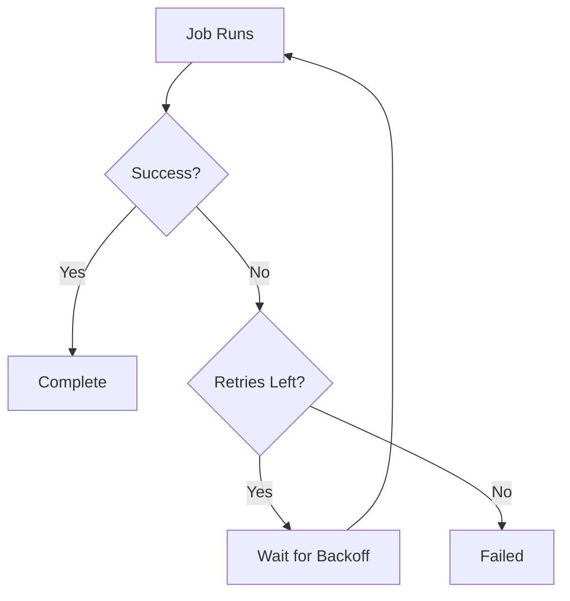

**Retry rules** configure how Ctrlplane handles failed jobs. You can control the
number of retry attempts, which failure types trigger retries, and the backoff
strategy between attempts.

## Overview



## Why Use Retry Rules?

Retry rules help you:

- **Handle transient failures** - Automatically recover from temporary issues
- **Reduce manual intervention** - Let the system retry before alerting
- **Configure per-environment** - More retries in dev, fewer in production
- **Control retry behavior** - Set backoff strategies to avoid thundering herd

## Configuration

Add a retry rule to your policy:

```yaml
policies:
  - name: retry-on-failure
    selectors:
      - environment: environment.name == "production"
    rules:
      - retry:
          maxRetries: 3
```

## Properties

| Property          | Type    | Required | Default              | Description                                         |
| ----------------- | ------- | -------- | -------------------- | --------------------------------------------------- |
| `maxRetries`      | integer | Yes      | -                    | Maximum retry attempts (0 = no retries)             |
| `retryOnStatuses` | array   | No       | failure, invalid\*   | Job statuses that trigger retry                     |
| `backoffSeconds`  | integer | No       | 0                    | Seconds to wait between retries                     |
| `backoffStrategy` | string  | No       | linear               | Backoff strategy: `linear` or `exponential`         |
| `maxBackoffSeconds` | integer | No     | -                    | Maximum backoff cap (for exponential)               |

\* Default statuses: `failure`, `invalidIntegration`, `invalidJobAgent`

## Job Statuses

The following job statuses can be used in `retryOnStatuses`:

| Status               | Description                              |
| -------------------- | ---------------------------------------- |
| `failure`            | Job failed during execution              |
| `successful`         | Job completed successfully               |
| `cancelled`          | Job was manually cancelled               |
| `skipped`            | Job was skipped                          |
| `invalidIntegration` | Integration configuration error          |
| `invalidJobAgent`    | Job agent configuration error            |

## Common Patterns

### Basic Retry

Retry failed jobs up to 3 times:

```yaml
policies:
  - name: basic-retry
    rules:
      - retry:
          maxRetries: 3
```

### Retry with Backoff

Wait between retry attempts:

```yaml
policies:
  - name: retry-with-delay
    rules:
      - retry:
          maxRetries: 3
          backoffSeconds: 30 # Wait 30 seconds between retries
```

### Exponential Backoff

Increase wait time with each retry:

```yaml
policies:
  - name: exponential-retry
    rules:
      - retry:
          maxRetries: 5
          backoffSeconds: 10
          backoffStrategy: exponential
          maxBackoffSeconds: 300 # Cap at 5 minutes
```

With exponential backoff, wait times are: 10s → 20s → 40s → 80s → 160s (capped at 300s)

### No Retries (Strict)

Disable retries for critical deployments:

```yaml
policies:
  - name: no-retry-production
    selectors:
      - environment: environment.name == "production"
    rules:
      - retry:
          maxRetries: 0
```

### Retry Specific Statuses

Only retry on specific failure types:

```yaml
policies:
  - name: retry-transient-only
    rules:
      - retry:
          maxRetries: 3
          retryOnStatuses:
            - failure
            - invalidIntegration
          backoffSeconds: 60
```

### Environment-Specific Retry

Different retry behavior per environment:

```yaml
policies:
  # Development: Many quick retries
  - name: dev-retry
    selectors:
      - environment: environment.name == "development"
    rules:
      - retry:
          maxRetries: 5
          backoffSeconds: 5

  # Staging: Moderate retries
  - name: staging-retry
    selectors:
      - environment: environment.name == "staging"
    rules:
      - retry:
          maxRetries: 3
          backoffSeconds: 30

  # Production: Limited retries with longer backoff
  - name: production-retry
    selectors:
      - environment: environment.name == "production"
    rules:
      - retry:
          maxRetries: 2
          backoffSeconds: 60
          backoffStrategy: exponential
```

## Backoff Strategies

### Linear Backoff

Constant wait time between retries:

```
Attempt 1: immediate
Attempt 2: wait 30s
Attempt 3: wait 30s
Attempt 4: wait 30s
```

### Exponential Backoff

Doubling wait time with each retry:

```
Attempt 1: immediate
Attempt 2: wait 10s  (10 * 2^0)
Attempt 3: wait 20s  (10 * 2^1)
Attempt 4: wait 40s  (10 * 2^2)
Attempt 5: wait 80s  (10 * 2^3)
```

Use `maxBackoffSeconds` to cap the maximum wait time.

## Retry Lifecycle

### 1. Job Fails

A job completes with a status in `retryOnStatuses`.

### 2. Retry Check

Ctrlplane checks if retries remain (`attempt < maxRetries + 1`).

### 3. Backoff Wait

If `backoffSeconds` is configured, Ctrlplane waits before the next attempt.

### 4. Retry Attempt

A new job is created for the retry attempt.

### 5. Success or Exhausted

The process continues until success or all retries are exhausted.

## Best Practices

### Retry Guidelines

| Scenario               | Max Retries | Backoff      | Strategy    |
| ---------------------- | ----------- | ------------ | ----------- |
| Transient network      | 3-5         | 10-30s       | exponential |
| Rate limiting          | 3           | 60s          | exponential |
| Resource contention    | 2-3         | 30s          | linear      |
| Critical production    | 1-2         | 60s          | linear      |
| Flaky tests (dev/qa)   | 5           | 5s           | linear      |

### Recommendations

- ✅ Use exponential backoff for external service failures
- ✅ Set `maxBackoffSeconds` to avoid excessive wait times
- ✅ Use fewer retries in production than in development
- ✅ Monitor retry rates to identify systemic issues
- ✅ Combine with alerting on final failure

### Anti-Patterns

- ❌ Infinite retries (always set `maxRetries`)
- ❌ No backoff for rate-limited APIs
- ❌ Same retry config across all environments
- ❌ Retrying on non-transient failures

## Next Steps

- [Policies Overview](./overview) - Learn about policy structure
- [Verification](./verification) - Add health checks after deployment
- [Environment Progression](./environment-progression) - Control promotion flow

