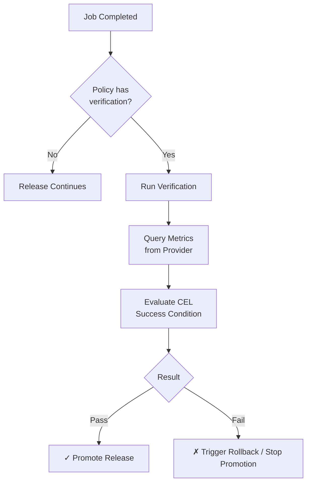

**Verification** allows you to validate that a deployment is healthy after it
completes. Ctrlplane can automatically run verification checks by querying
metrics from external providers and evaluating success conditions.

## Overview



## Why Use Verification?

Verification helps you:

- **Catch Issues Early** - Detect problems before they impact users
- **Automate Rollbacks** - Trigger rollback policies when verification fails
- **Build Confidence** - Ensure deployments meet quality standards
- **Gate Promotions** - Block progression to production until QA verifies
- **Environment-Specific Checks** - Run different verifications per environment

## Basic Configuration

Add a verification rule to your policy:

```yaml
policies:
  - name: qa-smoke-tests
    description: Run E2E smoke tests in QA before promotion
    selectors:
      - environment: environment.name == "qa"
    rules:
      - verification:
          metrics:
            - name: e2e-smoke-tests
              interval: 30s
              count: 5
              provider:
                type: http
                url: "http://e2e-runner.qa/run?service={{.resource.name}}"
              successCondition: result.ok && result.json.passed == true
              failureLimit: 1
```

## Environment-Specific Verifications

Different environments can have completely different verification requirements:

```yaml
policies:
  # QA: Run E2E smoke tests
  - name: qa-verification
    selectors:
      - environment: environment.name == "qa"
    rules:
      - verification:
          metrics:
            - name: e2e-smoke-tests
              interval: 1m
              count: 3
              provider:
                type: http
                url: "http://e2e-runner/smoke?env=qa&service={{.resource.name}}"
              successCondition: result.json.all_passed == true

  # Staging: Check error rates and latency
  - name: staging-verification
    selectors:
      - environment: environment.name == "staging"
    rules:
      - verification:
          metrics:
            - name: error-rate
              interval: 30s
              count: 10
              provider:
                type: datadog
                apiKey: "{{.variables.dd_api_key}}"
                appKey: "{{.variables.dd_app_key}}"
                queries:
                  errors: "sum:errors{service:{{.resource.name}},env:staging}.as_rate()"
              successCondition: result.queries.errors < 0.01
              failureLimit: 2

  # Production: Comprehensive health checks
  - name: production-verification
    selectors:
      - environment: environment.name == "production"
    rules:
      - verification:
          metrics:
            - name: error-rate
              interval: 1m
              count: 10
              provider:
                type: datadog
                apiKey: "{{.variables.dd_api_key}}"
                appKey: "{{.variables.dd_app_key}}"
                queries:
                  errors: "sum:errors{service:{{.resource.name}},env:prod}.as_rate()"
              successCondition: result.queries.errors < 0.005
              failureLimit: 2
            - name: p99-latency
              interval: 1m
              count: 10
              provider:
                type: datadog
                apiKey: "{{.variables.dd_api_key}}"
                appKey: "{{.variables.dd_app_key}}"
                queries:
                  latency: "avg:latency.p99{service:{{.resource.name}},env:prod}"
              successCondition: result.queries.latency < 200
              failureLimit: 2
```

## Reusable Verification with Selectors

Use policy selectors to apply the same verification across multiple deployments
or environments:

```yaml
policies:
  # Apply to all backend services
  - name: backend-health-verification
    selectors:
      - deployment: deployment.metadata.serviceType == "backend"
    rules:
      - verification:
          metrics:
            - name: health-check
              interval: 30s
              count: 5
              provider:
                type: http
                url: "http://{{.resource.name}}/health"
              successCondition: result.ok

  # Apply to all services with canary deployments
  - name: canary-verification
    selectors:
      - deployment: deployment.metadata.deploymentStrategy == "canary"
    rules:
      - verification:
          metrics:
            - name: canary-error-comparison
              interval: 2m
              count: 5
              provider:
                type: datadog
                apiKey: "{{.variables.dd_api_key}}"
                appKey: "{{.variables.dd_app_key}}"
                queries:
                  canary: "sum:errors{service:{{.resource.name}},version:canary}.as_rate()"
                  stable: "sum:errors{service:{{.resource.name}},version:stable}.as_rate()"
                formula: "canary / stable"
              successCondition:
                result.queries.canary < result.queries.stable * 1.1
```

## Progressive Delivery Gates

Use verification to gate promotion through environments:

```yaml
policies:
  # QA must pass smoke tests before staging
  - name: qa-gate
    selectors:
      - environment: environment.name == "qa"
    rules:
      - verification:
          metrics:
            - name: smoke-tests
              interval: 30s
              count: 3
              provider:
                type: http
                url: "http://smoke-test-runner/run"
                method: POST
                body: |
                  {
                    "service": "{{.resource.name}}",
                    "version": "{{.version.tag}}",
                    "environment": "qa"
                  }
              successCondition: result.json.status == "passed"
              failureLimit: 0

  # Staging must pass before production
  - name: staging-gate
    selectors:
      - environment: environment.name == "staging"
    rules:
      - verification:
          metrics:
            - name: integration-tests
              interval: 1m
              count: 5
              provider:
                type: http
                url: "http://integration-runner/run?service={{.resource.name}}"
              successCondition:
                result.json.passed_count == result.json.total_count
```

## Metric Configuration

### Metric Properties

| Property           | Type    | Required | Description                                   |
| ------------------ | ------- | -------- | --------------------------------------------- |
| `name`             | string  | Yes      | Name of the verification metric               |
| `interval`         | string  | Yes      | Time between measurements (e.g., "30s", "5m") |
| `count`            | integer | Yes      | Number of measurements to take                |
| `provider`         | object  | Yes      | Metric provider configuration                 |
| `successCondition` | string  | Yes      | CEL expression to evaluate success            |
| `failureLimit`     | integer | No       | Stop after this many failures (0 = no limit)  |

## Metric Providers

Ctrlplane supports multiple metric providers for collecting verification data.
Each provider has its own configuration and capabilities:

- **[HTTP Provider](./verification/providers/http)** - Query any HTTP endpoint
  that returns JSON
- **[Datadog Provider](./verification/providers/datadog)** - Query metrics from
  Datadog's Metrics API
- **[Sleep Provider](./verification/providers/sleep)** - Wait for a specified
  duration before considering verification passed
- **[Terraform Cloud Run Provider](./verification/providers/terraform-cloud-run)** -
  Verify Terraform Cloud run status for infrastructure deployments

See the individual provider documentation for detailed configuration options,
examples, and best practices.

## Template Variables

All provider configurations support Go templates with access to deployment
context:

```yaml
# Resource information
{{.resource.name}}
{{.resource.identifier}}
{{.resource.kind}}

# Environment information
{{.environment.name}}
{{.environment.id}}

# Deployment information
{{.deployment.name}}
{{.deployment.slug}}

# Version information
{{.version.tag}}
{{.version.id}}

# Custom variables (from deployment variables)
{{.variables.my_variable}}
{{.variables.dd_api_key}}
```

### Storing Secrets in Variables

For sensitive values like API keys, use deployment variables:

1. **Create a deployment variable**:

```bash
curl -X POST https://app.ctrlplane.dev/api/v1/deployments/{deploymentId}/variables \
  -H "Authorization: Bearer $CTRLPLANE_API_KEY" \
  -d '{"key": "dd_api_key", "description": "Datadog API key"}'
```

2. **Set the value**:

```bash
curl -X POST https://app.ctrlplane.dev/api/v1/deployments/{deploymentId}/variables/{variableId}/values \
  -H "Authorization: Bearer $CTRLPLANE_API_KEY" \
  -d '{"value": "your-actual-api-key"}'
```

3. **Reference in verification config**:

```yaml
provider:
  type: datadog
  apiKey: "{{.variables.dd_api_key}}"
  appKey: "{{.variables.dd_app_key}}"
  queries:
    errors: "sum:errors{service:api}"
```

## Success Conditions (CEL)

Success conditions are written in
[CEL (Common Expression Language)](https://github.com/google/cel-spec). The
measurement data is available as the `result` variable.

```yaml
# Boolean check (HTTP provider)
successCondition: result.ok

# Numeric comparison (HTTP provider)
successCondition: result.json.value < 0.01

# Datadog provider - access queries by name
successCondition: result.queries.errors < 0.01

# String comparison
successCondition: result.json.status == "healthy"

# Logical operators
successCondition: result.ok && result.json.ready
successCondition: result.json.status == "healthy" || result.json.status == "degraded"

# Arithmetic
successCondition: result.json.success_count / result.json.total_count > 0.99

# Datadog - compare multiple queries
successCondition: result.queries.canary < result.queries.stable * 1.1
```

## Verification Lifecycle

### 1. Policy Evaluation

When a job completes, Ctrlplane evaluates policies to determine which
verifications apply based on the policy selectors.

### 2. Verification Starts

If a matching policy has verification rules, Ctrlplane creates a verification
record and starts the measurement process.

### 3. Measurements Taken

For each configured metric, measurements are taken at the specified interval:

```
Metric: error-rate (interval: 30s, count: 10)

t+0s:   Measurement 1 → Passed (value: 0.005)
t+30s:  Measurement 2 → Passed (value: 0.007)
t+60s:  Measurement 3 → Failed (value: 0.015)
t+90s:  Measurement 4 → Passed (value: 0.008)
...
t+270s: Measurement 10 → Passed (value: 0.006)
```

### 4. Verification Result

- **Passed**: All measurements passed, or failures stayed below `failureLimit`
- **Failed**: Failures exceeded `failureLimit`

### 5. Policy Action

Based on the verification result, the policy can:

- **Allow promotion** to the next environment
- **Trigger rollback** to a previous version
- **Block release** until manual intervention

### Verification Status

| Status      | Description                                   |
| ----------- | --------------------------------------------- |
| `running`   | Verification in progress, taking measurements |
| `passed`    | All checks passed within acceptable limits    |
| `failed`    | Too many measurements failed                  |
| `cancelled` | Verification was manually cancelled           |

## Best Practices

### Timing Recommendations

| Scenario              | Recommended Interval | Recommended Count |
| --------------------- | -------------------- | ----------------- |
| Quick smoke test      | 10-30s               | 3-5               |
| Standard verification | 30s-1m               | 5-10              |
| Extended soak test    | 5m                   | 12-24             |

### Failure Limits

| Risk Tolerance | Failure Limit | Notes                  |
| -------------- | ------------- | ---------------------- |
| Strict         | 1             | Fail on first failure  |
| Normal         | 2-3           | Allow transient issues |
| Lenient        | 5+            | For noisy metrics      |

### Environment-Specific Recommendations

| Environment | Verification Focus                  | Timing         |
| ----------- | ----------------------------------- | -------------- |
| QA          | Smoke tests, E2E tests              | Quick (1-3min) |
| Staging     | Integration tests, error rates      | Medium (5min)  |
| Production  | Error rates, latency, business KPIs | Extended (10m) |

## Troubleshooting

### Verification always fails

- Check if the provider can reach the target (network, DNS)
- Verify API credentials are correct
- Test the query manually
- Review measurement data for unexpected values
- Check if success condition is too strict

### Verification not running

- Verify the policy selector matches the release target
- Check that the policy is enabled
- Review policy evaluation logs
- Ensure verification is configured in the policy rules

### Wrong verification applied

- Review policy selectors
- Check policy priority/ordering
- Verify environment and metadata values
- Review which policies matched the release

## Provider Documentation

For detailed information about each metric provider, see:

- [HTTP Provider](./verification/providers/http)
- [Datadog Provider](./verification/providers/datadog)
- [Sleep Provider](./verification/providers/sleep)
- [Terraform Cloud Run Provider](./verification/providers/terraform-cloud-run)

## Next Steps

- [Policies Overview](./overview) - Learn about policy structure
- [Gradual Rollouts](./gradual-rollouts) - Control deployment pace
- [Selectors](../concepts/selectors) - Deep dive into selector syntax
