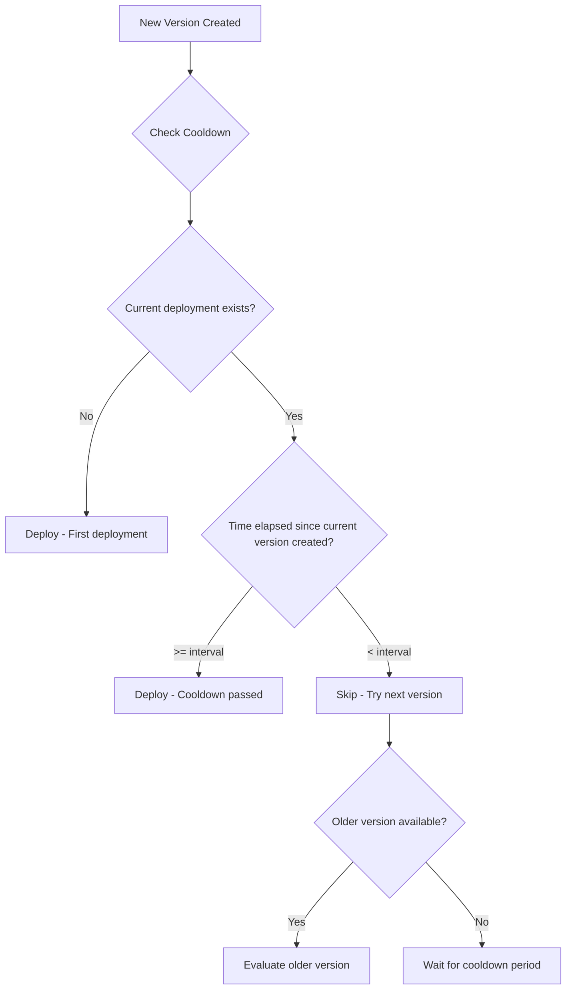

**Version cooldown rules** prevent rapid sequential deployments by requiring a
minimum time period to pass since the currently deployed (or in-progress)
version was created before allowing another deployment. This helps batch
frequent upstream releases into periodic deployments, reducing deployment churn
and infrastructure load.

## Overview



## Why Use Version Cooldown?

Version cooldown helps you:

- **Reduce deployment frequency** - Batch multiple rapid releases into fewer
  deployments
- **Decrease infrastructure load** - Avoid constant rolling updates from CI/CD
  pipelines
- **Improve stability** - Give each deployment time to prove itself before the
  next
- **Save resources** - Reduce compute spent on deployment overhead

## Configuration

Add a version cooldown rule to your policy:

```yaml
policies:
  - name: batch-deployments
    selectors:
      - environment: environment.name == "production"
    rules:
      - versionCooldown:
          intervalSeconds: 3600 # 1 hour cooldown period
```

## Properties

| Property          | Type    | Required | Description                                                                                                                                        |
| ----------------- | ------- | -------- | -------------------------------------------------------------------------------------------------------------------------------------------------- |
| `intervalSeconds` | integer | Yes      | Minimum seconds that must pass since the currently deployed (or in-progress) version was created before allowing another deployment (0 to disable) |

## How It Works

Version cooldown checks if enough **time has elapsed** since the currently
deployed (or in-progress) version was created, not the time gap between version
creation times:

1. **Find reference version**: The currently deployed or in-progress version
2. **Calculate elapsed time**: Time since the reference version was created
   (using current time)
3. **Apply cooldown**: If elapsed time >= interval, allow any version;
   otherwise, deny

### Example Timeline

```
Version Created:  v1.0 ────── v1.1 ── v1.2 ── v1.3 ────── v1.4
                  12:00       12:15   12:20   12:25       13:30

With intervalSeconds: 3600 (1 hour)
Currently deployed: v1.0 (created 12:00)

At 12:30 (30min elapsed):
  Candidate v1.3 (created 12:25): DENIED - only 30min elapsed (need 60min)
  Candidate v1.2 (created 12:20): DENIED - only 30min elapsed
  Candidate v1.1 (created 12:15): DENIED - only 30min elapsed

At 13:05 (65min elapsed):
  Candidate v1.3 (created 12:25): ALLOWED - 65min elapsed (>= 60min)
  Candidate v1.2 (created 12:20): ALLOWED - 65min elapsed
  Candidate v1.1 (created 12:15): ALLOWED - 65min elapsed
  Candidate v1.4 (created 13:30): ALLOWED - 65min elapsed
```

**Key point**: Once the cooldown period has elapsed, any version can be
deployed, regardless of when it was created. This enables batching rapid
releases.

## Common Patterns

### Hourly Batching

Deploy at most once per hour:

```yaml
policies:
  - name: hourly-deployments
    selectors:
      - environment: environment.name == "production"
    rules:
      - versionCooldown:
          intervalSeconds: 3600 # 1 hour
```

### Daily Batching

For stable environments that only need daily updates:

```yaml
policies:
  - name: daily-deployments
    selectors:
      - environment: environment.name == "production"
      - deployment: deployment.metadata.update_frequency == "daily"
    rules:
      - versionCooldown:
          intervalSeconds: 86400 # 24 hours
```

### Per-Environment Cooldown

Different intervals for different environments:

```yaml
policies:
  # Staging: 15 minute cooldown
  - name: staging-cooldown
    selectors:
      - environment: environment.name == "staging"
    rules:
      - versionCooldown:
          intervalSeconds: 900

  # Production: 1 hour cooldown
  - name: production-cooldown
    selectors:
      - environment: environment.name == "production"
    rules:
      - versionCooldown:
          intervalSeconds: 3600
```

### Combined with Other Rules

Use cooldown alongside other policy rules:

```yaml
policies:
  - name: production-controlled-release
    selectors:
      - environment: environment.name == "production"
    rules:
      # Batch rapid releases
      - versionCooldown:
          intervalSeconds: 1800 # 30 minutes

      # Require approval
      - approval:
          required: 1

      # Roll out gradually
      - gradualRollout:
          rolloutType: linear
          timeScaleInterval: 300
```

### With Deployment Windows

Combine cooldown with deployment windows for comprehensive control:

```yaml
policies:
  - name: controlled-production
    selectors:
      - environment: environment.name == "production"
    rules:
      # Only deploy during business hours
      - deploymentWindow:
          rrule: "FREQ=WEEKLY;BYDAY=MO,TU,WE,TH,FR;BYHOUR=9;BYMINUTE=0"
          durationMinutes: 480
          timezone: "America/New_York"

      # Batch releases to at most every 2 hours
      - versionCooldown:
          intervalSeconds: 7200
```

## Behavior Details

### Version Selection

When a candidate version fails cooldown:

1. Ctrlplane tries the next older version
2. This continues until a qualifying version is found
3. If no versions qualify, the release target waits

### Same Version Redeploys

Redeploying the currently deployed version is always allowed, regardless of
cooldown settings. This enables:

- Manual re-runs of failed deployments
- Rollback-and-redeploy workflows
- Configuration-only changes

### In-Progress Deployments

If a deployment is in progress, the cooldown uses that version as the reference:

- Prevents deploying a newer version while one is still rolling out
- Ensures sequential deployments respect the interval

## Use Cases

### High-Frequency CI/CD

For services with frequent commits:

```yaml
# Service deploys 20+ times per hour to staging
# Batch to every 30 minutes for production
policies:
  - name: ci-batching
    selectors:
      - environment: environment.name == "production"
    rules:
      - versionCooldown:
          intervalSeconds: 1800
```

### Monorepo Deployments

When multiple services share a repository and get versioned together:

```yaml
# Many services update simultaneously
# Stagger deployments to reduce infrastructure load
policies:
  - name: monorepo-stagger
    selectors:
      - deployment: deployment.metadata.source == "monorepo"
    rules:
      - versionCooldown:
          intervalSeconds: 600 # 10 minutes
```

### Cost Optimization

Reduce deployment frequency to save on infrastructure costs:

```yaml
# Non-critical services don't need instant updates
policies:
  - name: cost-optimized
    selectors:
      - deployment: deployment.metadata.tier == "standard"
    rules:
      - versionCooldown:
          intervalSeconds: 14400 # 4 hours
```

## Best Practices

### Interval Guidelines

| Use Case             | Suggested Interval | Notes                      |
| -------------------- | ------------------ | -------------------------- |
| High-frequency CI/CD | 15-30 minutes      | Balance freshness vs churn |
| Standard services    | 1-2 hours          | Reasonable batching        |
| Stable/low-priority  | 4-24 hours         | Significant batching       |
| Development/staging  | 5-15 minutes       | Faster feedback loops      |

### Recommendations

- ✅ Start with shorter intervals and increase as needed
- ✅ Use longer intervals for production vs staging
- ✅ Combine with gradual rollouts for safer deployments
- ✅ Monitor deployment frequency to tune intervals
- ❌ Don't set intervals so long that critical fixes are delayed
- ❌ Don't use cooldown on environments that need immediate updates

## Next Steps

- [Policies Overview](./overview) - Learn about policy structure
- [Gradual Rollouts](./gradual-rollouts) - Control deployment pace
- [Deployment Window](./deployment-window) - Time-based deployment control
