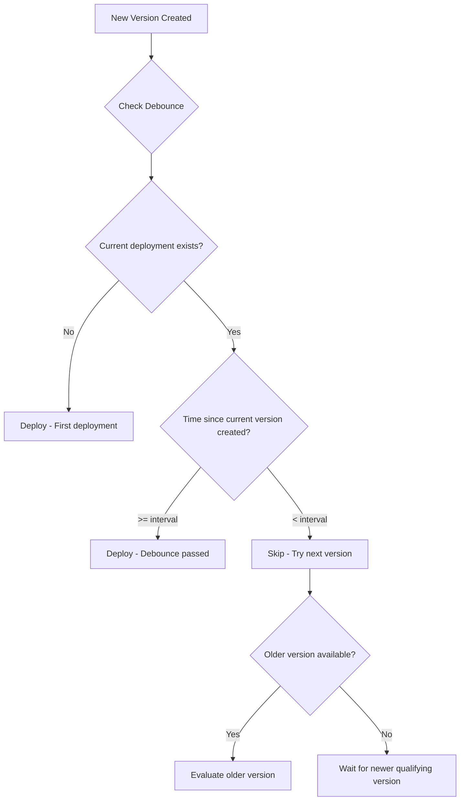

**Version debounce rules** prevent rapid sequential deployments by requiring a
minimum time gap between version creation times. This helps batch frequent
upstream releases into periodic deployments, reducing deployment churn and
infrastructure load.

## Overview



## Why Use Version Debounce?

Version debounce helps you:

- **Reduce deployment frequency** - Batch multiple rapid releases into fewer
  deployments
- **Decrease infrastructure load** - Avoid constant rolling updates from CI/CD
  pipelines
- **Improve stability** - Give each deployment time to prove itself before the
  next
- **Save resources** - Reduce compute spent on deployment overhead

## Configuration

Add a version debounce rule to your policy:

```yaml
policies:
  - name: batch-deployments
    selectors:
      - environment: environment.name == "production"
    rules:
      - versionDebounce:
          intervalSeconds: 3600 # 1 hour between version creation times
```

## Properties

| Property          | Type    | Required | Description                                                                |
| ----------------- | ------- | -------- | -------------------------------------------------------------------------- |
| `intervalSeconds` | integer | Yes      | Minimum seconds between creation times of deployed versions (0 to disable) |

## How It Works

Version debounce compares version **creation times**, not deployment times:

1. **Find reference version**: The currently deployed or in-progress version
2. **Calculate time gap**: Time between reference version creation and candidate
   version creation
3. **Apply debounce**: If gap >= interval, allow; otherwise, try older versions

### Example Timeline

```
Version Created:  v1.0 ────── v1.1 ── v1.2 ── v1.3 ────── v1.4
                  12:00       12:15   12:20   12:25       13:30

With intervalSeconds: 3600 (1 hour)

Currently deployed: v1.0 (created 12:00)
Minimum next version creation time: 13:00

Candidate v1.3 (12:25): DENIED - created only 25min after v1.0
Candidate v1.2 (12:20): DENIED - created only 20min after v1.0
Candidate v1.1 (12:15): DENIED - created only 15min after v1.0
Candidate v1.4 (13:30): ALLOWED - created 90min after v1.0 (>= 60min)
```

## Common Patterns

### Hourly Batching

Deploy at most once per hour:

```yaml
policies:
  - name: hourly-deployments
    selectors:
      - environment: environment.name == "production"
    rules:
      - versionDebounce:
          intervalSeconds: 3600 # 1 hour
```

### Daily Batching

For stable environments that only need daily updates:

```yaml
policies:
  - name: daily-deployments
    selectors:
      - environment: environment.name == "production"
      - deployment: deployment.metadata.update_frequency == "daily"
    rules:
      - versionDebounce:
          intervalSeconds: 86400 # 24 hours
```

### Per-Environment Debounce

Different intervals for different environments:

```yaml
policies:
  # Staging: 15 minute debounce
  - name: staging-debounce
    selectors:
      - environment: environment.name == "staging"
    rules:
      - versionDebounce:
          intervalSeconds: 900

  # Production: 1 hour debounce
  - name: production-debounce
    selectors:
      - environment: environment.name == "production"
    rules:
      - versionDebounce:
          intervalSeconds: 3600
```

### Combined with Other Rules

Use debounce alongside other policy rules:

```yaml
policies:
  - name: production-controlled-release
    selectors:
      - environment: environment.name == "production"
    rules:
      # Batch rapid releases
      - versionDebounce:
          intervalSeconds: 1800 # 30 minutes

      # Require approval
      - approval:
          required: 1

      # Roll out gradually
      - gradualRollout:
          rolloutType: linear
          timeScaleInterval: 300
```

### With Deployment Windows

Combine debounce with deployment windows for comprehensive control:

```yaml
policies:
  - name: controlled-production
    selectors:
      - environment: environment.name == "production"
    rules:
      # Only deploy during business hours
      - deploymentWindow:
          rrule: "FREQ=WEEKLY;BYDAY=MO,TU,WE,TH,FR;BYHOUR=9;BYMINUTE=0"
          durationMinutes: 480
          timezone: "America/New_York"

      # Batch releases to at most every 2 hours
      - versionDebounce:
          intervalSeconds: 7200
```

## Behavior Details

### Version Selection

When a candidate version fails debounce:

1. Ctrlplane tries the next older version
2. This continues until a qualifying version is found
3. If no versions qualify, the release target waits

### Same Version Redeploys

Redeploying the currently deployed version is always allowed, regardless of
debounce settings. This enables:

- Manual re-runs of failed deployments
- Rollback-and-redeploy workflows
- Configuration-only changes

### In-Progress Deployments

If a deployment is in progress, the debounce uses that version as the reference:

- Prevents deploying a newer version while one is still rolling out
- Ensures sequential deployments respect the interval

## Use Cases

### High-Frequency CI/CD

For services with frequent commits:

```yaml
# Service deploys 20+ times per hour to staging
# Batch to every 30 minutes for production
policies:
  - name: ci-batching
    selectors:
      - environment: environment.name == "production"
    rules:
      - versionDebounce:
          intervalSeconds: 1800
```

### Monorepo Deployments

When multiple services share a repository and get versioned together:

```yaml
# Many services update simultaneously
# Stagger deployments to reduce infrastructure load
policies:
  - name: monorepo-stagger
    selectors:
      - deployment: deployment.metadata.source == "monorepo"
    rules:
      - versionDebounce:
          intervalSeconds: 600 # 10 minutes
```

### Cost Optimization

Reduce deployment frequency to save on infrastructure costs:

```yaml
# Non-critical services don't need instant updates
policies:
  - name: cost-optimized
    selectors:
      - deployment: deployment.metadata.tier == "standard"
    rules:
      - versionDebounce:
          intervalSeconds: 14400 # 4 hours
```

## Best Practices

### Interval Guidelines

| Use Case                    | Suggested Interval | Notes                         |
| --------------------------- | ------------------ | ----------------------------- |
| High-frequency CI/CD        | 15-30 minutes      | Balance freshness vs churn    |
| Standard services           | 1-2 hours          | Reasonable batching           |
| Stable/low-priority         | 4-24 hours         | Significant batching          |
| Development/staging         | 5-15 minutes       | Faster feedback loops         |

### Recommendations

- ✅ Start with shorter intervals and increase as needed
- ✅ Use longer intervals for production vs staging
- ✅ Combine with gradual rollouts for safer deployments
- ✅ Monitor deployment frequency to tune intervals
- ❌ Don't set intervals so long that critical fixes are delayed
- ❌ Don't use debounce on environments that need immediate updates

## Next Steps

- [Policies Overview](./overview) - Learn about policy structure
- [Gradual Rollouts](./gradual-rollouts) - Control deployment pace
- [Deployment Window](./deployment-window) - Time-based deployment control

