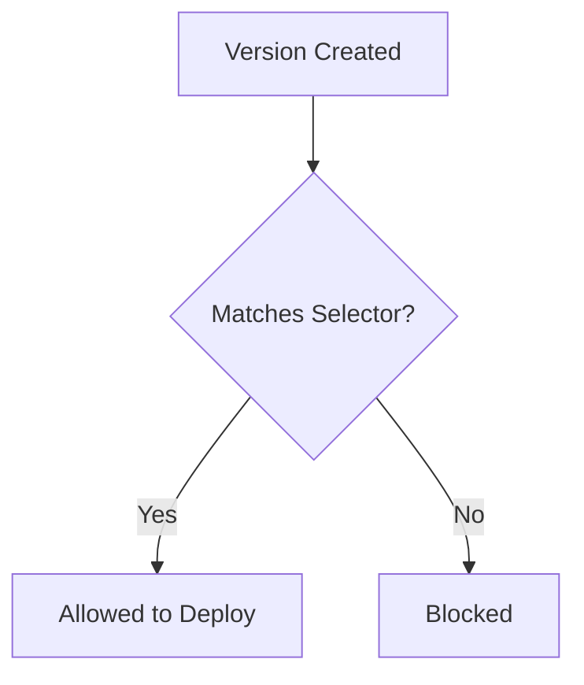

**Version selector rules** filter which deployment versions are allowed to
deploy to matching environments. Use them to restrict production to stable
releases, enforce naming conventions, or block specific versions.

## Overview



## Why Use Version Selectors?

Version selector rules help you:

- **Enforce release channels** - Only stable versions in production
- **Block bad versions** - Prevent known-bad releases from deploying
- **Naming conventions** - Require specific version formats
- **Feature flags** - Control rollout of experimental features
- **Context-aware filtering** - Use environment, resource, or deployment data
  to make dynamic version decisions

## Configuration

<Tabs>
<Tab title="Terraform">
```hcl
resource "ctrlplane_policy" "production_stable" {
  name     = "Production Stable Only"
  selector = "environment.name == 'production'"

  version_selector {
    selector    = "!version.tag.contains('-rc')"
    description = "Only stable versions (no release candidates)"
  }
}
```
</Tab>
<Tab title="API">
```bash
curl -X POST https://api.ctrlplane.com/v1/workspaces/{workspaceId}/policies \
  -H "Authorization: Bearer $TOKEN" \
  -H "Content-Type: application/json" \
  -d '{
    "name": "Production Stable Only",
    "selector": "environment.name == '\''production'\''",
    "rules": [
      {
        "versionSelector": {
          "selector": "!version.tag.contains('\''-rc'\'')",
          "description": "Only stable versions (no release candidates)"
        }
      }
    ]
  }'
```
</Tab>
</Tabs>

## Properties

<ParamField path="versionSelector.selector" type="string | object" required>
  A CEL expression (string) or JSON selector (object) to match allowed versions.
  CEL expressions have access to `version`, `environment`, `resource`, and
  `deployment` variables, enabling context-aware version filtering.
</ParamField>

<ParamField path="versionSelector.description" type="string">
  Human-readable explanation of the rule. Shown to users when a version is
  blocked.
</ParamField>

## CEL Expression Variables

When using CEL expressions, you have access to the following variables:

| Variable      | Type   | Description                                |
| ------------- | ------ | ------------------------------------------ |
| `version`     | map    | The deployment version being evaluated     |
| `environment` | map    | The target environment                     |
| `resource`    | map    | The target resource                        |
| `deployment`  | map    | The deployment                             |

### Version Fields

| Field                | Type   | Description                          |
| -------------------- | ------ | ------------------------------------ |
| `version.tag`        | string | Version tag (e.g., "v1.2.3")        |
| `version.metadata`   | map    | Custom metadata on the version       |
| `version.createdAt`  | string | When the version was created         |
| `version.status`     | string | Version status (e.g., "ready")       |

### Environment Fields

| Field                    | Type   | Description                      |
| ------------------------ | ------ | -------------------------------- |
| `environment.name`       | string | Environment name                 |
| `environment.metadata`   | map    | Custom metadata                  |

### Resource Fields

| Field                 | Type   | Description                       |
| --------------------- | ------ | --------------------------------- |
| `resource.name`       | string | Resource name                     |
| `resource.metadata`   | map    | Custom metadata                   |

### Deployment Fields

| Field                  | Type   | Description                      |
| ---------------------- | ------ | -------------------------------- |
| `deployment.name`      | string | Deployment name                  |
| `deployment.metadata`  | map    | Custom metadata                  |

The CEL environment includes standard extensions (string functions, math, etc.)
and all entity fields are accessible as map keys.

## Common Patterns

### Stable Versions Only

Block pre-release versions from production:

```json
{
  "name": "Production Stable",
  "selector": "environment.name == 'production'",
  "rules": [
    {
      "versionSelector": {
        "selector": "!version.tag.contains('-')",
        "description": "No pre-release versions (no hyphens in tag)"
      }
    }
  ]
}
```

### Semantic Version Pattern

Require semantic versioning format:

```json
{
  "versionSelector": {
    "selector": "version.tag.matches('^v[0-9]+\\\\.[0-9]+\\\\.[0-9]+$')",
    "description": "Must be semantic version (vX.Y.Z)"
  }
}
```

### Release Channel by Metadata

Use version metadata for release channels:

```json
[
  {
    "name": "Production Channel",
    "selector": "environment.name == 'production'",
    "rules": [
      {
        "versionSelector": {
          "selector": "version.metadata['channel'] == 'stable'",
          "description": "Only stable channel versions"
        }
      }
    ]
  },
  {
    "name": "Staging Channels",
    "selector": "environment.name == 'staging'",
    "rules": [
      {
        "versionSelector": {
          "selector": "version.metadata['channel'] in ['stable', 'beta']",
          "description": "Stable and beta channels allowed"
        }
      }
    ]
  }
]
```

### Major Version Restriction

Restrict major version changes:

```json
{
  "versionSelector": {
    "selector": "version.tag.startsWith('v2.')",
    "description": "Only v2.x versions allowed"
  }
}
```

### Context-Aware Version Filtering

Use environment or resource data to dynamically filter versions. This is
uniquely powerful because the selector has access to all four entity types:

```json
{
  "name": "Region-Specific Versions",
  "selector": "environment.name == 'production'",
  "rules": [
    {
      "versionSelector": {
        "selector": "resource.metadata['region'] != 'us-east-1' || version.metadata['us_east_certified'] == 'true'",
        "description": "US-East-1 requires certified versions"
      }
    }
  ]
}
```

### Branch-Based Filtering

Only deploy versions from the main branch:

```json
{
  "versionSelector": {
    "selector": "version.metadata['branch'] == 'main'",
    "description": "Only deploy versions from main branch"
  }
}
```

### Feature Flag Versions

Control feature rollout by version metadata and resource:

```json
{
  "name": "New UI Rollout",
  "selector": "environment.name == 'production'",
  "rules": [
    {
      "versionSelector": {
        "selector": "resource.metadata['region'] == 'us-east-1' || !has(version.metadata['feature_new_ui']) || version.metadata['feature_new_ui'] != 'true'",
        "description": "New UI only enabled for us-east-1"
      }
    }
  ]
}
```

## JSON Selector Format

As an alternative to CEL expressions, you can use JSON selectors that match
against the version object:

```json
{
  "versionSelector": {
    "selector": {
      "matchExpression": [
        {
          "key": "tag",
          "operator": "DoesNotContain",
          "value": "-rc"
        }
      ]
    },
    "description": "Only stable versions (no release candidates)"
  }
}
```

### JSON Selector Operators

| Operator         | Description            | Example                         |
| ---------------- | ---------------------- | ------------------------------- |
| `Equals`         | Exact match            | `tag Equals "v1.0.0"`          |
| `NotEquals`      | Not equal              | `tag NotEquals "v1.0.0"`       |
| `In`             | Value in list          | `tag In ["v1.0.0", "v1.0.1"]` |
| `NotIn`          | Value not in list      | `tag NotIn ["v1.0.0"]`         |
| `Contains`       | String contains        | `tag Contains "beta"`          |
| `DoesNotContain` | String does not contain| `tag DoesNotContain "rc"`      |
| `StartsWith`     | String starts with     | `tag StartsWith "v2."`         |
| `EndsWith`       | String ends with       | `tag EndsWith "-stable"`       |
| `Matches`        | Regex match            | `tag Matches "^v[0-9]+"`       |
| `Exists`         | Field exists           | `metadata.approved Exists`     |
| `DoesNotExist`   | Field does not exist   | `metadata.blocked DoesNotExist`|

<Note>
  JSON selectors only match against the `version` object. For cross-entity
  filtering (e.g., using environment or resource data), use CEL expressions
  instead.
</Note>

## Best Practices

### Environment Guidelines

| Environment | Version Policy                           |
| ----------- | ---------------------------------------- |
| Development | Allow all versions                       |
| QA          | Allow all or beta+                       |
| Staging     | Stable and beta                          |
| Production  | Stable only                              |

### Recommendations

- ✅ Use `description` to explain why versions are restricted
- ✅ Prefer CEL expressions for context-aware filtering (access to environment,
  resource, deployment)
- ✅ Use metadata for release channels instead of parsing tags
- ✅ Document blocked versions with links to issues
- ✅ Test selectors in lower environments first
- ✅ Start permissive and tighten over time

### Anti-Patterns

- ❌ Overly complex regex patterns
- ❌ Blocking without documentation
- ❌ Inconsistent version tagging conventions
- ❌ Forgetting to update blocked version lists

## Next Steps

- [Policies Overview](./overview) - Learn about policy structure
- [Environment Progression](./environment-progression) - Control promotion flow
- [Version Cooldown](./version-cooldown) - Batch frequent releases
