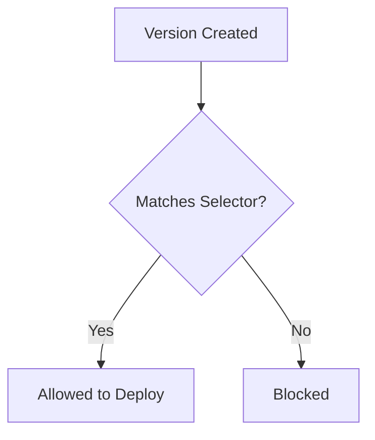

**Version selector rules** filter which deployment versions are allowed to
deploy to matching environments. Use them to restrict production to stable
releases, enforce naming conventions, or block specific versions.

## Overview



## Why Use Version Selectors?

Version selector rules help you:

- **Enforce release channels** - Only stable versions in production
- **Block bad versions** - Prevent known-bad releases from deploying
- **Naming conventions** - Require specific version formats
- **Feature flags** - Control rollout of experimental features

## Configuration

Add a version selector rule to your policy:

```yaml
policies:
  - name: production-stable-only
    selectors:
      - environment: environment.name == "production"
    rules:
      - versionSelector:
          selector:
            matchExpression:
              - key: tag
                operator: DoesNotContain
                value: "-rc"
          description: "Only stable versions (no release candidates)"
```

## Properties

| Property      | Type     | Required | Description                                    |
| ------------- | -------- | -------- | ---------------------------------------------- |
| `selector`    | Selector | Yes      | CEL expression to match allowed versions       |
| `description` | string   | No       | Human-readable explanation of the rule         |

## Selector Expressions

Version selectors use CEL expressions to evaluate version metadata:

### Available Fields

| Field                | Type   | Description                          |
| -------------------- | ------ | ------------------------------------ |
| `version.tag`        | string | Version tag (e.g., "v1.2.3")         |
| `version.metadata`   | object | Custom metadata on the version       |
| `version.createdAt`  | string | When the version was created         |

## Common Patterns

### Stable Versions Only

Block pre-release versions from production:

```yaml
policies:
  - name: production-stable
    selectors:
      - environment: environment.name == "production"
    rules:
      - versionSelector:
          selector:
            matchExpression:
              - key: tag
                operator: DoesNotContain
                value: "-"
          description: "No pre-release versions (no hyphens in tag)"
```

### Semantic Version Pattern

Require semantic versioning format:

```yaml
policies:
  - name: require-semver
    selectors:
      - environment: environment.name == "production"
    rules:
      - versionSelector:
          selector:
            matchExpression:
              - key: tag
                operator: Matches
                value: "^v[0-9]+\\.[0-9]+\\.[0-9]+$"
          description: "Must be semantic version (vX.Y.Z)"
```

### Block Specific Versions

Prevent known-bad versions from deploying:

```yaml
policies:
  - name: block-bad-versions
    rules:
      - versionSelector:
          selector:
            matchExpression:
              - key: tag
                operator: NotIn
                values:
                  - "v2.1.0"
                  - "v2.1.1"
          description: "Blocked versions with critical bugs"
```

### Release Channel by Metadata

Use version metadata for release channels:

```yaml
policies:
  # Production: Only 'stable' channel
  - name: production-channel
    selectors:
      - environment: environment.name == "production"
    rules:
      - versionSelector:
          selector:
            matchLabels:
              channel: stable
          description: "Only stable channel versions"

  # Staging: Allow 'stable' and 'beta' channels
  - name: staging-channels
    selectors:
      - environment: environment.name == "staging"
    rules:
      - versionSelector:
          selector:
            matchExpression:
              - key: metadata.channel
                operator: In
                values:
                  - stable
                  - beta
          description: "Stable and beta channels allowed"
```

### Major Version Restriction

Restrict major version changes:

```yaml
policies:
  - name: v2-only
    selectors:
      - environment: environment.name == "production"
    rules:
      - versionSelector:
          selector:
            matchExpression:
              - key: tag
                operator: StartsWith
                value: "v2."
          description: "Only v2.x versions allowed"
```

### Feature Flag Versions

Control feature rollout by version metadata:

```yaml
policies:
  - name: new-ui-rollout
    selectors:
      - environment: environment.name == "production"
      - resource: resource.metadata.region == "us-east-1"
    rules:
      - versionSelector:
          selector:
            matchLabels:
              feature.newUI: "true"
          description: "New UI enabled for us-east-1"
```

## Selector Operators

| Operator         | Description                              | Example                                  |
| ---------------- | ---------------------------------------- | ---------------------------------------- |
| `Equals`         | Exact match                              | `tag Equals "v1.0.0"`                    |
| `NotEquals`      | Not equal                                | `tag NotEquals "v1.0.0"`                 |
| `In`             | Value in list                            | `tag In ["v1.0.0", "v1.0.1"]`            |
| `NotIn`          | Value not in list                        | `tag NotIn ["v1.0.0"]`                   |
| `Contains`       | String contains                          | `tag Contains "beta"`                    |
| `DoesNotContain` | String does not contain                  | `tag DoesNotContain "rc"`                |
| `StartsWith`     | String starts with                       | `tag StartsWith "v2."`                   |
| `EndsWith`       | String ends with                         | `tag EndsWith "-stable"`                 |
| `Matches`        | Regex match                              | `tag Matches "^v[0-9]+"`                 |
| `Exists`         | Field exists                             | `metadata.approved Exists`               |
| `DoesNotExist`   | Field does not exist                     | `metadata.blocked DoesNotExist`          |

## Best Practices

### Environment Guidelines

| Environment | Version Policy                           |
| ----------- | ---------------------------------------- |
| Development | Allow all versions                       |
| QA          | Allow all or beta+                       |
| Staging     | Stable and beta                          |
| Production  | Stable only                              |

### Recommendations

- ✅ Use `description` to explain why versions are restricted
- ✅ Start permissive and tighten over time
- ✅ Use metadata for release channels instead of parsing tags
- ✅ Document blocked versions with links to issues
- ✅ Test selectors in lower environments first

### Anti-Patterns

- ❌ Overly complex regex patterns
- ❌ Blocking without documentation
- ❌ Inconsistent version tagging conventions
- ❌ Forgetting to update blocked version lists

## Next Steps

- [Policies Overview](./overview) - Learn about policy structure
- [Environment Progression](./environment-progression) - Control promotion flow
- [Selectors](../concepts/selectors) - Deep dive into selector syntax

