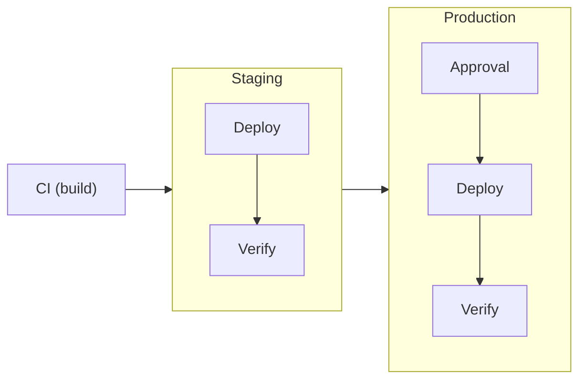

This guide walks you through setting up a complete deployment pipeline with
staging → production promotion and automated verification. By the end, you'll
have a working example of Ctrlplane's core capabilities.

## What You'll Build



- **Deployment** with automatic version creation from CI
- **Two environments** (staging, production) with resource selectors
- **Verification** that checks deployment health before promotion
- **Approval policy** requiring sign-off for production

## Prerequisites

- Ctrlplane account ([app.ctrlplane.dev](https://app.ctrlplane.dev) or
  [self-hosted](./installation))
- API key (Settings → API Keys)
- GitHub repository with CI workflow

## Step 1: Create a System

A system groups related deployments. This is typically a product, platform, or
bounded context.


```yaml YAML
# ctrlc apply -f system.yaml
type: System
name: Tutorial Quickstart
description: A tutorial on how to use Ctrlplane found in the Quickstart guide.
metadata:
  tutorial: quickstart
```

```bash
ctrlc apply -f https://raw.githubusercontent.com/ctrlplanedev/ctrlplane/main/examples/quickstart/1-system.yaml
```

## Step 2: Register Resources

Resources are your deployment targets. In production, you'd sync these from
Kubernetes or cloud providers. For this quickstart, we'll create them manually.

```yaml
# ctrlc apply -f resource.yaml
---
type: Resource
identifier: tutorial-quickstart-resource-staging
kind: KubernetesCluster
name: quickstart-staging-cluster
version: tutorial/quickstart/v1
metadata:
  tutorial: quickstart
  environment: staging
  region: us-east-1
config:
  number: 1
  string: "one"
  boolean: true
  array:
    - one
    - two
    - three
---
type: Resource
identifier: tutorial-quickstart-resource-production
kind: KubernetesCluster
name: quickstart-production-cluster
version: tutorial/quickstart/v1
metadata:
  tutorial: quickstart
  environment: production
  region: us-east-1
config:
  number: 1
  string: "one"
  boolean: true
  array:
    - one
    - two
    - three
```

```bash
ctrlc apply -f https://raw.githubusercontent.com/ctrlplanedev/ctrlplane/main/examples/quickstart/2-resources.yaml
```

## Step 3: Create Environments

Environments use selectors to dynamically match resources. When you add new
clusters with matching metadata, they're automatically included.

```yaml YAML
# Staging environment
type: Environment
name: Staging
description: Pre-production validation
resourceSelector: resource.metadata["environment"] == "staging"
---
# Production environment
type: Environment
name: Production
description: Live production environment
resourceSelector: resource.metadata["environment"] == "production"
```


```bash
ctrlc apply -f https://raw.githubusercontent.com/ctrlplanedev/ctrlplane/main/examples/quickstart/3-environments.yaml
```

## Step 4: Create a Job Agent

Job agents execute your deployments. We'll use a simple test runner, but Ctrlplane
supports GitHub Actions, Kubernetes jobs, ArgoCD, or custom agents.

```yaml YAML
# Production environment
type: JobAgent
name: Tutorial Quickstart Job Agent
description: A tutorial on how to use Ctrlplane found in the Quickstart guide.
metadata:
  tutorial: quickstart
agent:
  type: test-runner
  config:
    sleep: 5s
```

```bash
ctrlc apply -f https://raw.githubusercontent.com/ctrlplanedev/ctrlplane/main/examples/quickstart/4-job-agent.yaml
```

## Step 5: Create a Deployment

A deployment represents your application. The job agent config tells Ctrlplane
how to trigger deployments.

```yaml YAML
# Production environment
type: Deployment
name: Tutorial Quickstart Deployment
description: A tutorial on how to use Ctrlplane found in the Quickstart guide.
metadata:
  tutorial: quickstart
jobAgent:
  ref: Tutorial Quickstart Job Agent
```

```bash
ctrlc apply -f https://raw.githubusercontent.com/ctrlplanedev/ctrlplane/main/examples/quickstart/5-deployment.yaml
```

## Step 6: Add Deployment Workflow

Create `.github/workflows/deploy.yml` in your repository:

```yaml
name: Deploy

on:
  workflow_dispatch:
    inputs:
      job_id:
        description: "Ctrlplane Job ID"
        required: true

jobs:
  deploy:
    runs-on: ubuntu-latest
    steps:
      - uses: actions/checkout@v4

      - name: Get deployment context
        uses: ctrlplanedev/get-job-inputs@v1
        id: job
        with:
          job_id: ${{ inputs.job_id }}
          api_key: ${{ secrets.CTRLPLANE_API_KEY }}

      - name: Deploy to Kubernetes
        run: |
          echo "Deploying ${{ steps.job.outputs.version_tag }}"
          echo "Environment: ${{ steps.job.outputs.environment_name }}"
          echo "Cluster: ${{ steps.job.outputs.resource_identifier }}"

          # Your deployment logic here
          # kubectl set image deployment/api-gateway \
          #   api-gateway=${{ steps.job.outputs.version_tag }}
```

Add `CTRLPLANE_API_KEY` to your repository secrets.

## Step 7: Integrate CI Build

Add version creation to your build workflow (`.github/workflows/build.yml`):

```yaml
- name: Install Ctrlplane CLI
  uses: ctrlplanedev/cli@main
  with:
    api_key: ${{ secrets.CTRLPLANE_API_KEY }}

- name: Create deployment version
  if: github.ref == 'refs/heads/main'
  run: |
    ctrlc api upsert version \
      --workspace <your-workspace> \
      --deployment ${{ secrets.CTRLPLANE_DEPLOYMENT_ID }}  \
      --tag ${{ github.sha }} \
      --name "${{ github.sha::7 }}" \
      --metadata github/owner=${{ github.repository_owner }} \
      --metadata github/repo=${{ github.event.repository.name }} \
      --metadata git/sha=${{ github.sha }} \
      --metadata git/branch=${{ github.ref_name }} \
      --metadata github/run-number=${{ github.run_number }} \
      --metadata github/run-id=${{ github.run_id }} \
      --metadata github/run-attempt=${{ github.run_attempt }}
```

## Step 8: Add Production Approval

Create a policy requiring approval before production deployments

```yaml
# ctrlc apply -f policy.yaml
type: Policy
name: production-approval-policy
description: Production Approval Policy
metadata:
  tutorial: quickstart
selectors:
  - environments: environment.metadata["requires-approval"] == "true"
rules:
  - approval:
      required: 1
```

## Step 9: Test the Pipeline

1. Push a commit to `main`
2. CI builds and creates a version in Ctrlplane
3. Ctrlplane creates releases for staging and production
4. Staging deployment executes immediately
5. Verification runs health checks
6. Production waits for approval
7. After approval, production deploys and verifies

View the pipeline in the Ctrlplane UI:

- **Deployments** → See version progression across environments
- **Releases** → Track individual release status
- **Jobs** → View execution details and logs

## What You've Built

✅ **Deployment orchestration** with automatic environment progression  
✅ **Resource inventory** with metadata-based environment selectors  
✅ **Verification** ensuring deployment health before promotion  
✅ **Policy gates** requiring approval for production

## Next Steps

<CardGroup cols={2}>
  <Card title="Policies" icon="shield" href="./policies/overview">
    Configure gradual rollouts, concurrency limits, and custom gates
  </Card>
  <Card
    title="Verification"
    icon="check"
    href="./policies/verification/overview"
  >
    Add Datadog metrics, custom HTTP checks, and more
  </Card>
  <Card title="Resources" icon="server" href="./concepts/resources">
    Sync resources from Kubernetes, AWS, or custom providers
  </Card>
  <Card title="Job Agents" icon="robot" href="./integrations/job-agents/github">
    Deploy with GitHub Actions, ArgoCD, or custom agents
  </Card>
</CardGroup>

## Troubleshooting

**Jobs not being created:**

- Verify resource metadata matches environment selectors
- Check deployment has a job agent configured
- Review policy denials in the Releases view

**Verification failing:**

- Test the health endpoint manually
- Check the success condition syntax
- Review measurement data in the verification details

**GitHub workflow not triggering:**

- Ensure job agent type is `github`
- Verify workflow filename matches `jobAgentConfig`
- Check GitHub App permissions

Need help?
[GitHub Discussions](https://github.com/ctrlplanedev/ctrlplane/discussions)
