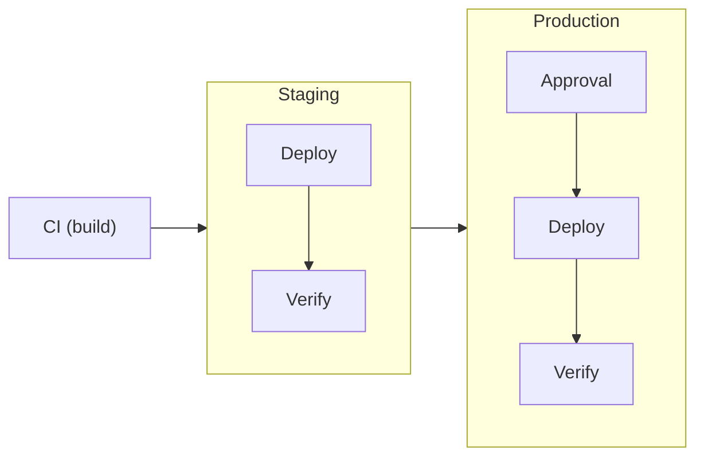

This guide walks you through setting up a complete deployment pipeline with
staging → production promotion and automated verification. By the end, you'll
have a working example of Ctrlplane's core capabilities.

## What You'll Build



- **Deployment** with automatic version creation from CI
- **Two environments** (staging, production) with resource selectors
- **Verification** that checks deployment health before promotion
- **Approval policy** requiring sign-off for production

## Prerequisites

- Ctrlplane account ([app.ctrlplane.dev](https://app.ctrlplane.dev) or
  [self-hosted](./installation))
- API key (Settings → API Keys)
- GitHub repository with CI workflow

## Step 1: Create a System

A system groups related deployments. This is typically a product, platform, or
bounded context.

<CodeGroup>

```yaml YAML
# ctrlc apply -f system.yaml
type: System
name: API Platform
slug: api-platform
description: Core API services
```

</CodeGroup>

## Step 2: Register Resources

Resources are your deployment targets. In production, you'd sync these from
Kubernetes or cloud providers. For this quickstart, we'll create them manually.

<CodeGroup>

```yaml ctrlc apply
# ctrlc apply -f resource.yaml
type: Resource
version: tutorial/v1
kind: KubernetesCluster
name: Staging Cluster
identifier: k8s-staging-useast1
metadata:
  environment: staging
  region: us-east-1
  provider: aws
config:
  namespace: api-platform
---
type: Resource
version: tutorial/v1
kind: KubernetesCluster
name: Production Cluster
identifier: k8s-prod-useast1
metadata:
  environment: production
  region: us-east-1
  provider: aws
config:
  namespace: api-platform
```

</CodeGroup>

## Step 3: Create Environments

Environments use selectors to dynamically match resources. When you add new
clusters with matching metadata, they're automatically included.

<CodeGroup>

```yaml YAML
# Staging environment
type: Environment
name: Staging
description: Pre-production validation
resourceSelector: resource.metadata["environment"] == "staging"
---
# Production environment
type: Environment
name: Production
description: Live production environment
resourceSelector: resource.metadata["environment"] == "production"
```

</CodeGroup>

## Step 4: Create a Job Agent

Job agents execute your deployments. We'll use GitHub Actions, but Ctrlplane
supports Kubernetes jobs, ArgoCD, or custom agents.

```bash
curl -X PATCH https://app.ctrlplane.dev/api/v1/job-agents/name \
  -H "Authorization: Bearer $CTRLPLANE_API_KEY" \
  -H "Content-Type: application/json" \
  -d '{
    "name": "github-actions",
    "type": "github",
    "workspaceId": "{workspaceId}"
  }'
```

Save the returned `id` as `JOB_AGENT_ID`.

## Step 5: Create a Deployment

A deployment represents your application. The job agent config tells Ctrlplane
how to trigger deployments.

```bash
curl -X POST https://app.ctrlplane.dev/api/v1/systems/$SYSTEM_ID/deployments \
  -H "Authorization: Bearer $CTRLPLANE_API_KEY" \
  -H "Content-Type: application/json" \
  -d '{
    "name": "API Gateway",
    "slug": "api-gateway",
    "description": "Main API gateway service",
    "jobAgentId": "'$JOB_AGENT_ID'",
    "jobAgentConfig": {
      "workflow": "deploy.yml",
      "owner": "your-org",
      "repo": "api-gateway"
    }
  }'
```

Save the returned `id` as `DEPLOYMENT_ID`.

## Step 6: Add Deployment Workflow

Create `.github/workflows/deploy.yml` in your repository:

```yaml
name: Deploy

on:
  workflow_dispatch:
    inputs:
      job_id:
        description: "Ctrlplane Job ID"
        required: true

jobs:
  deploy:
    runs-on: ubuntu-latest
    steps:
      - uses: actions/checkout@v4

      - name: Get deployment context
        uses: ctrlplanedev/get-job-inputs@v1
        id: job
        with:
          job_id: ${{ inputs.job_id }}
          api_key: ${{ secrets.CTRLPLANE_API_KEY }}

      - name: Deploy to Kubernetes
        run: |
          echo "Deploying ${{ steps.job.outputs.version_tag }}"
          echo "Environment: ${{ steps.job.outputs.environment_name }}"
          echo "Cluster: ${{ steps.job.outputs.resource_identifier }}"

          # Your deployment logic here
          # kubectl set image deployment/api-gateway \
          #   api-gateway=${{ steps.job.outputs.version_tag }}
```

Add `CTRLPLANE_API_KEY` to your repository secrets.

## Step 7: Integrate CI Build

Add version creation to your build workflow (`.github/workflows/build.yml`):

```yaml
- name: Create deployment version
  if: github.ref == 'refs/heads/main'
  run: |
    curl -X POST https://app.ctrlplane.dev/api/v1/deployments/$DEPLOYMENT_ID/versions \
      -H "Authorization: Bearer ${{ secrets.CTRLPLANE_API_KEY }}" \
      -H "Content-Type: application/json" \
      -d '{
        "tag": "${{ github.sha }}",
        "name": "Build #${{ github.run_number }}",
        "status": "ready",
        "metadata": {
          "commit": "${{ github.sha }}",
          "branch": "${{ github.ref_name }}",
          "actor": "${{ github.actor }}"
        }
      }'
```

## Step 8: Add Verification Policy

Create a policy that requires health checks before considering a deployment
successful:

```bash
curl -X POST https://app.ctrlplane.dev/api/v1/systems/$SYSTEM_ID/policies \
  -H "Authorization: Bearer $CTRLPLANE_API_KEY" \
  -H "Content-Type: application/json" \
  -d '{
    "name": "Health Check Verification",
    "enabled": true,
    "selectors": [],
    "rules": [{
      "verification": {
        "metrics": [{
          "name": "health-check",
          "intervalSeconds": 30,
          "count": 5,
          "provider": {
            "type": "http",
            "url": "http://{{.resource.config.namespace}}.{{.resource.identifier}}/health"
          },
          "successCondition": "result.ok && result.statusCode == 200",
          "failureThreshold": 2
        }]
      }
    }]
  }'
```

## Step 9: Add Production Approval

Create a policy requiring approval before production deployments:

```bash
curl -X POST https://app.ctrlplane.dev/api/v1/systems/$SYSTEM_ID/policies \
  -H "Authorization: Bearer $CTRLPLANE_API_KEY" \
  -H "Content-Type: application/json" \
  -d '{
    "name": "Production Approval",
    "enabled": true,
    "selectors": [{
      "environmentSelector": {
        "type": "name",
        "operator": "equals",
        "value": "Production"
      }
    }],
    "rules": [{
      "anyApproval": {
        "minApprovals": 1
      }
    }]
  }'
```

## Step 10: Test the Pipeline

1. Push a commit to `main`
2. CI builds and creates a version in Ctrlplane
3. Ctrlplane creates releases for staging and production
4. Staging deployment executes immediately
5. Verification runs health checks
6. Production waits for approval
7. After approval, production deploys and verifies

View the pipeline in the Ctrlplane UI:

- **Deployments** → See version progression across environments
- **Releases** → Track individual release status
- **Jobs** → View execution details and logs

## What You've Built

✅ **Deployment orchestration** with automatic environment progression  
✅ **Resource inventory** with metadata-based environment selectors  
✅ **Verification** ensuring deployment health before promotion  
✅ **Policy gates** requiring approval for production

## Next Steps

<CardGroup cols={2}>
  <Card title="Policies" icon="shield" href="./policies/overview">
    Configure gradual rollouts, concurrency limits, and custom gates
  </Card>
  <Card
    title="Verification"
    icon="check"
    href="./policies/verification/overview"
  >
    Add Datadog metrics, custom HTTP checks, and more
  </Card>
  <Card title="Resources" icon="server" href="./concepts/resources">
    Sync resources from Kubernetes, AWS, or custom providers
  </Card>
  <Card title="Job Agents" icon="robot" href="./job-agents/overview">
    Deploy with Kubernetes jobs, ArgoCD, or custom agents
  </Card>
</CardGroup>

## Troubleshooting

**Jobs not being created:**

- Verify resource metadata matches environment selectors
- Check deployment has a job agent configured
- Review policy denials in the Releases view

**Verification failing:**

- Test the health endpoint manually
- Check the success condition syntax
- Review measurement data in the verification details

**GitHub workflow not triggering:**

- Ensure job agent type is `github`
- Verify workflow filename matches `jobAgentConfig`
- Check GitHub App permissions

Need help?
[GitHub Discussions](https://github.com/ctrlplanedev/ctrlplane/discussions)
