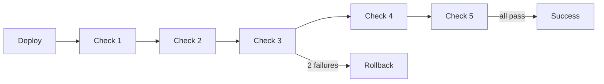

## The Scenario

Your deployment pipeline says "success" but the service is actually broken. You want:

- Automatic health checks after every deployment
- Real metrics from Datadog, Prometheus, or your monitoring stack
- Automatic rollback if verification fails
- No more "deploy succeeded, service is down" situations

## Without Ctrlplane

**The typical flow:**
1. CI/CD deploys the service
2. Pipeline says ✅ because kubectl apply succeeded
3. Service is actually broken (bad config, missing dependency, etc.)
4. Someone notices 30 minutes later
5. Frantic rollback ensues

**What goes wrong:**
- "Deployed successfully" ≠ "Working correctly"
- Health checks are bolted on, not built in
- Rollback is manual and error-prone
- No verification between regions during multi-cluster deploys

## With Ctrlplane

Add a verification policy:

```yaml
type: Policy
name: Deployment Health Check
selectors:
  - environment: environment.name in ["Staging", "Production"]
rules:
  - verification:
      metrics:
        - name: error-rate
          provider:
            type: datadog
            apiKey: "{{.secrets.DD_API_KEY}}"
            appKey: "{{.secrets.DD_APP_KEY}}"
            query: "sum:trace.http.request.errors{service:{{.deployment.name}},env:{{.environment.name}}}.as_rate()"
          successCondition: result.value < 0.01
          failureThreshold: 2
          intervalSeconds: 60
          count: 5

        - name: latency-p99
          provider:
            type: datadog
            apiKey: "{{.secrets.DD_API_KEY}}"
            appKey: "{{.secrets.DD_APP_KEY}}"
            query: "p99:trace.http.request.duration{service:{{.deployment.name}},env:{{.environment.name}}}"
          successCondition: result.value < 500  # 500ms
          failureThreshold: 2
          intervalSeconds: 60
          count: 5
```

## What Happens



1. **Deployment completes** — Job agent reports success
2. **Verification starts** — First metric check at 60 seconds
3. **Metrics queried** — Datadog returns error rate and latency
4. **Success condition evaluated** — Is error rate < 1%? Is p99 < 500ms?
5. **Continue or fail** — If 2+ checks fail, trigger rollback
6. **Rollback executes** — Previous version is deployed automatically

## Key Benefits

| Benefit | How It Works |
|---------|-------------|
| **Real metrics** | Use your actual monitoring data, not synthetic checks |
| **Automatic rollback** | No manual intervention when verification fails |
| **Configurable thresholds** | Define what "healthy" means for your service |
| **Multiple metrics** | Check error rate AND latency AND custom metrics |
| **Per-environment rules** | Stricter verification in production |

## Verification Providers

### Datadog

```yaml
provider:
  type: datadog
  apiKey: "{{.secrets.DD_API_KEY}}"
  appKey: "{{.secrets.DD_APP_KEY}}"
  query: "sum:errors{service:api}.as_rate()"
```

### Prometheus

```yaml
provider:
  type: prometheus
  address: "http://prometheus.monitoring:9090"
  query: "rate(http_requests_total{status=~\"5..\"}[5m])"
```

### HTTP Endpoint

```yaml
provider:
  type: http
  url: "https://{{.resource.config.host}}/health"
  method: GET
  headers:
    Authorization: "Bearer {{.secrets.HEALTH_TOKEN}}"
```

### Custom Script

```yaml
provider:
  type: http
  url: "https://internal-api/verify"
  method: POST
  body: |
    {
      "deployment": "{{.deployment.name}}",
      "version": "{{.version.tag}}",
      "resource": "{{.resource.identifier}}"
    }
```

## Variations

### Progressive Verification

Start with quick checks, then extend to thorough verification:

```yaml
metrics:
  # Quick smoke test (first 2 minutes)
  - name: health-endpoint
    provider:
      type: http
      url: "https://{{.resource.config.host}}/health"
    successCondition: result.statusCode == 200
    intervalSeconds: 30
    count: 4
    
  # Extended error rate check (next 5 minutes)
  - name: error-rate
    provider:
      type: datadog
      query: "sum:errors{service:api}"
    successCondition: result.value < 0.01
    intervalSeconds: 60
    count: 5
```

### Environment-Specific Thresholds

```yaml
# Staging: Lenient
- name: Staging Verification
  selectors:
    - environment: environment.name == "Staging"
  rules:
    - verification:
        metrics:
          - name: error-rate
            successCondition: result.value < 0.05  # 5% error rate OK

# Production: Strict
- name: Production Verification
  selectors:
    - environment: environment.name == "Production"
  rules:
    - verification:
        metrics:
          - name: error-rate
            successCondition: result.value < 0.01  # Only 1% allowed
            failureThreshold: 1  # Fail fast
```

### Multi-Metric Verification

```yaml
metrics:
  - name: error-rate
    successCondition: result.value < 0.01
    
  - name: latency-p99
    successCondition: result.value < 500
    
  - name: saturation
    successCondition: result.value < 0.8  # CPU < 80%
    
  - name: availability
    successCondition: result.value > 0.999  # 99.9% uptime
```

## Rollback Behavior

When verification fails:

1. **Rollback triggered** — Ctrlplane initiates rollback
2. **Previous version deployed** — The last successful version is redeployed
3. **Verification runs again** — Confirms rollback was successful
4. **Release marked failed** — Full audit trail preserved

You can also configure rollback behavior:

```yaml
rules:
  - verification:
      rollback:
        enabled: true
        toVersion: previous  # or specific version tag
```

## Next Steps

<CardGroup cols={2}>
  <Card title="Datadog Verification" icon="chart-line" href="../policies/verification/providers/datadog">
    Configure Datadog metrics
  </Card>
  <Card title="HTTP Verification" icon="globe" href="../policies/verification/providers/http">
    Set up HTTP health checks
  </Card>
  <Card title="Environment Promotion" icon="arrow-right" href="./environment-promotion">
    Gate promotions on verification
  </Card>
  <Card title="Multi-Region" icon="globe" href="./multi-region">
    Verify between regions
  </Card>
</CardGroup>
