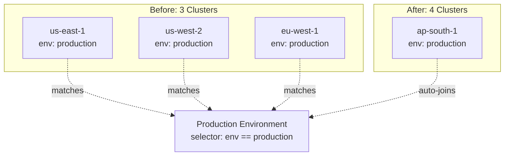

## The Scenario

You're adding infrastructure regularly—new clusters, new regions, new services. You want:

- New clusters to automatically receive deployments
- No config file updates when infrastructure changes
- Environment membership based on resource attributes
- Different policies for different resource types

## Without Ctrlplane

**The typical approach:**
1. Add new cluster to Kubernetes
2. Update CI/CD pipeline config
3. Update deployment manifests
4. Update ArgoCD ApplicationSet
5. Update monitoring config
6. Forget one thing, wonder why deploys don't work

**What goes wrong:**
- Adding infrastructure requires multiple config changes
- Easy to miss something
- Config files become the source of truth (and drift)
- Manual process doesn't scale

## With Ctrlplane

### Define Environments with Selectors

Instead of listing clusters, define what "Production" means:

```yaml
type: Environment
name: Production
resourceSelector: resource.metadata["env"] == "production"
```

### Tag Resources Appropriately

When you add a new cluster:

```yaml
type: Resource
name: prod-ap-south-1
kind: Kubernetes/Cluster
metadata:
  env: production      # ← This makes it "Production"
  region: ap-south-1
  cloud: aws
```

That's it. The new cluster:
- Is automatically part of the "Production" environment
- Receives deployments for all services targeting Production
- Inherits policies that apply to Production
- Shows up in the inventory immediately

## What Happens



1. **Environment defined** — "Production" = all resources where `env == production`
2. **3 clusters exist** — All have `env: production`, all are in Production
3. **New cluster added** — ap-south-1 tagged with `env: production`
4. **Automatic membership** — New cluster is now part of Production
5. **Deployments flow** — Next release automatically targets all 4 clusters

## Key Benefits

| Benefit | How It Works |
|---------|-------------|
| **Zero config changes** | Tag the resource, it joins automatically |
| **Declarative membership** | Environment definition is the source of truth |
| **Immediate effect** | New resources are included in next deployment |
| **Scales infinitely** | 4 clusters or 400, same environment definition |
| **Consistent policies** | New resources inherit existing policies |

## Selector Patterns

### By Environment Label

```yaml
# Simple environment matching
name: Production
resourceSelector: resource.metadata["env"] == "production"

name: Staging
resourceSelector: resource.metadata["env"] == "staging"
```

### By Region

```yaml
# US regions only
name: Production US
resourceSelector: |
  resource.metadata["env"] == "production" &&
  resource.metadata["region"].startsWith("us-")

# EU regions only
name: Production EU
resourceSelector: |
  resource.metadata["env"] == "production" &&
  resource.metadata["region"].startsWith("eu-")
```

### By Team

```yaml
# Platform team's infrastructure
name: Platform Production
resourceSelector: |
  resource.metadata["env"] == "production" &&
  resource.metadata["team"] == "platform"
```

### By Resource Type

```yaml
# Only Kubernetes clusters
name: K8s Production
resourceSelector: |
  resource.kind == "Kubernetes/Cluster" &&
  resource.metadata["env"] == "production"

# Only Lambda functions
name: Lambda Production
resourceSelector: |
  resource.kind == "AWS/Lambda" &&
  resource.metadata["env"] == "production"
```

### By Tier

```yaml
# Critical infrastructure only
name: Critical Production
resourceSelector: |
  resource.metadata["env"] == "production" &&
  resource.metadata["tier"] == "critical"
```

### Compound Selectors

```yaml
# Critical K8s clusters in US production
name: Critical US K8s
resourceSelector: |
  resource.kind == "Kubernetes/Cluster" &&
  resource.metadata["env"] == "production" &&
  resource.metadata["region"].startsWith("us-") &&
  resource.metadata["tier"] == "critical"
```

## Variations

### Hierarchical Environments

```yaml
# Global production
name: Production
resourceSelector: resource.metadata["env"] == "production"

# Regional sub-environments (inherit from Production)
name: Production/US
resourceSelector: |
  resource.metadata["env"] == "production" &&
  resource.metadata["region"].startsWith("us-")
directory: Production

name: Production/EU  
resourceSelector: |
  resource.metadata["env"] == "production" &&
  resource.metadata["region"].startsWith("eu-")
directory: Production
```

### Canary Environment

```yaml
# Canary gets deploys first
name: Canary
resourceSelector: resource.metadata["canary"] == "true"

# Production excludes canary
name: Production
resourceSelector: |
  resource.metadata["env"] == "production" &&
  resource.metadata["canary"] != "true"
```

### Deployment-Specific Targeting

Deployments can also filter which resources they target:

```yaml
type: Deployment
name: api-gateway
# Only deploy to clusters with api workloads
resourceSelector: resource.metadata["workloads"].contains("api")
```

Combined with environment:
```
Release Target = Deployment Filter ∩ Environment Filter
```

## Common Metadata Schema

Standardize your metadata for consistent environment targeting:

```yaml
metadata:
  # Required for environment membership
  env: production | staging | development
  
  # Geographic
  region: us-east-1 | eu-west-1 | ap-south-1
  cloud: aws | gcp | azure | onprem
  
  # Organizational
  team: platform | backend | data
  cost-center: engineering | infrastructure
  
  # Operational
  tier: critical | standard | experimental
  canary: "true" | "false"
  
  # Workload hints
  workloads: ["api", "worker", "cron"]
```

## Next Steps

<CardGroup cols={2}>
  <Card title="Selectors" icon="filter" href="../concepts/selectors">
    Full selector syntax reference
  </Card>
  <Card title="Environments" icon="layer-group" href="../concepts/environments">
    Environment configuration details
  </Card>
  <Card title="Infrastructure Inventory" icon="server" href="./infrastructure-inventory">
    Sync and manage resources
  </Card>
  <Card title="Multi-Region" icon="globe" href="./multi-region">
    Deploy across dynamic environments
  </Card>
</CardGroup>
