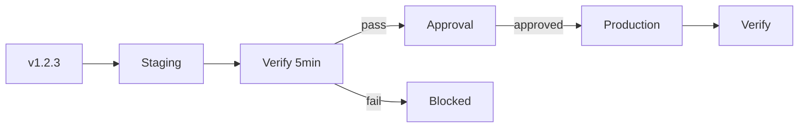

## The Scenario

You have a staging environment and a production environment. You want:

- Every version to deploy to staging first
- Production to only receive versions that passed staging
- Optional approval before production deploys
- No manual "okay, staging looks good, now deploy to prod" steps

## Without Ctrlplane

**The typical flow:**
1. CI deploys to staging
2. Someone checks if staging is healthy (maybe)
3. Someone remembers to trigger the prod deploy
4. Hopefully they deploy the right version
5. Hopefully staging actually passed

**What goes wrong:**
- "Staging passed" is based on vibes, not metrics
- The manual promotion step gets forgotten
- Wrong version deployed to prod
- No audit trail of what was verified

## With Ctrlplane

Define your environments:

```yaml
type: Environment
name: Staging
resourceSelector: resource.metadata["env"] == "staging"
---
type: Environment
name: Production
resourceSelector: resource.metadata["env"] == "production"
```

Add an environment progression policy:

```yaml
type: Policy
name: Staging Before Production
selectors:
  - environment: environment.name == "Production"
rules:
  - environmentProgression:
      waitFor: Staging
```

Add verification to staging:

```yaml
type: Policy
name: Staging Verification
selectors:
  - environment: environment.name == "Staging"
rules:
  - verification:
      metrics:
        - name: health-check
          provider:
            type: http
            url: "https://{{.resource.config.host}}/health"
          successCondition: result.statusCode == 200
          intervalSeconds: 30
          count: 10  # 5 minutes of health checks
```

Add approval for production:

```yaml
type: Policy
name: Production Approval
selectors:
  - environment: environment.name == "Production"
rules:
  - anyApproval:
      minApprovals: 1
```

## What Happens



1. **CI creates v1.2.3** — Version is marked ready
2. **Staging release created** — Deploys immediately (no gates)
3. **Staging verification runs** — 5 minutes of health checks
4. **Staging passes** → **Production is unblocked**
5. **Approval requested** — Notification sent to approvers
6. **Approval granted** — Team lead approves
7. **Production deploys** — Version goes live
8. **Production verification** — Confirms health in prod

If staging verification **fails**, production never receives the version. No manual intervention needed to block it.

## Key Benefits

| Benefit | How It Works |
|---------|-------------|
| **Enforced ordering** | Production physically cannot deploy before staging |
| **Verified promotion** | Only versions that pass verification can promote |
| **Audit trail** | Full history of what was verified and when |
| **Optional approval** | Add human gates where needed |
| **Automatic flow** | No manual "deploy to prod" step |

## Variations

### Multiple Pre-Production Environments

```yaml
# QA → Staging → Production
- name: Staging After QA
  selectors:
    - environment: environment.name == "Staging"
  rules:
    - environmentProgression:
        waitFor: QA

- name: Production After Staging  
  selectors:
    - environment: environment.name == "Production"
  rules:
    - environmentProgression:
        waitFor: Staging
```

### Different Verification per Environment

```yaml
# Light verification in QA
- name: QA Verification
  selectors:
    - environment: environment.name == "QA"
  rules:
    - verification:
        metrics:
          - name: smoke-test
            count: 3  # Quick check

# Thorough verification in Staging
- name: Staging Verification
  selectors:
    - environment: environment.name == "Staging"
  rules:
    - verification:
        metrics:
          - name: integration-tests
            count: 10  # Longer check
          - name: performance-baseline
            count: 5
```

### Skip Staging for Hotfixes

Use version metadata to bypass staging for critical fixes:

```yaml
- name: Hotfix Direct to Prod
  selectors:
    - environment: environment.name == "Production"
    - version: version.metadata["hotfix"] == "true"
  rules:
    - anyApproval:
        minApprovals: 2  # Require more approvals for hotfixes
    # No environment progression rule = skip staging
```

## Next Steps

<CardGroup cols={2}>
  <Card title="Environment Progression" icon="arrow-right" href="../policies/environment-progression">
    Configure progression rules
  </Card>
  <Card title="Verification" icon="check" href="../policies/verification/overview">
    Set up health checks
  </Card>
  <Card title="Approvals" icon="user-check" href="../policies/approval">
    Configure approval workflows
  </Card>
  <Card title="Multi-Region" icon="globe" href="./multi-region">
    Add gradual rollouts within production
  </Card>
</CardGroup>
