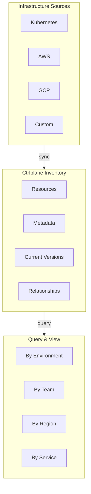

## The Scenario

You need to answer questions like:

- "What version of the API is running in eu-west-1 prod?"
- "How many clusters do we have? What's deployed to each?"
- "Which services are running on the new cluster we added last week?"
- "Show me all resources owned by the platform team"

## Without Ctrlplane

**The typical approach:**
1. Check Kubernetes dashboard (but which cluster?)
2. Check AWS console (but which region?)
3. Check the team's spreadsheet (but is it up to date?)
4. Ask in Slack (but who knows?)

**What goes wrong:**
- No single source of truth
- Information is scattered across tools
- Spreadsheets become stale immediately
- "What version is running?" requires multiple lookups

## With Ctrlplane

### Sync Resources Automatically

Resources are synced from your infrastructure via resource providers:

```yaml
# Kubernetes provider syncs all clusters
type: ResourceProvider
name: kubernetes-clusters
provider:
  type: kubernetes
  config:
    kubeconfig: "{{.secrets.KUBECONFIG}}"
sync:
  interval: 5m
```

Or register resources via API:

```bash
curl -X POST "https://api.ctrlplane.dev/resources" \
  -H "Authorization: Bearer $API_KEY" \
  -d '{
    "name": "prod-us-east-1",
    "kind": "KubernetesCluster",
    "identifier": "k8s-prod-use1",
    "metadata": {
      "env": "production",
      "region": "us-east-1",
      "team": "platform",
      "tier": "critical"
    },
    "config": {
      "server": "https://k8s-prod-use1.example.com",
      "namespace": "default"
    }
  }'
```

### Query Your Infrastructure

Once synced, query resources with selectors:

```yaml
# All production clusters
resource.metadata["env"] == "production"

# Critical services in us-east
resource.metadata["tier"] == "critical" && 
resource.metadata["region"] == "us-east-1"

# Everything owned by platform team
resource.metadata["team"] == "platform"
```

### See What's Deployed

Each resource shows its current deployed versions:

```
prod-us-east-1 (KubernetesCluster)
├── api-gateway: v1.2.3 (deployed 2h ago)
├── user-service: v2.0.1 (deployed 1d ago)
└── payment-service: v3.1.0 (deployed 3h ago)

prod-eu-west-1 (KubernetesCluster)
├── api-gateway: v1.2.2 (deployed 1d ago)  ← behind!
├── user-service: v2.0.1 (deployed 1d ago)
└── payment-service: v3.1.0 (deployed 3h ago)
```

## What You Get



## Key Benefits

| Benefit | How It Works |
|---------|-------------|
| **Single source of truth** | All resources in one place |
| **Real-time sync** | Providers keep inventory up to date |
| **Rich metadata** | Tag resources with any attributes |
| **Version tracking** | See what's deployed where |
| **Cross-provider** | Kubernetes, AWS, GCP, custom—all unified |

## Resource Metadata

Tag resources with metadata for powerful querying:

```yaml
metadata:
  # Environment classification
  env: production
  
  # Geographic location
  region: us-east-1
  cloud: aws
  
  # Ownership
  team: platform
  cost-center: engineering
  
  # Operational
  tier: critical
  on-call: platform-oncall@company.com
  
  # Custom
  compliance: soc2
  data-classification: pii
```

## Dynamic Environments

Environments use selectors to automatically group resources:

```yaml
type: Environment
name: Production US
resourceSelector: |
  resource.metadata["env"] == "production" &&
  resource.metadata["region"].startsWith("us-")
```

When you add a new cluster with matching metadata, it automatically joins the environment:

```yaml
# New cluster added
type: Resource
name: prod-us-west-2
metadata:
  env: production      # ← matches "production"
  region: us-west-2    # ← starts with "us-"
# Automatically part of "Production US" environment!
```

## Resource Relationships

Model dependencies between resources:

```yaml
type: Resource
name: api-gateway
relationships:
  - type: depends-on
    target: user-database
  - type: depends-on
    target: cache-cluster
```

Query relationships:

```yaml
# Find all resources that api-gateway depends on
resource.relationships.any(r, r.type == "depends-on")
```

## Variations

### Multi-Cloud Inventory

```yaml
# AWS resources
- type: ResourceProvider
  name: aws-resources
  provider:
    type: aws
    config:
      region: us-east-1

# GCP resources  
- type: ResourceProvider
  name: gcp-resources
  provider:
    type: gcp
    config:
      project: my-project

# On-prem Kubernetes
- type: ResourceProvider
  name: onprem-k8s
  provider:
    type: kubernetes
    config:
      kubeconfig: "{{.secrets.ONPREM_KUBECONFIG}}"
```

### Custom Resource Provider

Sync from any source using HTTP:

```yaml
type: ResourceProvider
name: custom-inventory
provider:
  type: http
  config:
    url: "https://internal-api/resources"
    method: GET
    headers:
      Authorization: "Bearer {{.secrets.INTERNAL_TOKEN}}"
sync:
  interval: 10m
```

### Version Tracking Queries

Find resources running old versions:

```yaml
# Resources where api-gateway is behind latest
resource.deployments["api-gateway"].version != "v1.2.3"

# Resources not updated in 7 days
resource.deployments["api-gateway"].deployedAt < now() - 7d
```

## Next Steps

<CardGroup cols={2}>
  <Card title="Resources" icon="server" href="../concepts/resources">
    Deep dive into resource configuration
  </Card>
  <Card title="Resource Providers" icon="rotate" href="../integrations/resource-providers">
    Set up automatic syncing
  </Card>
  <Card title="Selectors" icon="filter" href="../concepts/selectors">
    Learn the selector query language
  </Card>
  <Card title="Dynamic Environments" icon="layer-group" href="./dynamic-environments">
    Group resources automatically
  </Card>
</CardGroup>
