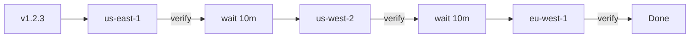

## The Scenario

You have 8 Kubernetes clusters across 3 regions (us-east, us-west, eu-west). When you release a new version, you need to:

- Deploy to all 8 clusters
- Not break everything at once
- Verify each cluster before moving to the next
- Roll back if something goes wrong

## Without Ctrlplane

**Option A: Deploy to all at once**
- Fast, but risky
- One bad deploy breaks all regions simultaneously
- Rollback is chaotic

**Option B: Manual sequential deploys**
- Safe, but slow
- Someone has to babysit each deployment
- Easy to forget a cluster
- Inconsistent timing between regions

**Option C: Complex CI/CD matrix**
- Build intricate pipeline logic
- Hard to maintain
- Verification is bolted on, not built in

## With Ctrlplane

Define your resources with region metadata:

```yaml
# Resources are synced from your infrastructure
type: Resource
name: prod-us-east-1
metadata:
  env: production
  region: us-east-1
---
type: Resource
name: prod-us-west-2
metadata:
  env: production
  region: us-west-2
---
type: Resource
name: prod-eu-west-1
metadata:
  env: production
  region: eu-west-1
```

Create an environment that matches all production clusters:

```yaml
type: Environment
name: Production
resourceSelector: resource.metadata["env"] == "production"
```

Add a gradual rollout policy:

```yaml
type: Policy
name: Production Gradual Rollout
selectors:
  - environment: environment.name == "Production"
rules:
  - gradualRollout:
      rolloutType: linear
      timeScaleInterval: 600  # 10 minutes between clusters
  - verification:
      metrics:
        - name: error-rate
          provider:
            type: datadog
            query: "sum:errors{env:prod,cluster:{{.resource.name}}}"
          successCondition: result.value < 0.01
          intervalSeconds: 60
          count: 5
```

## What Happens



1. **Version created** — CI builds v1.2.3 and tells Ctrlplane
2. **First cluster deploys** — us-east-1 receives the deployment
3. **Verification runs** — Datadog metrics are checked for 5 minutes
4. **Wait interval** — 10 minutes pass before next cluster
5. **Next cluster deploys** — us-west-2 receives the deployment
6. **Repeat** — Continue until all clusters are updated
7. **Auto-rollback** — If any verification fails, roll back that cluster

## Key Benefits

| Benefit | How It Works |
|---------|-------------|
| **Automatic sequencing** | No manual intervention between clusters |
| **Built-in verification** | Each cluster is verified before proceeding |
| **Configurable timing** | Control how fast the rollout proceeds |
| **Auto-rollback** | Failed verification triggers immediate rollback |
| **Full visibility** | See progress across all clusters in real-time |

## Variations

### By Region First

Deploy to all clusters in us-east first, then us-west, then eu-west:

```yaml
rules:
  - gradualRollout:
      rolloutType: linear
      sortBy:
        - resource.metadata["region"]
```

### Canary Then Full

Deploy to 1 cluster first, verify for an hour, then deploy to the rest:

```yaml
# First policy: canary cluster
- name: Canary
  selectors:
    - resource: resource.metadata["canary"] == "true"
  rules:
    - verification:
        # Extended verification for canary
        metrics:
          - name: error-rate
            intervalSeconds: 300
            count: 12  # 1 hour of checks

# Second policy: remaining clusters wait for canary
- name: Post-Canary Rollout
  selectors:
    - resource: resource.metadata["canary"] != "true"
  rules:
    - deploymentDependency:
        waitFor: canary-cluster
    - gradualRollout:
        rolloutType: linear
```

## Next Steps

<CardGroup cols={2}>
  <Card title="Gradual Rollouts" icon="chart-line" href="../policies/gradual-rollouts">
    Configure rollout timing and ordering
  </Card>
  <Card title="Verification" icon="check" href="../policies/verification/overview">
    Set up health checks with Datadog, Prometheus, HTTP
  </Card>
</CardGroup>
