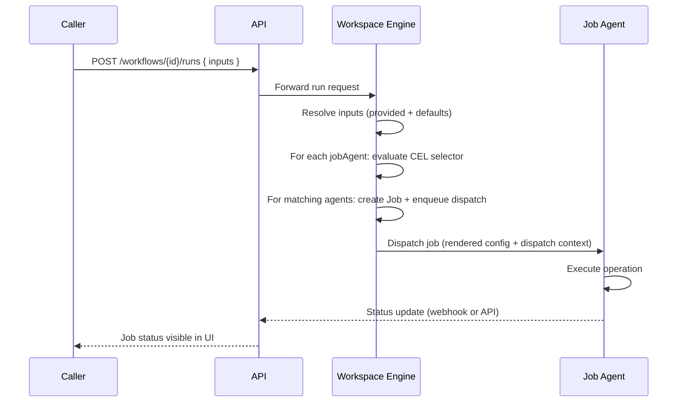

Workflows let you run on-demand operations — restarts, migrations, backfills, data exports — across one or more job agents. Unlike deployments, workflows are not tied to versions or release targets; they accept typed inputs at runtime and fan out jobs to whichever agents match the conditions you specify.

```
User triggers run
  → Inputs resolved (provided + defaults)
  → For each job agent whose selector matches:
      → Job created with dispatch context
      → Job agent executes with access to inputs
      → Status tracked
```

## Core Concepts

| Concept | Description |
| --- | --- |
| **Workflow** | A named template with input definitions and a list of job agents |
| **Input** | A typed parameter declared on the workflow (string, number, boolean, object, or array) |
| **Job Agent** | An executor (GitHub Actions, ArgoCD, Terraform Cloud, etc.) referenced by ID |
| **Selector** | A CEL expression evaluated against the dispatch context to decide whether the agent runs |
| **Workflow Run** | A single execution of a workflow with a specific set of input values |
| **Workflow Job** | A job dispatched to one agent during a run |

## Specifying Inputs

Inputs are declared in the `inputs` array of a workflow. Each input has a `key`, a `type`, and an optional `default`.

### Scalar inputs

```json
{
  "inputs": [
    { "key": "environment", "type": "string", "default": "staging" },
    { "key": "replicas",    "type": "number", "default": 2 },
    { "key": "dry_run",     "type": "boolean", "default": false },
    { "key": "config",      "type": "object",  "default": { "timeout": 30 } }
  ]
}
```

| Type | JSON type | Notes |
| --- | --- | --- |
| `string` | `string` | |
| `number` | `number` | Integer or float |
| `boolean` | `boolean` | |
| `object` | `object` | Arbitrary JSON object |
| `array` | `array` | See below |

### Array inputs

There are two kinds of array inputs:

**Manual array** — the caller provides a list of items directly:

```json
{ "key": "hosts", "type": "array" }
```

**Selector array** — dynamically resolved from your inventory using a CEL expression. Instead of the caller listing items, Ctrlplane queries entities matching the selector:

```json
{
  "key": "targets",
  "type": "array",
  "selector": {
    "entityType": "resource",
    "default": "resource.metadata['environment'] == 'staging'"
  }
}
```

`entityType` can be `resource`, `environment`, or `deployment`. The `default` is a CEL expression used when the caller does not override the selector.

### Input resolution

When a run is created, Ctrlplane merges the caller's provided values with the workflow's defaults:

1. Start with the values provided by the caller.
2. For each input defined on the workflow, if no value was provided, apply the `default` (if set).
3. The final merged map is stored on the `WorkflowRun` record and passed to every dispatched job.

If the caller omits an input and no default is defined, that key will not appear in the resolved inputs.

## Wiring in Job Agents

The `jobAgents` array defines which executors the workflow uses. Each entry has:

```json
{
  "jobAgents": [
    {
      "name": "my-github-agent",
      "ref": "<job-agent-id>",
      "config": {
        "installationId": "12345678",
        "owner": "my-org",
        "repo": "my-repo",
        "workflowId": "deploy.yml"
      },
      "selector": "true"
    }
  ]
}
```

| Field | Required | Description |
| --- | --- | --- |
| `name` | Yes | Display name for the agent within this workflow |
| `ref` | Yes | The UUID of a registered job agent |
| `config` | Yes | Agent-specific configuration (see [Templates](#templating-inputs-into-job-agents)) |
| `selector` | Yes | CEL expression — the agent only runs if this evaluates to `true` |

### Selector evaluation

Before dispatching, Ctrlplane evaluates each agent's `selector` against the **dispatch context**:

```
{
  "workflow": { ... },    // workflow definition
  "inputs":   { ... }     // resolved input values
}
```

Use `"true"` to always dispatch to this agent, or write a CEL expression to make it conditional:

```json
{ "selector": "inputs.environment == 'production'" }
```

This lets a single workflow definition fan out differently depending on what the caller provides — e.g., only trigger a manual approval agent for production.

Multiple agents can run in the same workflow run: every agent whose selector evaluates to `true` receives its own job.

## Templating Inputs into Job Agents

Both `config` values and the `selector` field support **Go `text/template`** syntax. Templates are rendered before dispatch using the same dispatch context:

| Variable | Description |
| --- | --- |
| `{{.inputs.<key>}}` | Resolved input values |
| `{{.workflow}}` | The workflow definition |
| `{{.jobAgentConfig}}` | This agent's rendered config (available in nested templates) |

### Example: GitHub Actions

```json
{
  "name": "github-deploy",
  "ref": "<github-agent-id>",
  "config": {
    "installationId": "12345678",
    "owner": "my-org",
    "repo": "{{.inputs.repo}}",
    "workflowId": "workflow-dispatch.yml",
    "ref": "{{.inputs.branch}}"
  },
  "selector": "true"
}
```

When the run is created with `{ "repo": "api-service", "branch": "main" }`, the rendered config becomes:

```json
{
  "installationId": "12345678",
  "owner": "my-org",
  "repo": "api-service",
  "workflowId": "workflow-dispatch.yml",
  "ref": "main"
}
```

This rendered config is stored on the `Job` record and passed to the job agent dispatcher. The agent then uses it to construct the actual dispatch call (e.g., the GitHub API `workflow_dispatch` event).

### Conditional agent selection

```json
{
  "name": "prod-approvals",
  "ref": "<approval-agent-id>",
  "config": {},
  "selector": "inputs.environment == 'production'"
}
```

The approval agent only runs when `environment` is `"production"`.

## Full Example: Database Migration Workflow

This workflow runs a database migration via GitHub Actions, with a dry-run option and environment targeting.

### Workflow definition (API)

```json
{
  "name": "Run Database Migration",
  "inputs": [
    { "key": "environment",  "type": "string",  "default": "staging" },
    { "key": "migration_id", "type": "string" },
    { "key": "dry_run",      "type": "boolean", "default": true }
  ],
  "jobAgents": [
    {
      "name": "migration-runner",
      "ref": "<github-agent-id>",
      "config": {
        "installationId": "12345678",
        "owner": "my-org",
        "repo": "my-app",
        "workflowId": "migrate.yml",
        "ref": "main"
      },
      "selector": "true"
    }
  ]
}
```

### GitHub Actions workflow

The GitHub Actions workflow receives a `job_id` from Ctrlplane. Use the `ctrlplanedev/get-job-inputs` action to fetch the resolved inputs:

```yaml
# .github/workflows/migrate.yml
name: Database Migration

on:
  workflow_dispatch:
    inputs:
      job_id:
        description: "Ctrlplane Job ID"
        required: true

jobs:
  migrate:
    runs-on: ubuntu-latest
    steps:
      - uses: actions/checkout@v4

      - name: Fetch workflow inputs
        uses: ctrlplanedev/get-job-inputs@v1
        id: job
        with:
          base_url: ${{ secrets.CTRLPLANE_BASE_URL }}
          job_id: ${{ inputs.job_id }}
          api_key: ${{ secrets.CTRLPLANE_API_KEY }}

      - name: Run migration
        env:
          DB_URL: ${{ secrets[format('DB_URL_{0}', steps.job.outputs.inputs_environment)] }}
        run: |
          echo "Environment: ${{ steps.job.outputs.inputs_environment }}"
          echo "Migration:   ${{ steps.job.outputs.inputs_migration_id }}"
          echo "Dry run:     ${{ steps.job.outputs.inputs_dry_run }}"

          if [ "${{ steps.job.outputs.inputs_dry_run }}" = "true" ]; then
            make migrate-dry-run ID=${{ steps.job.outputs.inputs_migration_id }}
          else
            make migrate ID=${{ steps.job.outputs.inputs_migration_id }}
          fi
```

<Note>
Workflow inputs are surfaced on the job as `inputs_<key>` outputs by `get-job-inputs`.
</Note>

### Triggering a run (API)

```bash
curl -X POST "https://ctrlplane.example.com/api/v1/workspaces/{workspaceId}/workflows/{workflowId}/runs" \
  -H "Authorization: Bearer $CTRLPLANE_API_KEY" \
  -H "Content-Type: application/json" \
  -d '{
    "inputs": {
      "environment": "production",
      "migration_id": "20240115_add_user_index",
      "dry_run": false
    }
  }'
```

If `dry_run` were omitted, Ctrlplane would fall back to the default `true`.

## Example: Multi-Agent Workflow (GitHub + Terraform Cloud)

A single workflow can dispatch to multiple agents simultaneously. Here, a restart workflow notifies Slack via GitHub Actions and triggers a Terraform Cloud run to scale down and back up:

```json
{
  "name": "Rolling Restart",
  "inputs": [
    { "key": "service",     "type": "string" },
    { "key": "environment", "type": "string", "default": "staging" }
  ],
  "jobAgents": [
    {
      "name": "notify",
      "ref": "<github-agent-id>",
      "config": {
        "installationId": "12345678",
        "owner": "my-org",
        "repo": "ops-tooling",
        "workflowId": "notify-restart.yml",
        "ref": "main"
      },
      "selector": "true"
    },
    {
      "name": "terraform-restart",
      "ref": "<tfe-agent-id>",
      "config": {
        "organization": "my-org",
        "address": "https://app.terraform.io",
        "token": "<tfe-token>",
        "webhookUrl": "https://ctrlplane.example.com/api/tfe/webhook",
        "template": "name: restart-{{.inputs.service}}-{{.inputs.environment}}\nauto_apply: true\n"
      },
      "selector": "inputs.environment == 'production'"
    }
  ]
}
```

The `notify` agent runs for every environment. The `terraform-restart` agent only runs when targeting production.

## Terraform Provider

Use the `ctrlplane` Terraform provider to manage workflows as code.

### Create a workflow

```hcl
resource "ctrlplane_workflow" "db_migration" {
  name = "Run Database Migration"

  input {
    key     = "environment"
    type    = "string"
    default = "staging"
  }

  input {
    key  = "migration_id"
    type = "string"
  }

  input {
    key     = "dry_run"
    type    = "boolean"
    default = "true"
  }

  job_agent {
    name     = "migration-runner"
    ref      = ctrlplane_job_agent.github.id
    selector = "true"

    config = {
      installationId = var.github_installation_id
      owner          = "my-org"
      repo           = "my-app"
      workflowId     = "migrate.yml"
      ref            = "main"
    }
  }
}
```

### Reference other resources

```hcl
resource "ctrlplane_job_agent" "github" {
  name = "github-actions"

  github_app {
    installation_id = var.github_installation_id
    owner           = "my-org"
  }
}

resource "ctrlplane_workflow" "rolling_restart" {
  name = "Rolling Restart"

  input {
    key  = "service"
    type = "string"
  }

  input {
    key     = "environment"
    type    = "string"
    default = "staging"
  }

  job_agent {
    name     = "notify"
    ref      = ctrlplane_job_agent.github.id
    selector = "true"

    config = {
      installationId = var.github_installation_id
      owner          = "my-org"
      repo           = "ops-tooling"
      workflowId     = "notify-restart.yml"
      ref            = "main"
    }
  }

  job_agent {
    name     = "terraform-restart"
    ref      = ctrlplane_job_agent.tfc.id
    selector = "inputs.environment == 'production'"

    config = {
      organization = var.tfc_org
      address      = "https://app.terraform.io"
      token        = var.tfc_token
      webhookUrl   = "https://ctrlplane.example.com/api/tfe/webhook"
      template     = <<-EOT
        name: restart-{{"{{"}.inputs.service{{"}}"}}-{{"{{"}.inputs.environment{{"}}"}}
        auto_apply: true
      EOT
    }
  }
}
```

## API Reference

| Method | Endpoint | Description |
| --- | --- | --- |
| `GET` | `/v1/workspaces/{workspaceId}/workflows` | List all workflows |
| `POST` | `/v1/workspaces/{workspaceId}/workflows` | Create a workflow |
| `GET` | `/v1/workspaces/{workspaceId}/workflows/{workflowId}` | Get a workflow |
| `PUT` | `/v1/workspaces/{workspaceId}/workflows/{workflowId}` | Update a workflow |
| `DELETE` | `/v1/workspaces/{workspaceId}/workflows/{workflowId}` | Delete a workflow |
| `POST` | `/v1/workspaces/{workspaceId}/workflows/{workflowId}/runs` | Trigger a workflow run |

### Create workflow run request body

```json
{
  "inputs": {
    "environment": "production",
    "migration_id": "20240115_add_index",
    "dry_run": false
  }
}
```

Only `inputs` is required. Omit keys to use their defaults; keys with no default and no provided value will be absent from the dispatch context.

## How It Works Internally



1. **Input resolution** — user-provided values are merged with defaults declared on the workflow.
2. **Selector evaluation** — each agent's `selector` CEL expression is evaluated against `{ workflow, inputs }`. Only agents whose selector returns `true` receive a job.
3. **Job creation** — a `Job` is inserted with the rendered `jobAgentConfig` and the full `DispatchContext` (which includes the resolved inputs).
4. **Job dispatch** — the workspace engine picks up the job and calls the agent-specific dispatcher (GitHub, TFC, ArgoCD, etc.).
5. **Status tracking** — agents report back via webhooks or the Ctrlplane API, updating job status in real time.

## Next Steps

<CardGroup cols={2}>
  <Card title="GitHub Actions" icon="github" href="/integrations/job-agents/github">
    Wire up GitHub Actions as a job agent
  </Card>
  <Card title="Terraform Cloud" icon="cloud" href="/integrations/job-agents/terraform-cloud">
    Trigger Terraform Cloud runs from workflows
  </Card>
  <Card title="ArgoCD" icon="ship" href="/integrations/job-agents/argocd">
    Sync ArgoCD applications on demand
  </Card>
  <Card title="Argo Workflows" icon="diagram-project" href="/integrations/job-agents/argo-workflows">
    Execute Argo Workflow templates
  </Card>
</CardGroup>
