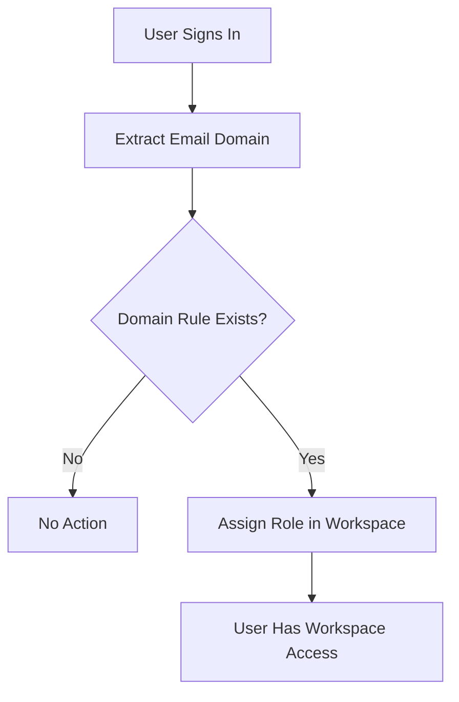

**Domain matching** lets you configure rules that automatically assign roles to
users when they sign in with an email address matching a specified domain. This
simplifies onboarding for teams by removing the need to manually invite every
user.

## Overview

When a user signs in, Ctrlplane extracts the domain portion of their email
address (e.g., `acme.com` from `alice@acme.com`) and checks it against all
configured domain matching rules. If a match is found, the user is automatically
assigned the specified role in the corresponding workspace.

## Why Use Domain Matching?

Domain matching helps you:

- **Automate onboarding** - New team members get workspace access instantly on
  first sign-in
- **Enforce consistency** - Everyone from the same domain gets the same baseline
  role
- **Reduce admin work** - No need to send individual invitations for every user
- **Support multiple workspaces** - A single domain can map to multiple
  workspaces with different roles

## Configuration

Domain matching is configured in **Workspace Settings > General**.

### Adding a Rule

To create a domain matching rule, provide:

| Field                  | Description                                                 |
| ---------------------- | ----------------------------------------------------------- |
| **Domain**             | The email domain to match (e.g., `acme.com`)                |
| **Role**               | The workspace role to assign to matching users              |
| **Verification Email** | An email address used to verify ownership of the domain     |

<Steps>
  <Step title="Navigate to Settings">
    Go to your workspace settings by clicking the gear icon, then select
    **General**.
  </Step>
  <Step title="Find Domain Matching">
    Scroll to the **Domain Matching** card.
  </Step>
  <Step title="Add a Rule">
    Enter the domain (e.g., `acme.com`), select a role, and provide a
    verification email address. Click **Add**.
  </Step>
</Steps>

### Verification

Each domain matching rule includes a verification step to confirm ownership of
the domain. When a rule is created, a verification code is generated. The domain
owner must verify the rule before it is considered fully active.

### Deleting a Rule

To remove a domain matching rule, click the trash icon next to the rule in the
Domain Matching card. Users who were previously assigned via the rule will retain
their existing role assignments.

## How It Works

1. **User signs in** via any configured authentication provider (Google, email
   and password, or custom OAuth).
2. **Domain extraction** - The domain is extracted from the user's email address
   and converted to lowercase.
3. **Rule lookup** - Ctrlplane queries all domain matching rules for the
   extracted domain.
4. **Role assignment** - For each matching rule, the user is assigned the
   configured role in the corresponding workspace. If the user already has the
   role, no duplicate is created.

<Note>
  Domain matching runs on every sign-in, so if you add a new rule, existing
  users will be assigned the role the next time they sign in.
</Note>

## Constraints

- Each workspace can only have **one rule per domain**. You cannot create two
  rules for the same domain within the same workspace.
- Domain matching is **case-insensitive** - `Acme.com` and `acme.com` are
  treated as the same domain.
- Role assignments created by domain matching behave the same as manually
  assigned roles and can be removed individually if needed.

## Common Patterns

### Company-Wide Access

Give everyone at your company viewer access:

| Domain       | Role   |
| ------------ | ------ |
| `acme.com`   | Viewer |

### Team-Based Roles

Assign different roles based on team domains:

| Domain              | Role   |
| ------------------- | ------ |
| `engineering.co`    | Admin  |
| `contractors.co`    | Viewer |

### Multi-Workspace Setup

The same domain can be configured across different workspaces with different
roles. For example, `acme.com` could map to an **Admin** role in the
`infrastructure` workspace and a **Viewer** role in the `production` workspace.

## Best Practices

- Use domain matching for broad organizational access and supplement with
  individual role assignments for elevated permissions.
- Verify domain rules promptly to ensure they are active.
- Review domain matching rules periodically as teams and organizational
  structures change.
- Combine domain matching with workspace-level RBAC for fine-grained access
  control.

## Next Steps

- [Concepts Overview](/concepts/overview) - Understand core Ctrlplane concepts
- [Quickstart](/quickstart) - Get started with Ctrlplane
